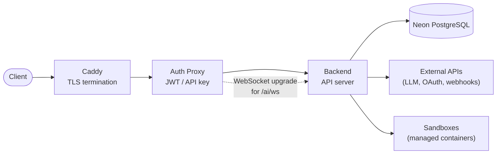
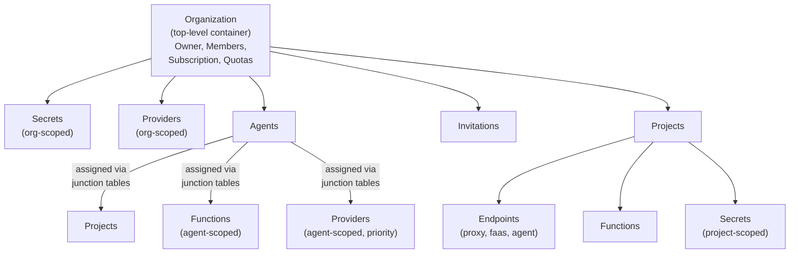
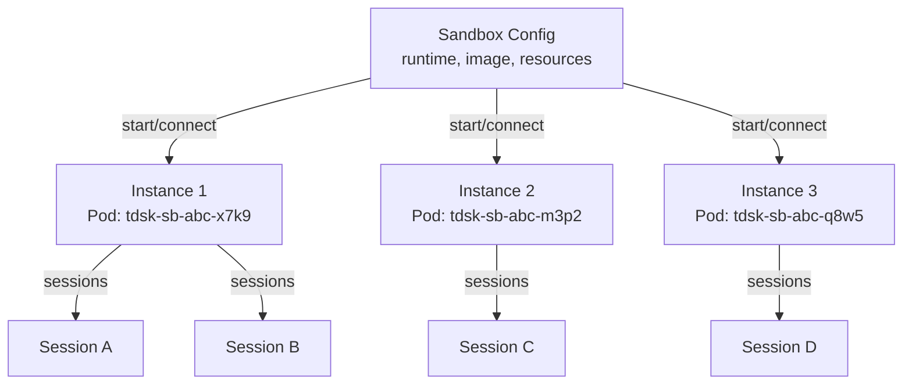

# Platform Overview

---

## What is Threaded Stack

Threaded Stack is an **AI operations layer** for companies integrating AI agents into their workflows. It sits alongside existing tooling and solves the governance, security, and sharing problems that come with deploying AI agents across an organization.

### Core Problems Solved

1. **Secret exposure** -- AI agents and users never see raw credential values. Secrets use `{{PLACEHOLDER}}` references that are replaced just-in-time outside the agent's context via the MITM proxy. Encryption uses industry-standard encryption (AES-256-GCM).

2. **Environment inconsistency** -- Sandboxes provide secure, consistent, pre-configured containers where AI agents run. All traffic routes through the proxy for secret management, so every execution environment behaves identically regardless of where or how the agent is invoked.

3. **Siloed setups** -- A shared entity model (org -> projects -> resources) eliminates per-engineer custom configurations. Agents, functions, tools, and secrets are configured once at the org level and shared across projects and teams.

4. **Access control** -- Users are scoped to organizations and projects via a role-based permission system (viewer, member, admin, owner, super). Resources are only exposed to projects they have been assigned to. A 17-resource permission matrix governs who can do what.

5. **Maintenance burden** -- Centralized configuration means agents, tools, and secrets are updated in one place and propagate to all connected projects. Provider configuration, model selection, and secret rotation happen at the org level.

6. **Onboarding friction** -- Environment consistency and reuse of existing tools (Claude Code, Codex, OpenCode, or any Docker-compatible AI tool) reduce the learning curve. New team members join an org and immediately have access to configured agents and environments.

### Key Differentiator

**"Bring your own AI tool, we make it secure and managed."** Sandboxes can host any off-the-shelf AI tool -- anything that runs in a Docker container. Users connect directly to the sandbox (SSH or similar). All traffic goes through the MITM proxy, so the tool works normally but never sees real credentials. When the sandbox tears down, nothing leaks.

---

## System Topology

### Service Roles

| Service | Role |
|---------|------|
| **Caddy** | TLS termination, load balancing, automatic certificate management. Single external entry point. |
| **Auth Proxy** | Triple-auth gateway: JWT validation via JWKS (Neon Auth), API key validation (`tdsk_*` Bearer tokens), and session token validation for WebSocket connections. Forwards authenticated requests to Backend with user identity headers. |
| **Backend** | Core API server. Admin CRUD, proxy engine, AI engine, payment webhooks, email service. Orchestrates agent execution, secret injection, and sandbox lifecycle. |
| **Neon PostgreSQL** | Database provider and user authentication (Neon Auth). |

### Auth Flow

Each route gets exactly one auth mechanism -- never multiple:

- **Public routes** (`/health`, `/domains/validate`) -- Skip all auth.
- **Session routes** (`/ai/ws`) -- Skip JWT and API key auth. Require session token (ephemeral, created via `POST /_/ai/sessions`, validated by backend).
- **All other routes** (`/_/*`, `/proxy/*`, other `/ai/*`) -- JWT or API key required. API key auth is a fallback if JWT does not set `req.user`.

---

## Interaction Surfaces

### 1. Sandbox Connect (Primary)

The recommended way to use Threaded Stack. Developers run `tsa run <sandbox-id>` to start a managed sandbox, sync files, and launch their AI tool of choice (Claude Code, Codex, OpenCode, or custom). Every new organization is seeded with four built-in sandbox presets that are immediately startable. `tsa ssh <sandbox-id>` provides plain SSH access without launching a runtime. All sandbox traffic routes through the MITM proxy for transparent secret injection.

### 2. TSA CLI (`tsa chat`)

A terminal-native TUI compiled to a standalone binary. Developers authenticate with an API key (`tsa login <key>`), browse agents and threads, then enter an interactive chat session. The TSA runs the agent ReAct loop locally but proxies all LLM calls through the backend WebSocket so API keys never leave the server. Supports context injection, slash commands, lifecycle hooks, and YAML-based configuration.

### 3. Threads Web App

A browser-based interface for non-developer users to interact with AI agents through a conversation-oriented UI. Built as a separate SPA. Shares authentication infrastructure with the admin dashboard via Neon Auth.

Built as a separate SPA with routing, auth, state management, and page scaffolding.

### 4. API (SSE / WebSocket)

Programmatic integration for embedding agent execution into existing codebases. Two paths:

- **SSE** -- `POST /_/agents/:id/run` streams agent events (text, tool calls, tool results, errors, done) as server-sent events. Authenticated via JWT or API key.
- **WebSocket** -- `WS /ai/ws?token=<session-token>` provides bidirectional streaming with session-token auth. The session token is obtained from `POST /_/ai/sessions` which resolves the API key server-side.

---

## Shared Entity Model

Resources in Threaded Stack are organized in a hierarchical ownership model. Org-level configuration propagates to projects, which scope the resources available to endpoints, agents, and users.

### Key Relationships

- **Organizations** own providers, secrets, agents, projects, and invitations. One user can own multiple orgs (limited by subscription tier).
- **Agents** are org-scoped but connect to projects, functions, and providers via many-to-many relationships. Providers on an agent have priority ordering.
- **Secrets** use a 4-way exclusive arc pattern: each secret belongs to exactly one of org, project, provider, or agent (with one additional valid combo: org + provider). Encryption uses AES-256-GCM with HKDF key derivation.
- **Endpoints** are project-scoped and come in three types: proxy (HTTP forwarding with transforms), FaaS (sandboxed function execution), and agent (AI agent execution with SSE streaming).
- **Threads** belong to an org and optionally to an agent and project. They support branching (creating a new thread from a specific message in an existing thread).
- **Roles** use a 2-way exclusive arc: each role is scoped to either an org or a project, with a unique constraint on user+org and user+project.

### Sandbox Config vs Instance

A **sandbox** is a _configuration_ record stored in the database -- it defines the runtime, Docker image, resource limits, init script, environment variables, and attached secrets. An **instance** is a running Kubernetes pod created from that configuration. One sandbox config can have multiple concurrent instances, each identified by a unique `instanceId`.

| Concept | Persisted | Identifier | Lifecycle |
|---------|-----------|------------|-----------|
| **Sandbox (config)** | Yes (database row) | `sandboxId` (UUID) | CRUD via Admin API |
| **Instance (pod)** | No (runtime only) | `instanceId` (generated) | Created on `connect`/`start`, destroyed on `stop` or idle timeout |

Instances are **runtime entities** -- they are not stored in the database. They exist as Kubernetes pods with labels for `orgId`, `projectId`, `userId`, and `sandboxId`. The backend discovers running instances by querying the Kubernetes API for pods matching those labels.

### Instance Lifecycle

Instances follow a straightforward lifecycle:

1. **Create** -- A `connect` or `start` request provisions a new pod from the sandbox config. The backend generates an `instanceId`, builds the pod manifest, and submits it to the Kubernetes API.
2. **Running** -- The instance runs independently, hosting its own sessions, file sync connections, and exec commands. Multiple users can connect to the same instance.
3. **Stop** -- A `stop` request targeting a specific `instanceId` (or all instances of a sandbox) deletes the pod. All sessions on that instance are terminated.

Because instances are ephemeral, stopping an instance discards all in-container state. Persistent work should be synced to the host via the file sync mechanism before stopping.

The following diagram illustrates the relationship between a sandbox config and its instances:

---

## Subscription Tiers

| Tier | Orgs | Projects | Compute Units | Threads | Messages | Endpoints | Secrets | Retention | Seats |
|------|------|----------|--------------|---------|----------|-----------|---------|-----------|-------|
| **Free** | 1 | 2 | 1,000 | 100 | 500 | 3 | 5 | 7 days | 1 |
| **Solo** | 2 | 10 | 10,000 | 1,000 | 10,000 | 20 | 25 | 30 days | 1 |
| **Pro** | 5 | 50 | 100,000 | unlimited | unlimited | unlimited | unlimited | 90 days | 3 |
| **Team** | unlimited | unlimited | unlimited | unlimited | unlimited | unlimited | unlimited | 365 days | 10 |
