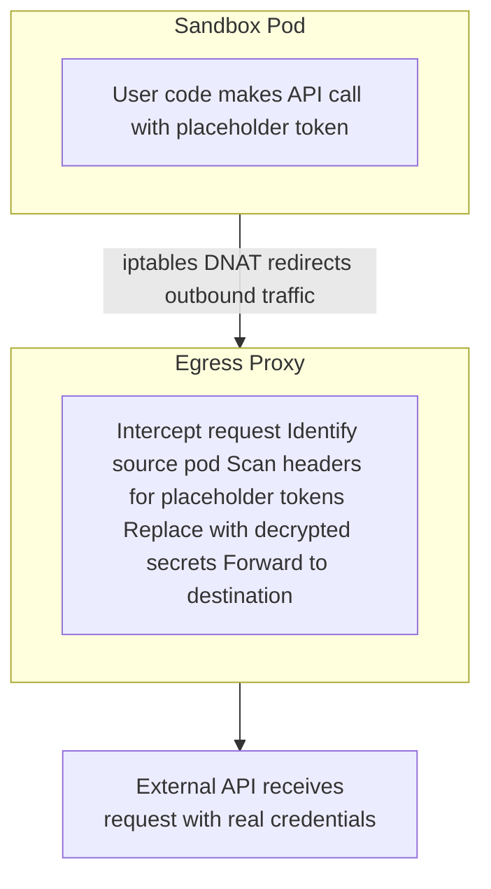

# Security Model

## Security Philosophy

Threaded Stack follows a **defense-in-depth** strategy built around one core invariant: **sandbox code and end users never see raw credentials**. Secrets are encrypted at rest using AES-256-GCM, decrypted only at the point of use, and injected outside the sandbox execution context. If any single layer is compromised, multiple additional barriers remain.

The system enforces this through five reinforcing layers:

1. **Encryption at rest** -- All secrets are stored encrypted in PostgreSQL using per-entity derived keys.
2. **Hash-only authentication** -- API keys are stored as SHA-256 hashes; raw keys are shown once at creation and never persisted.
3. **Just-in-time injection** -- Secrets are decrypted and injected into outbound requests at the last possible moment, then immediately discarded.
4. **Egress interception** -- All outbound traffic from sandboxed code passes through a MITM proxy that replaces placeholder tokens with real values, ensuring the sandbox code only ever handles opaque tokens.
5. **Scoped access** -- Secrets are bound to exactly one entity (org, project, or provider) via exclusive arc constraints enforced at the database level.

## Encryption at Rest

All secret values are encrypted with AES-256-GCM before being stored in the database. Each entity (organization, project, or provider) receives its own derived encryption key through HKDF key derivation from the platform master key. This isolation means that compromising one entity's derived key cannot be used to decrypt any other entity's secrets.

## API Key Security

API keys provide programmatic access to the platform as an alternative to JWT authentication. Keys use the `tdsk_` prefix for easy identification.

When a key is created, 32 bytes of cryptographically random data are generated and returned to the user exactly once. Only a one-way SHA-256 hash of the key is stored in the database -- the raw key is never persisted. On subsequent requests, the presented key is hashed and compared against stored hashes for authentication.

A short prefix (first 12 characters) is stored alongside the hash for display purposes, allowing users to identify which key is which without exposing the full value.

## JIT Secret Injection

Just-in-time (JIT) secret injection keeps credentials out of sandbox and function code. There are two injection paths depending on the execution context.

### Server-Side Resolution (Proxy/FaaS Endpoints)

For proxy and FaaS endpoints, secrets are resolved server-side before outbound requests are made. Endpoint configurations reference secrets via placeholder templates. At request time, the platform loads the relevant secrets, decrypts them, replaces the templates with real values, and forwards the request to the external API. The plaintext credentials exist only in memory for the duration of the request.

### Egress Proxy Replacement (Sandbox Pods)

For sandboxed code running in Kubernetes pods, secrets are handled differently. Each secret is assigned a random opaque placeholder token (prefixed with `tdsk_ph_`) that the sandbox code uses in place of real credentials. All outbound traffic from the pod passes through an egress proxy that intercepts requests, finds placeholder tokens, and replaces them with decrypted secret values before forwarding to external services. The sandbox code never has access to real credential values.

## MITM Proxy (Sandbox Egress)

### Why a MITM Proxy?

Sandbox pods execute user-provided code in isolated Kubernetes environments. This code must be able to call external APIs using credentials (API keys, tokens) without ever having access to the real credential values. A transparent intercepting proxy solves this:

1. When a sandbox pod is created, each secret gets a random placeholder token
2. The sandbox code receives only placeholder tokens as environment variables
3. All outbound traffic is redirected to the egress proxy via iptables DNAT rules
4. The proxy intercepts requests, finds placeholder tokens in headers, and replaces them with decrypted secret values
5. The request reaches the external API with real credentials -- but the sandbox code never saw them

### Architecture

If a placeholder token cannot be resolved (e.g., the underlying secret was deleted), the proxy returns an error to the sandbox rather than forwarding the request, preventing placeholder tokens from leaking to external services.

## Secret Scoping

Secrets follow the **exclusive arc** pattern -- each secret belongs to exactly one owner entity. The database enforces this with constraints.

### Four Scope Levels

| Scope | Visibility | Use Case |
|-------|-----------|----------|
| **Organization** | All members of the org | Shared API keys, org-wide credentials |
| **Project** | Project members only | Project-specific service credentials |
| **Provider** | Provider context only | LLM API keys tied to a specific provider config |

Scope determines which derived encryption key is used. When resolving secrets for an operation, provider-scoped secrets take precedence over org-scoped secrets when names collide.

## Auth Chain

### Three Auth Mechanisms

| Mechanism | Token Format | Routes | Who Issues |
|-----------|-------------|--------|------------|
| **JWT** | `Bearer <jwt>` | All protected routes | Neon Auth (social login) |
| **API Key** | `Bearer tdsk_<base64url>` | All protected routes (fallback) | Platform (shown once at creation) |
| **Session Token** | `Bearer <token>` or `?token=<token>` | `/ai/ws` only | Platform (via authenticated session request) |

Each request uses exactly one auth mechanism -- they do not overlap. The middleware chain short-circuits once authentication succeeds.

TLS is terminated at the edge by Caddy. The auth proxy validates credentials and forwards authenticated identity to the backend via internal headers. A shared secret between the proxy and backend ensures the backend only accepts requests that passed through the auth proxy.

### WebSocket Authentication

WebSocket connections for AI interaction use a dedicated session-based flow. The client first obtains a session token via an authenticated API call, then connects to the WebSocket endpoint with that token. The backend validates the session token against its internal state before allowing the connection upgrade.
