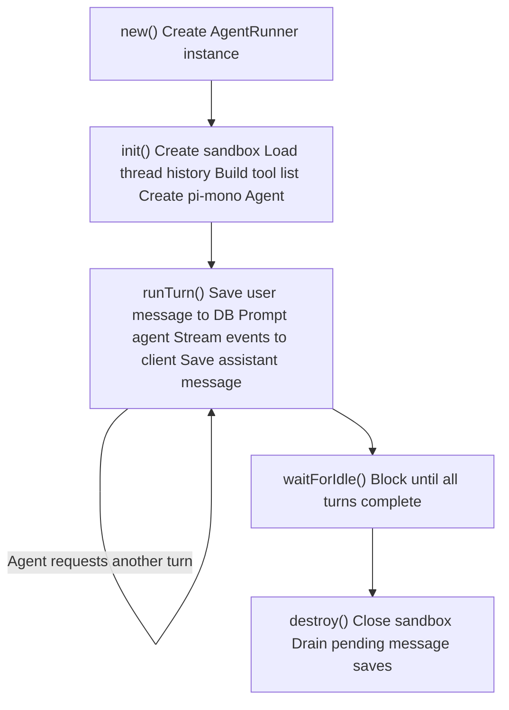
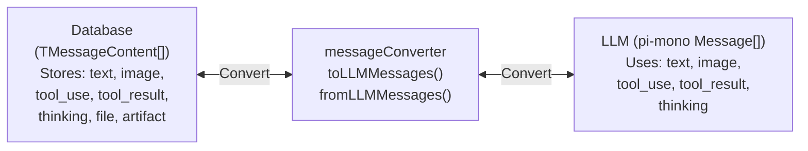

# Agent Endpoints — Developer Internals

## AgentRunner

The `AgentRunner` class (`repos/agent/src/runner/runner.ts`) wraps pi-mono's `Agent` class with Threaded Stack's persistence, event bridging, and sandbox lifecycle.

### Instance Lifecycle



### Key Methods

**`init(opts: TAgentInitOpts)`** -- Creates the sandbox (if configured), loads conversation history from the database, converts messages to pi-mono format, resolves the LLM model, builds sandbox + web + custom function tools, creates the pi-mono `Agent` instance, and subscribes to agent events for streaming and message persistence.

**`runTurn(opts: TAgentTurnOpts)`** -- Resolves active skills for the current prompt, saves the user message to the database, prompts the pi-mono `Agent`, and returns a `TAgentHandle` with `steer()`, `followUp()`, `abort()`, and `waitForIdle()` methods. Includes automatic retry logic for transient LLM errors and context overflow detection.

**`updateConfig(config: TAgentConfig)`** -- Mutates the live pi-mono `Agent` at runtime. Can change model, system prompt, thinking level, or tools between turns without re-initialization.

**`destroy()`** -- Unsubscribes from agent events, drains all pending message persistence promises, closes the sandbox, and nulls all internal references. After destroy, `init()` can be called again.

**`static run(opts: TAgentRunOpts)`** -- One-shot convenience method that creates a runner, calls `init()` + `runTurn()`, and auto-destroys on completion. Used by the SSE endpoint and TSA for fire-and-forget execution.

### Pluggable Persistence

`AgentRunner` accepts an `IAgentRunnerDB` interface rather than a direct database dependency:

```typescript
interface IAgentRunnerDB {
  listMessages(opts: {
    where: { threadId: string }
    limit: number
    offset: number
  }): Promise<{ data?: Array<{ type: string; content: TMessageContent[] }> }>

  createMessage(data: {
    threadId: string
    type: string
    content: TMessageContent[]
    orgId: string
  }): Promise<unknown>
}
```

The backend implements this via direct DB service calls (`repos/backend/src/utils/agent/resolveAgentConfig.ts` -- `createDBAdapter()`). The TSA implements it via HTTP calls to the backend API. This decoupling means the agent runtime has no dependency on the database package.

## Message Flow

### Conversion Pipeline

Messages flow between two formats: Threaded Stack's `TMessageContent[]` (database representation) and pi-mono's `Message[]` (LLM representation). The adapters in `repos/agent/src/adapters/` handle bidirectional conversion.



Source: `repos/agent/src/adapters/messageConverter.ts`.

### History Loading and Saving

**Loading (on init):** The runner calls `db.listMessages()` to fetch existing thread messages, then `convertToLlmMessages()` converts them to pi-mono format. The current model's `api`/`provider`/`model` values are passed as defaults so `AssistantMessage` objects are reconstructed with the correct provider metadata.

**Saving (on turn_end):** The runner subscribes to pi-mono agent events. On each `turn_end` event, it converts the `AssistantMessage` via `convertAssistantToContent()` and each `ToolResultMessage` via `convertToolResultToContent()`, then queues `db.createMessage()` calls. All pending persistence is drained (via `Promise.allSettled`) when the agent completes or the runner is destroyed.

### Event Bridge

`mapAgentEvent()` (`repos/agent/src/adapters/eventBridge.ts`) maps pi-mono's internal `AgentEvent` types to Threaded Stack's `TStreamEvent` for client output:

| pi-mono Event | Sub-type | TStreamEvent type |
|--------------|----------|-------------------|
| `message_update` | `text_delta` | `text` |
| `message_update` | `thinking_delta` | `thinking` |
| `message_update` | `toolcall_start` | `tool_call_start` |
| `message_update` | `toolcall_delta` | `tool_call_args` |
| `message_update` | `done` | `done` |
| `message_update` | `error` | `error` |
| `tool_execution_update` | -- | `tool_execution_update` |
| `tool_execution_end` | -- | `tool_result` |
| `turn_end` | -- | `turn_end` (includes token usage + cost) |
| `agent_end` | -- | `done` (stopReason: `end_turn`) |
| `agent_start`, `turn_start`, `message_start`, `message_end`, `tool_execution_start` | -- | Not forwarded |

## Database Schema

The `agents` table stores the core configuration. Source: `repos/database/src/schemas/agents.ts`.

| Column | Type | Description |
|--------|------|-------------|
| `name` | text | Agent display name |
| `description` | text | Optional description |
| `orgId` | varchar(10) | Organization owner (cascade delete) |
| `systemPrompt` | text | System prompt sent to the LLM |
| `model` | text | Model identifier override (falls back to provider default) |
| `maxTokens` | integer | Maximum tokens for responses (default: 100000) |
| `tools` | jsonb | Array of allowed tool names (empty = all tools) |
| `envVars` | jsonb | Environment variables passed to sandbox |
| `environment` | jsonb | Execution settings: sandbox type, timeout, temperature, thinking level, context budget, web provider config |
| `active` | boolean | Whether the agent can be used (default: true) |

## Junction Tables

Agents use three junction tables for many-to-many relationships:

**`agent_providers`** (`repos/database/src/schemas/agentProviders.ts`) -- Links agents to LLM providers. Each row has a `priority` field: `0` = primary/default provider, `1+` = secondary. A per-provider `model` override can be set. Uniqueness is enforced on `(agentId, providerId)`.

**`agent_projects`** (`repos/database/src/schemas/agentProjects.ts`) -- Links agents to projects with per-project configuration overrides. Override fields (`model`, `maxTokens`, `systemPrompt`, `tools`, `envVars`, `environment`, `functionIds`) are nullable; `NULL` means inherit from the base agent config. The `enabled` flag controls whether the agent is active in that project. Uniqueness is enforced on `(agentId, projectId)`.

**`agent_skills`** (`repos/database/src/schemas/agentSkills.ts`) -- Links agents to skills. Skills provide additional system prompt instructions and tool registrations that are resolved per-turn based on the user's prompt. Uniqueness is enforced on `(agentId, skillId)`.

## Secret Resolution

The `SecretResolver` service (`repos/backend/src/services/secrets/secretResolver.ts`) performs a 3-tier API key lookup:

1. **Agent-level** -- secrets directly attached to the agent
2. **Provider-level** -- secrets attached to the provider
3. **Org-level** -- secrets belonging to the organization

Provider headers and body params support `{{SECRET_NAME}}` template substitution, where references are replaced with decrypted secret values at runtime. API keys never leave the backend.

## Tool Implementation

### Sandbox Tools

`createSandboxTools()` (`repos/agent/src/tools/tools.ts`) creates pi-mono `AgentTool[]` definitions backed by an `ISandbox` instance. Each tool streams progress via `onUpdate()` during execution.

### Custom Function Tools

`buildCustomFunctionTools()` converts user-defined `FunctionModel[]` into `AgentTool[]`. Each tool delegates execution to an `onExecuteFunction` callback provided by the backend, which runs the function in a sandboxed environment via `FunctionExecutor`.

Parameter schemas are auto-generated in three modes:

1. **`inputSchema`** (preferred) -- Rich typed parameters with name, type (`string`/`number`/`boolean`/`object`/`array`), description, and required flag
2. **`defaultArgs`** (legacy) -- Named string parameters derived from `defaultArgs` keys
3. **Generic fallback** -- A single `input: Record<string, any>` wrapper property

### Tool Interface

All tools implement pi-mono's `AgentTool` interface with TypeBox parameter schemas:

```typescript
{
  name: string
  label: string
  description: string
  parameters: TypeBox.TObject
  execute: (toolCallId, params, signal, onUpdate?) => Promise<ToolResult>
}
```

## Runtime Dependencies

The agent runtime is built on pi-mono (`@mariozechner/pi-agent-core` and `@mariozechner/pi-ai`), which provides the ReAct loop, multi-provider LLM streaming, and tool execution orchestration.

## Source References

| Component | Path |
|-----------|------|
| AgentRunner | `repos/agent/src/runner/runner.ts` |
| Message converter | `repos/agent/src/adapters/messageConverter.ts` |
| Event bridge | `repos/agent/src/adapters/eventBridge.ts` |
| Sandbox tools | `repos/agent/src/tools/tools.ts` |
| SecretResolver | `repos/backend/src/services/secrets/secretResolver.ts` |
| Agent config resolver | `repos/backend/src/utils/agent/resolveAgentConfig.ts` |
| SSE endpoint | `repos/backend/src/endpoints/agents/runAgent.ts` |
| Agent endpoint service | `repos/backend/src/services/endpoints/agentEndpoint.ts` |
| WebSocket endpoint | `repos/backend/src/endpoints/ai/onWSConnect.ts` |
| Agents schema | `repos/database/src/schemas/agents.ts` |
| Agent providers schema | `repos/database/src/schemas/agentProviders.ts` |
| Agent projects schema | `repos/database/src/schemas/agentProjects.ts` |
| Agent skills schema | `repos/database/src/schemas/agentSkills.ts` |
