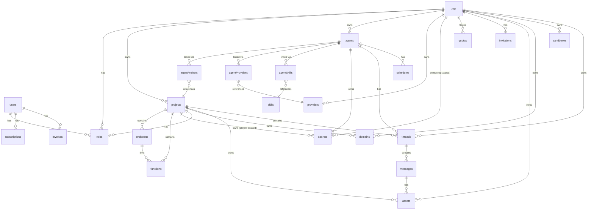
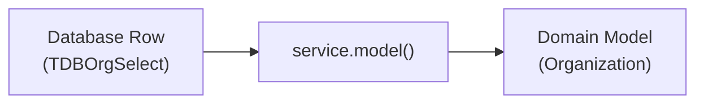

# Data Model Architecture

## 1. Overview

Threaded Stack's persistence layer is built on **Drizzle ORM** with **PostgreSQL** hosted on **Neon.com**. The database defines **25 table schemas** in total:

- **23 Drizzle-managed tables** -- defined in `repos/database/src/schemas/schemas.ts`, included in migrations
- **2 externally-managed tables** -- defined for read-only query access but excluded from Drizzle migrations:
  - `users` (Neon Auth, schema `neon_auth`, table `user`)
  - `certificates` (`caddy_certmagic_objects`, managed by the caddy-storage-postgresql plugin)

All Drizzle-managed tables share a common base schema (`repos/database/src/utils/schema/base.ts`) providing `id` (UUID, random default, primary key), `createdAt`, and `updatedAt` (timestamps, default now, not null).

Polymorphic ownership is implemented via the **Exclusive Arc** pattern -- CHECK constraints that enforce a record belongs to exactly one parent entity out of several possible owners.

Source: `repos/database/src/schemas/`

---

## 2. Entity Relationship Diagram



### Key Relationship Summary

| Parent | Children |
|--------|----------|
| `orgs` | projects, agents, providers, secrets, quotas, roles, invitations, assets, domains, sandboxes, threads |
| `users` | roles, subscriptions (1:1), invoices, threads, assets |
| `projects` | endpoints, functions, secrets, roles, domains, assets, agentProjects, threads, messages |
| `agents` | agentProjects, agentProviders, agentSkills, secrets, threads, schedules |
| `endpoints` | functions |
| `threads` | messages, branches (self-referencing via parentThreadId) |
| `messages` | assets |
| `skills` | agentSkills |

---

## 3. Exclusive Arc Pattern

The Exclusive Arc pattern enforces that a row belongs to **exactly one** parent entity from a set of possible owners. This is implemented as a SQL CHECK constraint in the table definition, ensuring mutual exclusivity at the database level.

### 3.1 Secrets -- 4-Way Arc with Combo

A secret belongs to exactly one of: Organization, Project, Provider, or Agent. An additional combo rule allows `orgId + providerId` together (for org-scoped provider secrets).

**Source:** `repos/database/src/schemas/secrets.ts`

```sql
-- CHECK constraint: secret_scope_check
(org_id IS NOT NULL AND project_id IS NULL AND provider_id IS NULL AND agent_id IS NULL) OR
(org_id IS NULL AND project_id IS NOT NULL AND provider_id IS NULL AND agent_id IS NULL) OR
(org_id IS NULL AND project_id IS NULL AND provider_id IS NOT NULL AND agent_id IS NULL) OR
(org_id IS NULL AND project_id IS NULL AND provider_id IS NULL AND agent_id IS NOT NULL) OR
(org_id IS NOT NULL AND provider_id IS NOT NULL AND project_id IS NULL AND agent_id IS NULL)
```

**5 valid scope combinations:**

| Scope | orgId | projectId | providerId | agentId | Use Case |
|-------|-------|-----------|------------|---------|----------|
| Org | set | null | null | null | Org-wide shared secret |
| Project | null | set | null | null | Project-specific secret |
| Provider | null | null | set | null | Provider credential |
| Agent | null | null | null | set | Agent-specific secret |
| Org+Provider | set | null | set | null | Org-scoped provider secret |

Secrets store encrypted values using AES-256-GCM with HKDF key derivation (`repos/database/src/utils/crypto.ts`). The `encryptedValue` field holds the ciphertext and the `hashKey` field holds a key derivation parameter.

### 3.2 Assets -- 5-Way Strict Arc

An asset belongs to exactly one of: Organization, Project, User, Thread, or Message. The `providerId` field is **not** part of the arc -- it is an independent nullable FK.

**Source:** `repos/database/src/schemas/assets.ts`

```sql
-- CHECK constraint: asset_owner_check
(
  (org_id IS NOT NULL)::int +
  (project_id IS NOT NULL)::int +
  (user_id IS NOT NULL)::int +
  (thread_id IS NOT NULL)::int +
  (message_id IS NOT NULL)::int
) = 1
```

### 3.3 Roles -- 2-Way Strict Arc

A role binds a user to exactly one of: Organization or Project (never both).

**Source:** `repos/database/src/schemas/roles.ts`

```sql
-- CHECK constraint: role_scope_check
(org_id IS NOT NULL AND project_id IS NULL) OR
(org_id IS NULL AND project_id IS NOT NULL)
```

### 3.4 Domains -- 2-Way Strict Arc

A domain is owned by exactly one of: Organization or Project.

**Source:** `repos/database/src/schemas/domains.ts`

```sql
-- CHECK constraint: domain_owner_check
(
  (org_id IS NOT NULL)::int +
  (project_id IS NOT NULL)::int
) = 1
```

### 3.5 API Keys -- Partial Arc (Not Strict)

API keys have a CHECK constraint but it is **not a strict exclusive arc** -- both `orgId` and `projectId` can be null (for user-scoped keys). The constraint only prevents setting both simultaneously.

**Source:** `repos/database/src/schemas/apiKeys.ts`

```sql
-- CHECK constraint: api_key_scope_check
(org_id IS NOT NULL AND project_id IS NULL)
OR (org_id IS NULL AND project_id IS NOT NULL)
OR (org_id IS NULL AND project_id IS NULL)
```

---

## 4. Core Entities

### 4.1 Identity

#### `organizations` (variable: `orgs`)

The root multi-tenancy boundary. Every billable resource is scoped to an org.

| Column | Type | Constraints |
|--------|------|-------------|
| id | uuid | PK, random default |
| name | text | NOT NULL |
| description | text | nullable |
| ownerId | uuid | FK -> users, NOT NULL, indexed |
| createdAt, updatedAt | timestamp | NOT NULL, default now |

**Relations:** owner (user), users (via roles), quotas, assets, agents, secrets, projects, providers, invitations

**Source:** `repos/database/src/schemas/orgs.ts`

#### `users` (Neon Auth, external)

Human identity managed by Neon Auth. Lives in PostgreSQL schema `neon_auth`, table name `user`. Threaded Stack reads this table but never writes to it.

| Column | Type | Constraints |
|--------|------|-------------|
| id | uuid | PK, Neon-managed |
| name, email, image, role | text | nullable |
| banned | boolean | nullable |
| banReason | text | nullable |
| banExpires | timestamp | nullable |
| emailVerified | boolean | nullable |
| createdAt, updatedAt | timestamp | NOT NULL |

**Relations:** orgs (via roles), roles, assets, threads, providers, subscription (1:1)

**Source:** `repos/database/src/schemas/users.ts`

#### `roles`

RBAC binding that connects a user to an org OR project with a permission level (admin/member/viewer). Uses the 2-way exclusive arc pattern.

| Column | Type | Constraints |
|--------|------|-------------|
| id | uuid | PK |
| name | text | nullable |
| type | text | NOT NULL (admin/member/viewer) |
| userId | uuid | FK -> users, NOT NULL, cascade |
| orgId | varchar(10) | FK -> orgs, cascade, arc with projectId |
| projectId | varchar(10) | FK -> projects, cascade, arc with orgId |
| createdAt, updatedAt | timestamp | NOT NULL |

**Unique indexes:** `(userId, orgId)`, `(userId, projectId)`

**Source:** `repos/database/src/schemas/roles.ts`

#### `invitations`

Tracks invitations to join an organization. Status workflow: `pending` -> `accepted` | `expired` | `revoked`.

| Column | Type | Constraints |
|--------|------|-------------|
| id | uuid | PK |
| email | text | NOT NULL |
| userId | uuid | FK -> users, cascade (invitee, nullable) |
| roleType | text | NOT NULL |
| orgId | varchar(10) | FK -> orgs, NOT NULL, cascade |
| invitedBy | uuid | FK -> users, on delete set null |
| token | text | NOT NULL, unique |
| status | text | NOT NULL, default 'pending' |
| expiresAt | timestamp | NOT NULL |
| acceptedAt, revokedAt | timestamp | nullable |
| revokedBy | uuid | FK -> users, on delete set null |
| createdAt, updatedAt | timestamp | NOT NULL |

**Indexes:** `orgId`, `email`, `status`

**Source:** `repos/database/src/schemas/invitations.ts`

---

### 4.2 Resources

#### `projects`

Logical workspace within an org. Groups related endpoints, functions, and agent configurations. Projects enable project-level RBAC.

| Column | Type | Constraints |
|--------|------|-------------|
| id | uuid | PK |
| name | text | NOT NULL |
| description | text | nullable |
| gitUrl | text | nullable |
| branch | text | default 'main' |
| meta | jsonb | nullable |
| orgId | varchar(10) | FK -> orgs, NOT NULL, cascade |
| createdAt, updatedAt | timestamp | NOT NULL |

**Unique index:** `(orgId, name)`
**Relations:** endpoints, functions, secrets, roles, domains, assets, agents (via agentProjects)

**Source:** `repos/database/src/schemas/projects.ts`

#### `endpoints`

HTTP route definitions within a project. Each endpoint maps a path + method to a behavior type (proxy, faas, or agent).

| Column | Type | Constraints |
|--------|------|-------------|
| id | uuid | PK |
| name | text | nullable |
| path | text | NOT NULL |
| method | varchar(10) | default 'GET' |
| type | varchar(10) | NOT NULL, default 'proxy' |
| public | boolean | default false |
| headers | jsonb | nullable |
| options | jsonb | nullable |
| projectId | varchar(10) | FK -> projects, NOT NULL, cascade |
| createdAt, updatedAt | timestamp | NOT NULL |

**Unique index:** `(projectId, path, method)`

**Source:** `repos/database/src/schemas/endpoints.ts`

#### `functions`

Serverless code units bound to a project, optionally linked to an endpoint. Executed in sandboxed environments.

| Column | Type | Constraints |
|--------|------|-------------|
| id | uuid | PK |
| name | text | NOT NULL |
| description | text | nullable |
| content | text | NOT NULL (source code) |
| branch | text | default 'main' |
| language | varchar(50) | default 'typescript' |
| defaultArgs | jsonb | default {} |
| dependencies | jsonb | default {} |
| inputSchema | jsonb | default [], typed TFunctionParam[] |
| endpointId | varchar(10) | FK -> endpoints, cascade (nullable) |
| projectId | varchar(10) | FK -> projects, NOT NULL, cascade |
| createdAt, updatedAt | timestamp | NOT NULL |

**Indexes:** `projectId`, `endpointId`

**Source:** `repos/database/src/schemas/functions.ts`

#### `providers`

LLM or API provider configurations, scoped to an organization. Not an exclusive arc -- only has `orgId` (required).

| Column | Type | Constraints |
|--------|------|-------------|
| id | uuid | PK |
| name | text | nullable |
| type | text | NOT NULL, typed EProvider |
| brand | text | typed TProviderBrand (nullable) |
| options | jsonb | nullable |
| headers | jsonb | nullable |
| bodyParams | jsonb | nullable (column: `body_params`) |
| secretId | varchar(10) | nullable (FK via migration, avoids circular import) |
| orgId | varchar(10) | FK -> orgs, NOT NULL, cascade |
| createdAt, updatedAt | timestamp | NOT NULL |

**Index:** `orgId`

**Source:** `repos/database/src/schemas/providers.ts`

#### `secrets`

Encrypted credentials with 4-way exclusive arc ownership. Values are encrypted with AES-256-GCM using HKDF key derivation.

| Column | Type | Constraints |
|--------|------|-------------|
| id | uuid | PK |
| name | text | NOT NULL |
| description | text | nullable |
| hashKey | text | NOT NULL |
| encryptedValue | text | NOT NULL |
| orgId | varchar(10) | FK -> orgs, cascade, arc column |
| projectId | varchar(10) | FK -> projects, cascade, arc column |
| providerId | varchar(10) | FK -> providers, cascade, arc column |
| agentId | varchar(10) | FK -> agents, cascade, arc column |
| createdAt, updatedAt | timestamp | NOT NULL |

**Indexes:** `orgId`, `projectId`, `providerId`, `agentId`
**CHECK:** `secret_scope_check` (see Section 3.1)

**Source:** `repos/database/src/schemas/secrets.ts`

#### `api_keys` (variable: `apiKeys`)

Bearer token credentials (`tdsk_*` prefix) for programmatic API access. Key material is stored as a one-way hash.

| Column | Type | Constraints |
|--------|------|-------------|
| id | uuid | PK |
| name | text | NOT NULL |
| keyHash | text | NOT NULL, unique |
| keyPrefix | varchar(12) | NOT NULL |
| scopes | text | default 'read' |
| active | boolean | default true |
| rateLimit | integer | default 100 |
| expiresAt | timestamp | nullable |
| lastUsedAt | timestamp | nullable |
| orgId | varchar(10) | FK -> orgs, cascade (nullable) |
| projectId | varchar(10) | FK -> projects, cascade (nullable) |
| userId | uuid | FK -> users, cascade (nullable) |
| createdAt, updatedAt | timestamp | NOT NULL |

**Indexes:** `orgId`, `keyHash`, `projectId`, `userId`
**CHECK:** `api_key_scope_check` (see Section 3.5)

**Source:** `repos/database/src/schemas/apiKeys.ts`

#### `skills`

Reusable agent skill definitions scoped to an organization. Skills contain instructions and trigger keywords that agents can reference.

| Column | Type | Constraints |
|--------|------|-------------|
| id | uuid | PK |
| name | text | NOT NULL |
| description | text | NOT NULL |
| instructions | text | NOT NULL |
| triggerKeywords | jsonb | default [], typed string[] |
| tools | jsonb | default [], typed string[] |
| alwaysActive | boolean | default false, NOT NULL |
| orgId | varchar(10) | FK -> orgs, NOT NULL, cascade |
| createdAt, updatedAt | timestamp | NOT NULL |

**Index:** `orgId`

**Source:** `repos/database/src/schemas/skills.ts`

---

### 4.3 AI

#### `agents`

AI agent configurations with execution settings. Agents belong to an organization and connect to projects, providers, and skills via junction tables.

| Column | Type | Constraints |
|--------|------|-------------|
| id | uuid | PK |
| name | text | NOT NULL |
| description | text | nullable |
| orgId | varchar(10) | FK -> orgs, NOT NULL, cascade |
| systemPrompt | text | nullable |
| model | text | nullable |
| maxTokens | integer | default 100000 |
| tools | jsonb | default [], typed string[] |
| envVars | jsonb | default {}, typed Record<string, string> |
| environment | jsonb | default {}, typed TAgentEnvironment |
| active | boolean | default true |
| createdAt, updatedAt | timestamp | NOT NULL |

**Relations:** org, secrets (many), threads (many), projects (via agentProjects), providers (via agentProviders), skills (via agentSkills), schedules (many)

**Source:** `repos/database/src/schemas/agents.ts`

#### `agent_projects` (variable: `agentProjects`)

Many-to-many junction between agents and projects. Stores per-project configuration overrides -- null override fields inherit from the base agent config.

| Column | Type | Constraints |
|--------|------|-------------|
| id | uuid | PK |
| agentId | varchar(10) | FK -> agents, NOT NULL, cascade |
| projectId | varchar(10) | FK -> projects, NOT NULL, cascade |
| alias | text | nullable |
| model | text | nullable (override) |
| maxTokens | integer | nullable (override) |
| systemPrompt | text | nullable (override) |
| tools | jsonb | nullable (override) |
| functionIds | jsonb | nullable, typed string[] |
| envVars | jsonb | nullable (deep merged with base) |
| environment | jsonb | nullable (deep merged with base) |
| enabled | boolean | default true |
| createdAt, updatedAt | timestamp | NOT NULL |

**Unique constraint:** `(agentId, projectId)`

**Source:** `repos/database/src/schemas/agentProjects.ts`

#### `agent_providers` (variable: `agentProviders`)

Many-to-many junction between agents and providers. The `priority` field determines the default provider (0 = primary).

| Column | Type | Constraints |
|--------|------|-------------|
| id | uuid | PK |
| agentId | varchar(10) | FK -> agents, NOT NULL, cascade |
| providerId | varchar(10) | FK -> providers, NOT NULL, cascade |
| priority | integer | default 0 |
| model | text | nullable (per-provider model override) |
| createdAt, updatedAt | timestamp | NOT NULL |

**Unique constraint:** `(agentId, providerId)`
**Index:** `(agentId, priority)`

**Source:** `repos/database/src/schemas/agentProviders.ts`

#### `agent_skills` (variable: `agentSkills`)

Many-to-many junction between agents and skills.

| Column | Type | Constraints |
|--------|------|-------------|
| id | uuid | PK |
| agentId | varchar(10) | FK -> agents, NOT NULL, cascade |
| skillId | varchar(10) | FK -> skills, NOT NULL, cascade |
| createdAt, updatedAt | timestamp | NOT NULL |

**Unique constraint:** `(agentId, skillId)`

**Source:** `repos/database/src/schemas/agentSkills.ts`

#### `threads`

Conversation threads for AI agent interactions. Supports branching via self-referencing `parentThreadId` and `branchMessageId`.

| Column | Type | Constraints |
|--------|------|-------------|
| id | uuid | PK |
| name | text | nullable |
| meta | jsonb | nullable |
| public | boolean | default false |
| parentThreadId | varchar(10) | self-ref (nullable, branching) |
| branchMessageId | varchar(10) | FK -> messages (nullable, branching) |
| providerId | varchar(10) | FK -> providers, on delete set null |
| agentId | varchar(10) | FK -> agents, on delete set null |
| orgId | varchar(10) | FK -> orgs, cascade |
| projectId | varchar(10) | FK -> projects, cascade |
| userId | uuid | FK -> users, NOT NULL, cascade |
| createdAt, updatedAt | timestamp | NOT NULL |

**Indexes:** `userId`, `agentId`, `parentThreadId`, `orgId`, `projectId`

**Source:** `repos/database/src/schemas/threads.ts`

#### `messages`

Individual messages within a thread. Content is stored as JSONB to support structured message formats (text, tool calls, tool results).

| Column | Type | Constraints |
|--------|------|-------------|
| id | uuid | PK |
| meta | jsonb | nullable |
| type | text | NOT NULL |
| content | jsonb | NOT NULL |
| orgId | varchar(10) | FK -> orgs, cascade |
| projectId | varchar(10) | FK -> projects, cascade |
| threadId | varchar(10) | FK -> threads, NOT NULL, cascade |
| createdAt, updatedAt | timestamp | NOT NULL |

**Indexes:** `threadId`, `orgId`, `projectId`

**Source:** `repos/database/src/schemas/messages.ts`

---

### 4.4 Assets & Domains

#### `assets`

File attachments and generated artifacts. Uses the 5-way exclusive arc pattern (see Section 3.2). The `providerId` is an independent nullable FK, not part of the arc.

| Column | Type | Constraints |
|--------|------|-------------|
| id | uuid | PK |
| name | text | NOT NULL |
| type | text | NOT NULL |
| url | text | nullable |
| meta | jsonb | nullable |
| content | jsonb | nullable |
| providerId | varchar(10) | FK -> providers, on delete set null |
| orgId | varchar(10) | FK -> orgs, cascade, arc column |
| userId | uuid | FK -> users, cascade, arc column |
| threadId | varchar(10) | FK -> threads, cascade, arc column |
| projectId | varchar(10) | FK -> projects, cascade, arc column |
| messageId | varchar(10) | FK -> messages, cascade, arc column |
| createdAt, updatedAt | timestamp | NOT NULL |

**Indexes:** `orgId`, `threadId`, `projectId`, `messageId`

**Source:** `repos/database/src/schemas/assets.ts`

#### `domains`

Custom domain registrations with SSL certificate management. Uses the 2-way exclusive arc (org or project). SSL certificates are stored by Caddy in the `certificates` table.

| Column | Type | Constraints |
|--------|------|-------------|
| id | uuid | PK |
| domain | text | NOT NULL, unique |
| verified | boolean | NOT NULL, default false |
| verifiedAt | timestamp | nullable |
| sslEnabled | boolean | NOT NULL, default false |
| sslPrivateKey | text | nullable |
| sslCertificate | text | nullable |
| sslExpiresAt | timestamp | nullable |
| orgId | varchar(10) | FK -> orgs, cascade, arc column |
| projectId | varchar(10) | FK -> projects, cascade, arc column |
| createdAt, updatedAt | timestamp | NOT NULL |

**Unique index:** `(orgId, domain)`
**CHECK:** `domain_owner_check` (see Section 3.4)

**Source:** `repos/database/src/schemas/domains.ts`

#### `caddy_certmagic_objects` (variable: `certificates`, external)

TLS certificate storage managed by the caddy-storage-postgresql plugin. Not included in Drizzle migrations.

| Column | Type | Constraints |
|--------|------|-------------|
| parent | text | NOT NULL, composite PK |
| name | text | NOT NULL, composite PK |
| isFile | boolean | NOT NULL |
| value | bytea | nullable (NOT NULL when isFile=true) |
| modified | timestamp | NOT NULL, default now |

**CHECK:** `(isFile=true AND value IS NOT NULL) OR (isFile=false AND value IS NULL)`

**Source:** `repos/database/src/schemas/certificates.ts`

---

### 4.5 Billing

#### `subscriptions`

User payment plans integrated with Stripe. One subscription per user (userId is unique). The org owner's subscription tier determines quota limits for all orgs they own.

| Column | Type | Constraints |
|--------|------|-------------|
| id | uuid | PK |
| userId | uuid | FK -> users, NOT NULL, unique, cascade |
| tier | text | NOT NULL, default 'free' |
| status | text | NOT NULL, default 'active' |
| stripeCustomerId | text | nullable |
| stripeSubscriptionId | text | nullable |
| stripePriceId | text | nullable |
| currentPeriodStart | timestamp | nullable |
| currentPeriodEnd | timestamp | nullable |
| cancelAtPeriodEnd | boolean | default false |
| seats | integer | default 1 |
| createdAt, updatedAt | timestamp | NOT NULL |

**Tiers:** `free`, `solo`, `pro`, `team` (defined in `ESubscriptionTier`)
**Statuses:** `active`, `canceled`, `past_due`, `incomplete`, `trialing` (defined in `ESubscriptionStatus`)

**Source:** `repos/database/src/schemas/subscriptions.ts`, `repos/domain/src/types/payments.types.ts`

#### `invoices`

Payment invoice records synced from Stripe.

| Column | Type | Constraints |
|--------|------|-------------|
| id | uuid | PK |
| userId | uuid | FK -> users, NOT NULL, cascade |
| stripeInvoiceId | text | NOT NULL, unique |
| amount | integer | default 0, NOT NULL (cents) |
| currency | text | default 'usd', NOT NULL |
| status | text | NOT NULL |
| invoiceUrl | text | nullable |
| period | text | NOT NULL |
| createdAt, updatedAt | timestamp | NOT NULL |

**Source:** `repos/database/src/schemas/invoices.ts`

#### `quotas`

Organization resource usage tracking per billing period. Each row records cumulative usage counters for a specific org in a specific period.

| Column | Type | Constraints |
|--------|------|-------------|
| id | uuid | PK |
| orgId | varchar(10) | FK -> orgs, NOT NULL, cascade |
| period | text | NOT NULL (e.g., "2026-04") |
| projects | integer | default 0, NOT NULL |
| compute | integer | default 0, NOT NULL |
| threads | integer | default 0, NOT NULL |
| messages | integer | default 0, NOT NULL |
| endpoints | integer | default 0, NOT NULL |
| secrets | integer | default 0, NOT NULL |
| createdAt, updatedAt | timestamp | NOT NULL |

**Unique index:** `(orgId, period)`

**Source:** `repos/database/src/schemas/quotas.ts`

---

### 4.6 Infrastructure

#### `sandboxes`

Persistent sandbox environment configurations for code execution. Each organization is seeded with four built-in sandbox configs (Claude Code, Codex, OpenCode, Base) on creation.

| Column | Type | Constraints |
|--------|------|-------------|
| id | varchar(10) | PK, `sb_` prefix + nanoid |
| name | text | NOT NULL |
| orgId | varchar(10) | FK -> orgs, NOT NULL, cascade |
| userId | uuid | FK -> users, on delete set null |
| projectId | varchar(10) | FK -> projects, on delete cascade |
| builtIn | boolean | NOT NULL, default false |
| config | jsonb | NOT NULL, typed TKubeSandboxConfig |
| createdAt, updatedAt | timestamp | NOT NULL |

The `builtIn` column marks sandbox configs that were automatically seeded when the organization was created. Built-in sandboxes are editable, copyable, and deletable. Copies always have `builtIn: false`.

The `config` JSONB column includes runtime fields for AI tool integration:

| Field | Type | Description |
|-------|------|-------------|
| `runtime` | `ESandboxRuntime` | AI tool runtime: `claude-code`, `codex`, `opencode`, or `custom` |
| `runtimeCommand` | `string` | Shell command executed by `tsa run` to launch the AI tool |
| `initScript` | `string` | Shell script run after container start for setup tasks |

These fields are in addition to the existing config fields (`image`, `command`, `args`, `workdir`, `envVars`, `ports`, `resources`, `runtimes`, `secretIds`, etc.).

**Indexes:** `orgId`, `(orgId, userId)`, `projectId`

**Source:** `repos/database/src/schemas/sandboxes.ts`

#### `schedules`

Cron-based scheduled agent executions.

| Column | Type | Constraints |
|--------|------|-------------|
| id | uuid | PK |
| agentId | varchar(10) | FK -> agents, NOT NULL, cascade |
| orgId | varchar(10) | FK -> orgs, NOT NULL, cascade |
| cronExpression | varchar(255) | NOT NULL |
| prompt | text | NOT NULL |
| enabled | boolean | default true, NOT NULL |
| lastRunAt | timestamp | nullable |
| nextRunAt | timestamp | nullable |
| threadId | varchar(10) | FK -> threads, on delete set null |
| createThread | boolean | default true, NOT NULL |
| maxConsecutiveErrors | integer | default 5, NOT NULL |
| consecutiveErrors | integer | default 0, NOT NULL |
| createdAt, updatedAt | timestamp | NOT NULL |

**Indexes:** `orgId`, `agentId`, `(enabled, nextRunAt)`

**Source:** `repos/database/src/schemas/schedules.ts`

---

## 5. Domain Models

Database schemas map to domain model classes defined in `repos/domain/src/models/`. Domain models provide a typed, framework-agnostic representation of database records with computed properties and business logic.

### 5.1 The Converter Pattern

Each database service extends a `Base` class that defines a `model()` method. This method converts a raw database select result into a domain model instance:



Services override `model()` to construct the appropriate domain class:

```typescript
// repos/database/src/services/org.ts
export class Org extends Base<typeof orgs, TDBOrgSelect, TDBOrgInsert, OrgModel> {
  constructor(opts: TServiceOpts) {
    super({ ...opts, table: orgs })
  }
  model = (data: TDBOrgSelect) => new OrgModel(data)
}
```

All domain model constructors accept a `Partial<T>` and use `Object.assign(this, data)` to populate fields. This allows flexible construction from any subset of fields.

### 5.2 Schema-to-Model Mapping

| Schema (DB Table) | Domain Model Class | Service | Notes |
|--------------------|--------------------|---------|-------|
| `orgs` | `Organization` | `org` | |
| `users` | `User` | `user` | External table, read-only |
| `roles` | `Role` | `role` | |
| `invitations` | `Invitation` | `invitation` | Status workflow methods |
| `projects` | `Project` | `project` | |
| `endpoints` | `Endpoint` | `endpoint` | |
| `functions` | `Function` | `function` | |
| `providers` | `Provider` | `provider` | |
| `secrets` | `Secret` | `secret` | `sanitize()` strips encrypted value |
| `apiKeys` | `ApiKey` | `apiKey` | |
| `skills` | `Skill` | `skill` | |
| `agents` | `Agent` | `agent` | Complex: nested secrets/projects/providers |
| `agentProjects` | (no model) | (via agent) | Managed by Agent service |
| `agentProviders` | (no model) | (via agent) | Managed by Agent service |
| `agentSkills` | (no model) | (via agent) | Managed by Agent service |
| `threads` | `Thread` | `thread` | Branching support |
| `messages` | `Message` | `message` | Batch create |
| `assets` | `Asset` | `asset` | |
| `domains` | `Domain` | `domain` | SSL/verification methods |
| `certificates` | `Certificate` | (none) | External, queried via domain service |
| `subscriptions` | `Subscription` | `subscription` | |
| `invoices` | `Invoice` | `invoice` | |
| `quotas` | `Quota` | `quota` | Atomic increment/decrement |
| `sandboxes` | `Sandbox` | `sandbox` | |
| `schedules` | `Schedule` | `schedule` | |
| (no table) | `Plan` | (none) | In-memory only, defined in constants |

**Source:** `repos/domain/src/models/index.ts`, `repos/database/src/services/index.ts`

### 5.3 Notable Domain Model Behaviors

**Agent** (`repos/domain/src/models/agent.ts`) -- The most complex model. Nests related `Secret[]`, `Project[]`, and `Provider[]` models. Provides:
- `primaryProvider` -- getter for the first provider (priority 0)
- `agentProviders` -- getter that pairs providers with their priority and per-provider model override
- `resolveModel(providerId)` -- 3-tier model resolution: per-provider junction model > agent-level model > provider default model
- `getEffectiveConfig(projectId)` -- merges base agent config with project-level overrides from `agentProjects`
- `sanitize()` -- returns a copy with encrypted secret values stripped

**Secret** (`repos/domain/src/models/secret.ts`) -- Exposes `sanitize()` to strip `value` and `encryptedValue` fields before sending to clients. Declares `scopeFields` as a static constant for arc column names.

**Thread** (`repos/domain/src/models/thread.ts`) -- Carries optional `parentThreadId` and `branchMessageId` for thread branching. The Thread service's `branchThread()` method copies a thread and its messages up to a branch point in a transaction.

---

## 6. Quota Tracking

Quota tracking enforces subscription tier limits on organization resource usage. Each org's limits are determined by the org owner's subscription tier.

### 6.1 Tracked Resource Types

The quota schema tracks **6 resource counters** per org per period:

| Counter | Column | What It Tracks |
|---------|--------|----------------|
| Projects | `projects` | Number of projects created |
| Compute | `compute` | Compute units consumed (function calls, runtime) |
| Threads | `threads` | Conversation threads created |
| Messages | `messages` | Messages sent across all threads |
| Endpoints | `endpoints` | HTTP endpoints configured |
| Secrets | `secrets` | Secrets stored |

### 6.2 Plan Limits

Each subscription tier defines maximum values for quota counters. A value of `-1` means unlimited.

**Source:** `repos/domain/src/constants/plans.ts`

| Resource | Free | Solo | Pro | Team |
|----------|------|------|-----|------|
| Organizations | 1 | 2 | 5 | unlimited |
| Projects | 2 | 10 | 50 | unlimited |
| Compute | 1,000 | 10,000 | 100,000 | unlimited |
| Threads | 100 | 1,000 | unlimited | unlimited |
| Messages | 500 | 10,000 | unlimited | unlimited |
| Endpoints | 3 | 20 | unlimited | unlimited |
| Secrets | 5 | 25 | unlimited | unlimited |
| Retention (days) | 7 | 30 | 90 | 365 |
| Seats | 1 | 1 | 3 | 10 |
| Additional Seats | no | no | yes | yes |

Plan limits are defined in `TPlanLimits` (`repos/domain/src/types/payments.types.ts`) and the static limit table lives in `PlanLimits` (`repos/domain/src/constants/plans.ts`).

### 6.3 Atomic Increment/Decrement

Usage counters are updated atomically using SQL `INSERT ... ON CONFLICT DO UPDATE`:

```typescript
// repos/database/src/services/quota.ts
async increment(orgId: string, period: string, key: TIncrementKey, amount = 1) {
  await this.db
    .insert(this.table)
    .values({ orgId, period, [key]: amount })
    .onConflictDoUpdate({
      target: [this.table.orgId, this.table.period],
      set: {
        updatedAt: new Date(),
        [key]: sql`${column} + ${amount}`,
      },
    })
    .returning()
}
```

This upsert pattern ensures the quota row is created on first use and incremented atomically on subsequent calls -- no race conditions from concurrent requests.

Decrement uses `GREATEST(column - amount, 0)` to prevent negative values.

The `initializePeriod()` method creates a new quota row with all counters at zero, using `ON CONFLICT DO NOTHING` to safely handle duplicate initialization attempts.

**Valid increment keys:** `projects`, `compute`, `threads`, `messages`, `endpoints`, `secrets`

**Source:** `repos/database/src/services/quota.ts`

### 6.4 Period Format

Periods are stored as text strings. The format is typically `YYYY-MM` (e.g., `"2026-04"`) for monthly billing cycles, aligned with the subscription's `currentPeriodStart` and `currentPeriodEnd` timestamps.

---

## 7. Schema Verification

### 7.1 All Schemas Accounted For

Cross-referencing `repos/database/src/schemas/schemas.ts` (23 Drizzle-managed exports) and `repos/database/src/schemas/index.ts` (adds 2 external):

**Drizzle-managed (23):**
orgs, roles, quotas, agents, assets, skills, threads, domains, secrets, apiKeys, messages, projects, schedules, sandboxes, functions, providers, endpoints, invitations, agentSkills, agentProjects, invoices, subscriptions, agentProviders

**External (2):**
users, certificates

**Total: 25 schemas**

### 7.2 Services Coverage

21 database services are exported from `repos/database/src/services/index.ts`:
org, role, user, asset, quota, agent, skill, apiKey, secret, thread, invoice, project, message, sandbox, endpoint, function, provider, schedule, domain, invitation, subscription

Junction tables (`agentProjects`, `agentProviders`, `agentSkills`) do not have standalone services -- they are managed through the Agent service's `create`/`update` methods and dedicated junction management methods (`addProject`, `removeProject`, `setProviders`, etc.).

The `certificates` table has no service -- it is queried through the Domain service when needed.
