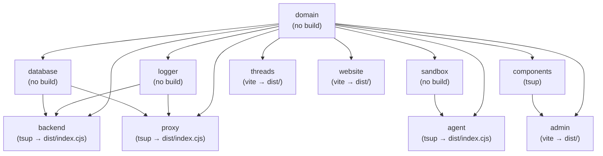
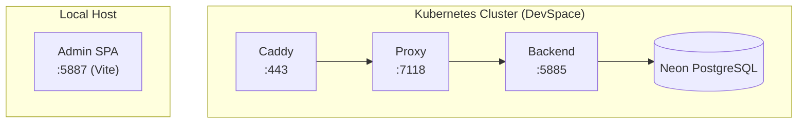

# Platform Overview -- Developer Internals

This document contains internal implementation details extracted from the platform overview. It is intended for developers working on the Threaded Stack codebase, not for end users.

---

## Workspace Structure

The monorepo contains 14 sub-repositories under `repos/`, managed with PNPM workspaces.

| Directory | Package | Role | Key Technologies |
|-----------|---------|------|-----------------|
| `admin/` | `@tdsk/admin` | SPA dashboard -- org/project/agent management, billing, quota tracking, AI chat | Vite, React, MUI, Jotai, TanStack React Query, Emotion, Neon Auth |
| `agent/` | `@tdsk/agent` | Headless AI agent orchestration library -- ReAct loop, streaming, tool execution | TypeScript, pi-mono (`@mariozechner/pi-agent-core`, `@mariozechner/pi-ai`), SSE, WebSocket |
| `backend/` | `@tdsk/backend` | Core API server -- admin CRUD, proxy engine, FaaS, AI orchestration, payments, email | Express 5, tsup, Stripe, Resend/Mailgun |
| `cli/` | `@tdsk/cli` | Developer CLI -- DevOps orchestration, Docker/K8s management, service lifecycle | Node.js, `@keg-hub/args-parse` |
| `components/` | `@tdsk/components` | Shared React component library -- 30+ components, 8 hook categories, Monaco editor | React, MUI, tsup |
| `database/` | `@tdsk/database` | ORM layer and migration system -- 23 schemas, 17 services, connection pooling | Drizzle ORM, PostgreSQL (Neon), `pg` |
| `domain/` | `@tdsk/domain` | Shared foundation -- 19 model classes, types, crypto, permissions, constants | TypeScript (consumed as source, no build step) |
| `integration/` | `@tdsk/integration` | API and E2E integration tests -- three-tier strategy | Vitest, Playwright |
| `logger/` | `@tdsk/logger` | Winston-based logging service -- `buildApiLogger` factory, secret redaction | Winston |
| `proxy/` | `@tdsk/proxy` | Auth gateway -- JWT/JWKS validation, API key auth, session auth, request forwarding | Express 5, jose, http-proxy-middleware |
| `tsa/` | `@tdsk/tsa` | Terminal TUI for AI agent interaction -- `tsa` binary | Bun, pi-mono, `@keg-hub/args-parse` |
| `sandbox/` | `@tdsk/sandbox` | Pluggable sandbox execution layer -- isolated environments for agent code | isolated-vm, E2B SDK, just-bash (consumed as source, no build step) |
| `threads/` | `@tdsk/threads` | Threads web app -- browser-based AI chat for non-developers | Vite, React |
| `website/` | `@tdsk/website` | Marketing website and pricing page | Vite, React |

---

## Dependency Graph (Build Order)



Domain, database, logger, and sandbox have no build step -- their TypeScript source is consumed directly via path aliases.

---

## Development Environment

Development uses **Kubernetes via DevSpace** for the backend services (Caddy, Proxy, Backend), while the admin SPA runs locally via Vite dev server.



K8s auto-syncs local files and auto-restarts services -- code on disk is always the running code. The `tdsk` CLI (`repos/cli/`) manages all service lifecycle operations (start, stop, logs, enter pods, render Helm templates).

---

## Configuration Loading Order

Configuration is loaded by `@keg-hub/parse-config` with later sources overriding earlier ones:

| Priority | Source | Purpose |
|----------|--------|---------|
| 1 (lowest) | `deploy/values.yaml` | Base config: ports, hosts, public settings |
| 2 | `deploy/values.local.yaml` | Local overrides for `NODE_ENV=local` |
| 3 (highest) | `~/.config/tdsk/values.yaml` | Secrets: DB credentials, API keys, master key, payment keys |

Each repo has a config loader in `configs/` that reads from environment variables populated by this merge chain. For example, `repos/backend/configs/backend.config.ts` builds sections for `server`, `proxy`, `database`, `logger`, `email`, and `payments`.

---

## Kubernetes Secrets

Sensitive values are injected into K8s pods via secrets managed by the `tdsk` CLI:

```bash
tdsk kube secret database    # DB connection string
tdsk kube secret payments    # Stripe keys
tdsk kube secret email       # Email provider keys
tdsk kube secret docker      # Docker registry auth
tdsk kube secret tdsk        # Master encryption key
```

---

## Tech Stack Summary

| Layer | Technology | Purpose |
|-------|-----------|---------|
| **API Framework** | Express 5 | Backend and proxy HTTP servers |
| **ORM** | Drizzle ORM | Type-safe PostgreSQL queries, migrations, schema management |
| **Database** | PostgreSQL (Neon) | Primary data store + user authentication (Neon Auth) |
| **Frontend** | React, Vite, MUI (Material UI) | Admin dashboard, threads app, website |
| **State Management** | Jotai | Lightweight atomic state for admin SPA |
| **API Caching** | TanStack React Query | Client-side request caching with stale-while-revalidate |
| **Authentication** | Neon Auth (JWKS/JWT), API keys (`tdsk_*`) | Social OAuth, programmatic access |
| **AI Agent Runtime** | pi-mono (`@mariozechner/pi-agent-core`, `@mariozechner/pi-ai`) | Multi-provider LLM streaming (Anthropic, OpenAI, Google), ReAct agent loop |
| **Sandbox Isolation** | isolated-vm (V8), E2B (Firecracker microVMs), just-bash | Code execution isolation with graceful degradation |
| **Payments** | Stripe | Subscription billing, checkout sessions, customer portal, webhooks |
| **Email** | Resend, Mailgun (strategy pattern) | Invitation and notification emails |
| **Logging** | Winston | Structured logging with secret redaction |
| **CLI Runtime** | Bun | TSA binary compilation and execution |
| **Terminal UI** | Ink (React for CLIs) | TSA interactive chat interface |
| **Build Tools** | tsup, Vite, Bun | Backend/library bundling, frontend dev/build, binary compilation |
| **Infrastructure** | Kubernetes, DevSpace, Caddy, Helm | Container orchestration, dev environment, TLS/load balancing |
| **Monorepo** | PNPM workspaces | Package management, workspace linking |
| **Testing** | Vitest, Playwright | Unit tests, API integration tests, E2E browser tests |

---

## Source File References

These references were collected from the user-facing platform overview to consolidate internal file paths in one place.

| Topic | Source Files |
|-------|-------------|
| Secret encryption | `repos/domain/src/crypto/crypto.ts` |
| Permission matrix | `repos/domain/src/constants/values.ts` |
| Auth middleware | `repos/proxy/src/middleware/setupAuth.ts`, `repos/proxy/src/middleware/setupApiKeyAuth.ts`, `repos/proxy/src/middleware/setupSessionAuth.ts` |
| Sandbox connect | `repos/tsa/src/tasks/run.ts`, `repos/sandbox/`, `repos/backend/src/services/sandboxes/` |
| TSA CLI | `repos/tsa/` |
| Threads app | `repos/threads/` |
| Agent execution (SSE/WS) | `repos/backend/src/endpoints/agents/runAgent.ts`, `repos/backend/src/endpoints/ai/` |
| Entity model schemas | `repos/database/src/schemas/` (23 table definitions), `repos/domain/src/models/` (19 model classes) |
| Subscription plans | `repos/domain/src/constants/plans.ts` |
| Quota tracking | `repos/database/src/services/quota.ts` |
