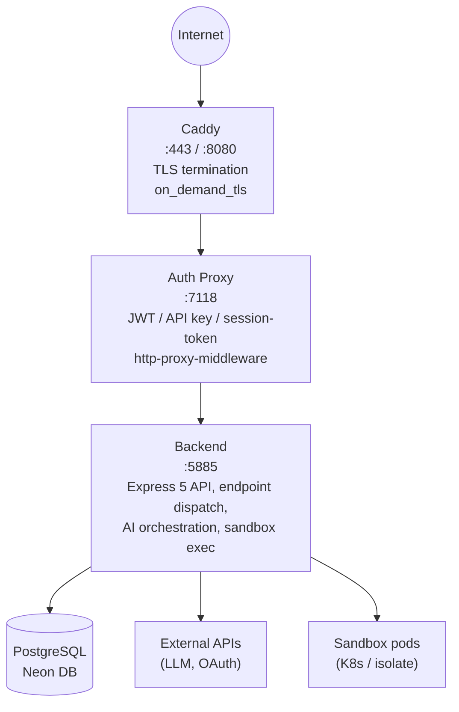
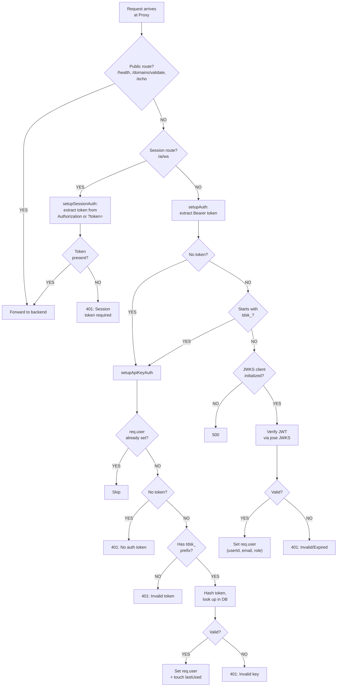
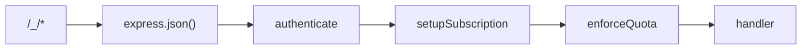
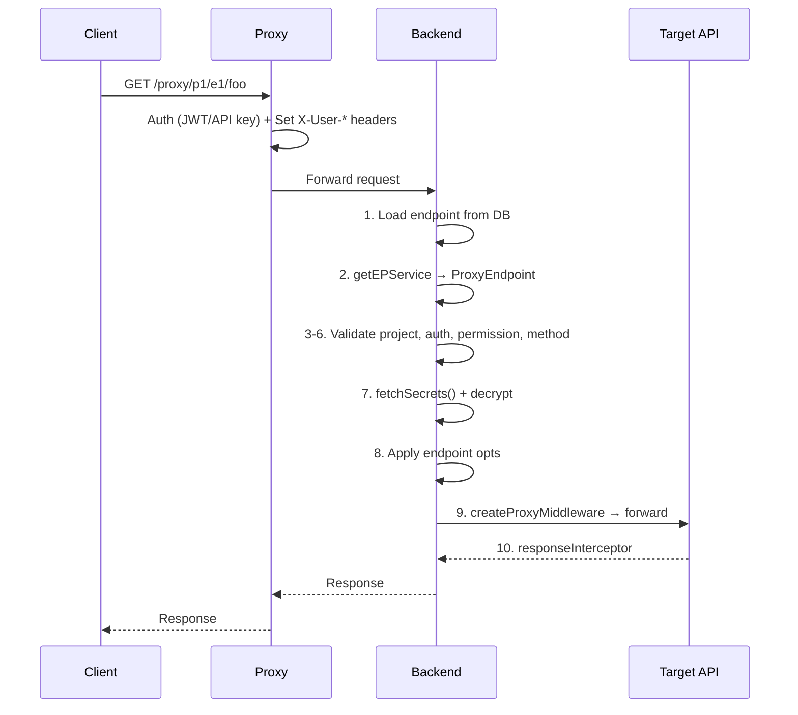
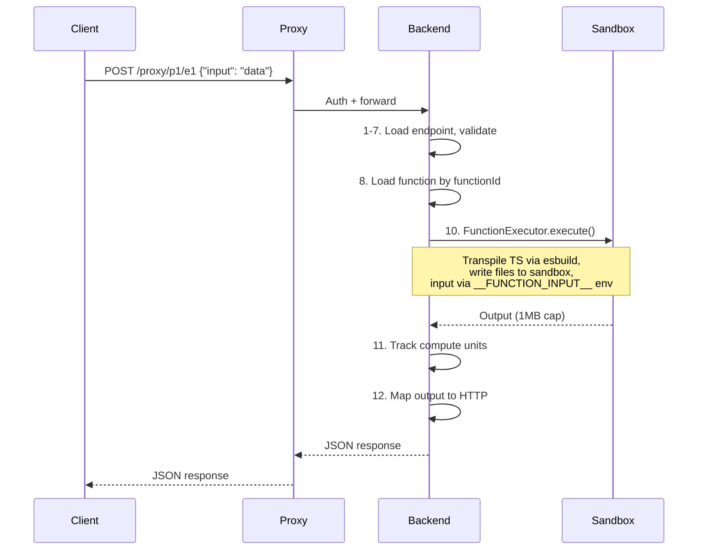
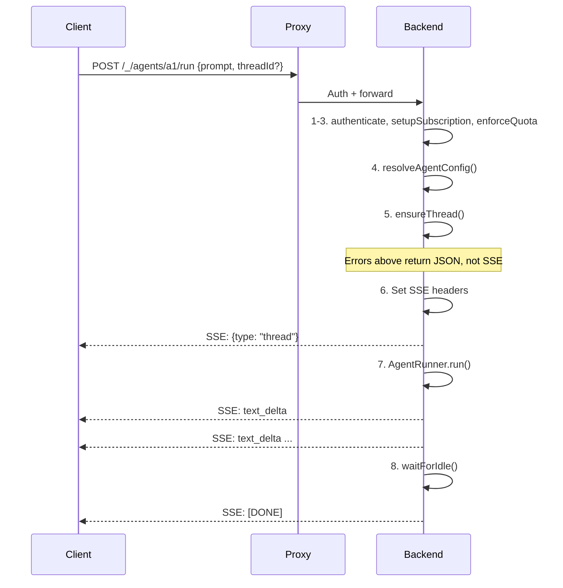
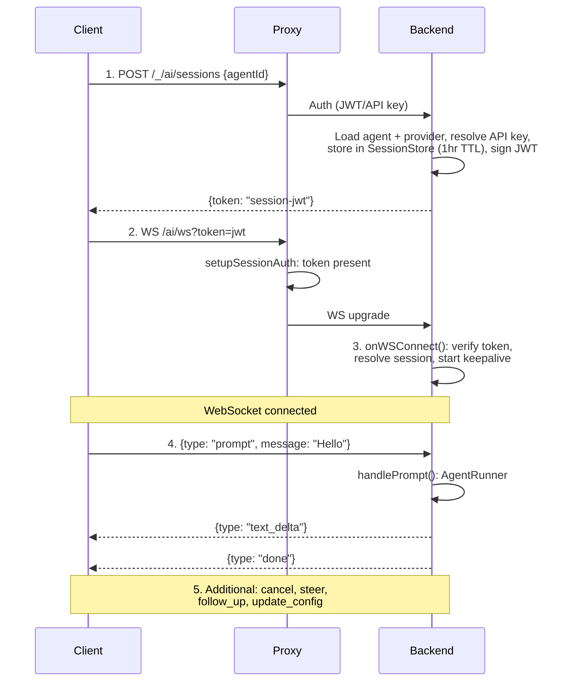
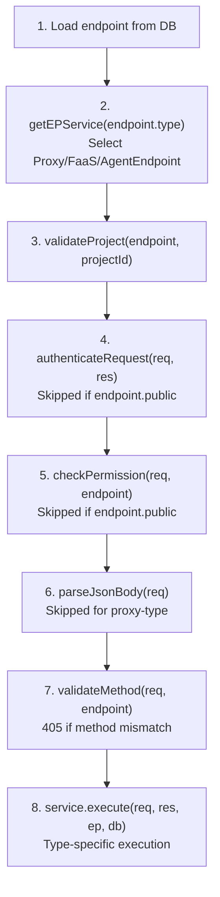

# Request Flow Architecture

This document describes how HTTP and WebSocket requests travel through the
Threaded Stack infrastructure, which authentication mechanism applies at each
stage, and how the three endpoint types (Proxy, FaaS, Agent) execute once a
request reaches the backend.

---

## 1. Overview

Every external request enters through the same three-tier pipeline:



**Caddy** handles TLS termination, issues internal certificates, and forwards
traffic to the Proxy.  It also provides the `on_demand_tls` endpoint for
custom domain certificate validation.

**Auth Proxy** (`repos/proxy/`) is the single security boundary. It validates
credentials, attaches identity headers (`X-User-Id`, `X-User-Role`,
`X-User-Email`), and forwards requests to the Backend via
`http-proxy-middleware`.

**Backend** (`repos/backend/`) receives pre-authenticated requests, applies
business logic middleware (subscription provisioning, quota enforcement), and
dispatches to the appropriate handler or endpoint type service.

---

## 2. Authentication Flow

Three mutually exclusive authentication mechanisms exist. Each request uses
exactly one, determined by route classification and token format.



### 2.1 JWT Authentication (Neon Auth)

Users authenticate client-side with Neon Auth social login (GitHub, GitLab,
Google, Vercel). The Admin SPA receives a JWT and sends it in the
`Authorization: Bearer <jwt>` header. The Proxy validates it using a JWKS
endpoint provided by Neon.

- **Source**: `repos/proxy/src/middleware/setupAuth.ts` -- `validateAuth()`
- **JWKS client**: `repos/proxy/src/services/auth.ts` -- `Auth` class
  uses `jose.createRemoteJWKSet()`
- **Identity extraction**: `sub` or `userId` claim for user ID, `email`
  claim, `role` claim (defaults to `user`)

### 2.2 API Key Authentication

Programmatic access uses API keys with a `tdsk_` prefix. The Proxy hashes the
key with `hashKey()` from `@tdsk/domain` and looks it up in the database.

- **Source**: `repos/proxy/src/middleware/setupApiKeyAuth.ts` --
  `validateApiKeyAuth()`
- **Scope-to-role mapping**:
  - `admin` scope --> `admin` role
  - `write` scope --> `member` role
  - All others --> `viewer` role
- **Scoped keys**: API keys may be scoped to a specific `orgId` or
  `projectId`, which is carried through to the backend on `req.user`

### 2.3 Session Token Authentication (WebSocket)

The `/ai/ws` WebSocket endpoint uses ephemeral session tokens:

1. Client calls `POST /_/ai/sessions` with JWT or API key auth
2. Backend resolves agent config + API key server-side, stores in
   `SessionStore` (in-memory, 1-hour TTL)
3. Backend returns a signed session token (JWT) -- the LLM API key never
   leaves the server
4. Client connects to `/ai/ws?token=<session-jwt>`
5. Proxy checks that a token is present (does not validate it)
6. Backend verifies the session JWT and loads the cached session config

- **Proxy source**: `repos/proxy/src/middleware/setupSessionAuth.ts`
- **Backend session creation**: `repos/backend/src/endpoints/ai/createSession.ts`
- **Backend WS handler**: `repos/backend/src/endpoints/ai/onWSConnect.ts`

---

## 3. Route Categories

All routes are registered in the Proxy and forwarded to the Backend via
`http-proxy-middleware`. The Proxy handles four groups of routes:

| Route Pattern | Auth Mechanism | Proxy Target | Backend Handler |
|---|---|---|---|
| `/health` | Public (no auth) | Proxy responds directly | -- |
| `/domains/validate` | Public (no auth) | Proxy responds directly | -- |
| `/echo` | Public (no auth) | Proxy responds directly | -- |
| `/auth/me` | JWT or API key | Proxy responds directly | -- |
| `/auth/logout` | JWT or API key | Proxy responds directly | -- |
| `/_/*` | JWT or API key | Backend `/_/*` | `accounts` endpoint tree |
| `/proxy/*` | JWT or API key | Backend `/proxy/*` | `proxy` endpoint dispatcher |
| `/ai/ws` | Session token | Backend `/ai/ws` | WebSocket `onWSConnect` |
| Sandbox subdomains | JWT or API key | Backend (Host preserved) | `sandboxProxy` middleware |

### 3.1 Backend Account Routes (`/_/*`)

The `accounts` endpoint builder (`repos/backend/src/endpoints/accounts.ts`)
mounts all admin API routes under the `/_` prefix with a shared middleware
chain:



Nested endpoint groups:

- `/_/ai/*` -- AI session management
- `/_/auth/*` -- Backend auth endpoints
- `/_/orgs/*` -- Organizations CRUD + members + roles + quickstart
- `/_/users/*` -- Users CRUD
- `/_/agents/*` -- Agents CRUD + POST /:id/run (SSE)
- `/_/assets/*` -- Asset management
- `/_/payments/*` -- Payment webhooks
- `/_/invitations/*` -- Invitation management
- `/_/subscriptions/*` -- Subscription management
- `/_/providers/*` -- Provider model listing
- `/_` and `/_/health` -- Base and health endpoints

### 3.2 Backend Proxy Routes (`/proxy/*`)

The proxy endpoint dispatcher (`repos/backend/src/endpoints/proxy/endpoint.ts`)
handles all three endpoint types through a single route:

```text
ALL /proxy/:projectId/:endpointId/*  -->  endpoint dispatcher
```

Auth is deferred until after the endpoint record is loaded from the database:
public endpoints skip authentication entirely.

### 3.3 Proxy Forwarding Configuration

The Proxy uses `http-proxy-middleware` with the following settings
(`repos/proxy/src/middleware/setupProxy.ts`):

- **Path filter**: `/_`, `/ai`, `/proxy`
- **Path rewrite**: preserves `req.originalUrl`
- **Custom headers**: shared secret via `headerKey`/`headerValue` config
- **Auth headers**: `X-User-Id`, `X-User-Role`, `X-User-Email` via
  `setAuthHeaders()` from `@tdsk/domain`
- **WebSocket**: manual upgrade handler dispatches to backend or sandbox
  proxy based on hostname
- **Sandbox subdomains**: requests matching `^\d+--sb-` hostname pattern are
  forwarded with `changeOrigin: false` to preserve the original Host header

---

## 4. Proxy Endpoint Request Lifecycle

When a request hits `/proxy/:projectId/:endpointId/*`, the backend's proxy
endpoint dispatcher executes the following sequence:



### Key details

- **Secret injection**: The `ProxyService` resolves `{{SECRET_NAME}}` template
  references in headers, auth config, OAuth credentials, and response bodies
  using decrypted project-scoped secrets.
  Source: `repos/backend/src/services/proxy/proxy.ts`

- **OAuth token caching**: OAuth access tokens are cached with a 5-minute
  buffer before expiration. The cache key is `${tokenUrl}:${clientId}`.
  Source: `repos/backend/src/services/proxy/proxy.ts` -- `getOAuthToken()`

- **Retry logic**: Failed requests are retried with exponential backoff
  (default 3 retries, 2x multiplier, max 30s delay). Retryable status codes:
  `408, 429, 500, 502, 503, 504`.
  Source: `repos/backend/src/services/proxy/retryService.ts`

- **Body passthrough**: Proxy-type endpoints skip `parseJsonBody()` -- the raw
  request body is forwarded to the target API unchanged.
  Source: `repos/backend/src/endpoints/proxy/endpoint.ts` line 67

---

## 5. FaaS Endpoint Request Lifecycle

When a request hits `/proxy/:projectId/:endpointId/*` and the endpoint type
is `faas`, the `FaaSEndpoint` service executes:



### Key details

- **TypeScript transpilation**: Functions written in TypeScript are transpiled
  to ESM via esbuild before sandbox execution.
  Source: `repos/backend/src/services/functions/functionExecutor.ts`

- **Sandbox providers**: Execution uses `@tdsk/sandbox` with pluggable
  providers (E2b Firecracker microVMs or local V8 isolate via `just-bash`).

- **Output constraints**: Maximum 1 MB output, configurable timeout (default
  30 seconds).

- **Compute tracking**: After execution, compute units are calculated from
  invocation count and runtime duration, then incremented on the org's quota
  record (fire-and-forget).
  Source: `repos/backend/src/services/endpoints/faasEndpoint.ts` lines 78-93

- **JSON body parsing**: Unlike proxy endpoints, FaaS endpoints parse the
  request body via `parseJsonBody()` before execution.
  Source: `repos/backend/src/endpoints/proxy/endpoint.ts` line 67

---

## 6. Agent Endpoint Request Lifecycle

Agent execution has two transport paths: SSE (one-shot) and WebSocket
(persistent connection). Both share the same `AgentEndpoint` class for core
execution logic.

### 6.1 SSE Path: `POST /_/agents/:id/run`



**Key details**:

- **Pre-SSE error handling**: Config resolution and thread creation happen
  before SSE headers are sent. If either fails, the client receives a standard
  JSON error response (not a broken SSE stream).
  Source: `repos/backend/src/services/endpoints/agentEndpoint.ts` lines 129-145

- **Abort handling**: If the client disconnects (`req.on('close')`), the
  `aborted` flag prevents further writes and the stream ends cleanly.
  Source: `repos/backend/src/services/endpoints/agentEndpoint.ts` lines 158-160

- **SSE sentinel**: The stream terminates with `data: [DONE]\n\n`, following
  the same convention as the OpenAI streaming API.

- **Event types**: `thread`, `text_start`, `text_delta`, `text_end`,
  `thinking_start`, `thinking_delta`, `thinking_end`, `toolcall_start`,
  `toolcall_delta`, `toolcall_end`, `error`

### 6.2 WebSocket Path: `/ai/ws?token=<session-jwt>`



**Key details**:

- **Two-phase auth**: Session creation uses standard JWT/API key auth. The
  WebSocket connection uses the resulting session token. The LLM API key
  never reaches the client.
  Source: `repos/backend/src/endpoints/ai/createSession.ts`

- **Session verification**: The backend verifies the session JWT signature
  and loads agent configuration fresh from the database on each connection.
  Source: `repos/backend/src/endpoints/ai/onWSConnect.ts`

- **Message types supported**: `prompt`, `cancel`, `steer`, `follow_up`,
  `update_config`, `file_upload` (not yet implemented), `workspace_manifest`
  (not yet implemented)
  Source: `repos/backend/src/endpoints/ai/onWSConnect.ts` lines 80-138

- **Keepalive**: Periodic heartbeat messages prevent proxy/load-balancer
  layers from killing idle connections.

- **Close codes**: `4001` for auth failures (missing/invalid session token)

---

## 7. Middleware Chain

### 7.1 Proxy Middleware Order

Defined in `repos/proxy/src/proxy.ts`:

| # | Middleware | Source File | Purpose |
|---|-----------|-------------|---------|
| 1 | setupLogger | `middleware/setupLogger.ts` | Request/response timing, UUID |
| 2 | setupServer | `middleware/setupServer.ts` | CORS, x-powered-by, urlencoded |
| 3 | setupDatabase | `middleware/setupDatabase.ts` | DB singleton on app.locals.db |
| 4 | setupAuth | `middleware/setupAuth.ts` | JWT via JWKS (skip public + session) |
| 5 | setupApiKeyAuth | `middleware/setupApiKeyAuth.ts` | tdsk\_\* key hash lookup (fallback) |
| 6 | setupSessionAuth | `middleware/setupSessionAuth.ts` | Session token presence (/ai/ws only) |
| 7 | setupPrewarm | `middleware/setupPrewarm.ts` | Caddy cert pre-warming interceptor |
| 8 | setupEndpoints | `middleware/setupEndpoints.ts` | /health, /auth/me, /auth/logout, /domains/validate |
| 9 | setupProxy | `middleware/setupProxy.ts` | http-proxy-middleware -> backend |
| 10 | setupErrorHandler | `middleware/setupErrorHandler.ts` | Global error handler |

### 7.2 Backend Middleware Order

Defined in `repos/backend/src/main.ts`:

| # | Middleware | Source File | Purpose |
|---|-----------|-------------|---------|
| 1 | setupLogger | `middleware/setupLogger.ts` | Winston request/error logging |
| 2 | setupServer | `middleware/setupServer.ts` | CORS, x-powered-by, router mount |
| 3 | setupDatabase | `middleware/setupDatabase.ts` | DB connection with validation |
| 4 | setupSandbox | `middleware/setupSandbox.ts` | Sandbox provider initialization |
| 5 | setupSandboxProxy | `middleware/sandboxProxy.ts` | Subdomain-based sandbox routing |
| 6 | setupEndpoints | `middleware/setupEndpoints.ts` | Dynamic route registration |
| 7 | setupErrorHandler | `middleware/setupErrorHandler.ts` | Error response formatting |

### 7.3 Backend Account Route Middleware

Applied per-request on all `/_/*` routes via the `accounts` endpoint builder
(`repos/backend/src/endpoints/accounts.ts`):

| # | Middleware | Source File | Purpose |
|---|-----------|-------------|---------|
| 1 | express.json() | express built-in | Parse JSON request body |
| 2 | authenticate | `middleware/setupAuth.ts` | Validate proxy-forwarded auth headers |
| 3 | setupSubscription | `middleware/setupSubscription.ts` | Auto-create free tier for new users |
| 4 | enforceQuota | `middleware/enforceQuota.ts` | Block POST if quota exceeded |

**authenticate** (`repos/backend/src/middleware/setupAuth.ts`):
Calls `authenticateRequest()` which reads `X-User-Id`, `X-User-Role`,
`X-User-Email` headers set by the Proxy, loads the user from the database,
and sets `req.user`. Skips routes in `AuthIgnore` (`/`, `/health`).
Source: `repos/backend/src/utils/auth/authenticateRequest.ts`

**setupSubscription** (`repos/backend/src/middleware/setupSubscription.ts`):
Checks if the authenticated user has a subscription record. If not, creates
a free-tier subscription (`tier: 'free'`, `seats: 1`, `status: 'active'`).
Non-blocking -- errors are logged but do not fail the request.

**enforceQuota** (`repos/backend/src/middleware/enforceQuota.ts`):
Intercepts `POST` requests to resource-creation routes and checks the org
owner's tier-based quota limits before allowing the request through. Returns
`403 quota_exceeded` if the limit is reached. Tracked resources:

| POST Route Pattern | Quota Resource |
|---|---|
| `*/projects` | `projects` |
| `*/endpoints` | `endpoints` |
| `*/secrets` | `secrets` |
| `*/threads` | `threads` |
| `*/threads/:id/messages` | `messages` |
| `*/orgs` | `organizations` |

Unlimited resources (limit = -1) always pass. Quota enforcement is non-blocking
on errors -- if the check fails, the request proceeds.

### 7.4 Backend Proxy Route Middleware

The `/proxy/:projectId/:endpointId` dispatcher
(`repos/backend/src/endpoints/proxy/endpoint.ts`) applies its own inline
middleware sequence because auth is deferred until after the endpoint is
loaded from the database:



Source: `repos/backend/src/endpoints/proxy/endpoint.ts`
Base class: `repos/backend/src/services/endpoints/base.ts`

---

## 8. Cross-Service Communication

### 8.1 Proxy-to-Backend Headers

The Proxy injects two categories of headers on every forwarded request:

**Identity headers** (set by `setAuthHeaders()` from `@tdsk/domain`):
- `X-User-Id` -- authenticated user's ID
- `X-User-Role` -- user's role (admin, member, viewer)
- `X-User-Email` -- user's email address

**Proxy identity header** (shared secret):
- Configured via `TDSK_BE_HEADER_KEY` / `TDSK_BE_HEADER_VALUE`
- Proves the request came from the trusted Proxy, not a direct connection

### 8.2 Backend Authentication of Forwarded Requests

The backend's `authenticateRequest()` function
(`repos/backend/src/utils/auth/authenticateRequest.ts`):

1. Calls `pxToBeHeader(req)` to normalize proxy-forwarded headers
2. Calls `fromAuthHeaders(req)` to extract `userId` from `X-User-Id`
3. Loads the full user record from the database
4. Sets `req.user` to the database user model and `res.locals.auth` to the
   raw header values

This two-step auth model (Proxy validates credentials, Backend loads user
record) ensures the Backend never handles raw secrets (JWTs, API keys) and
always works with verified database-backed user objects.
