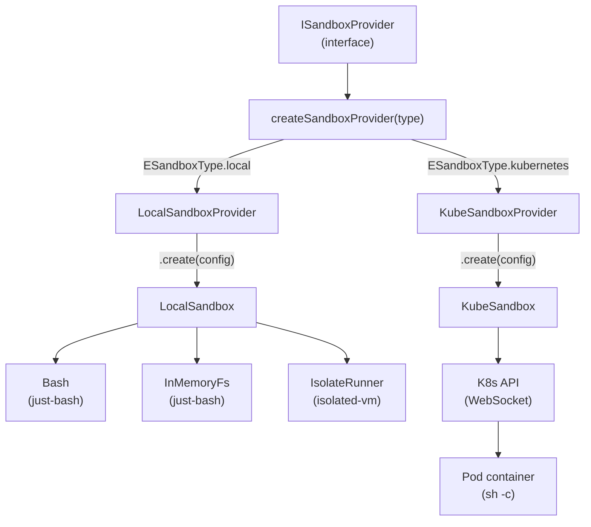
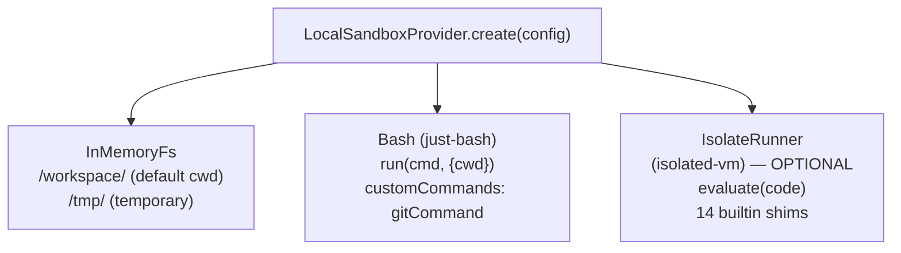
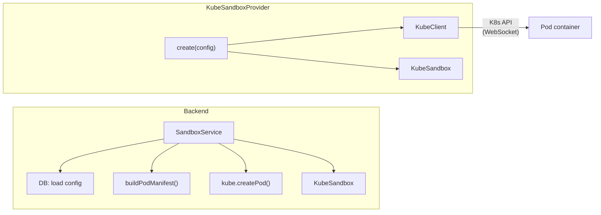
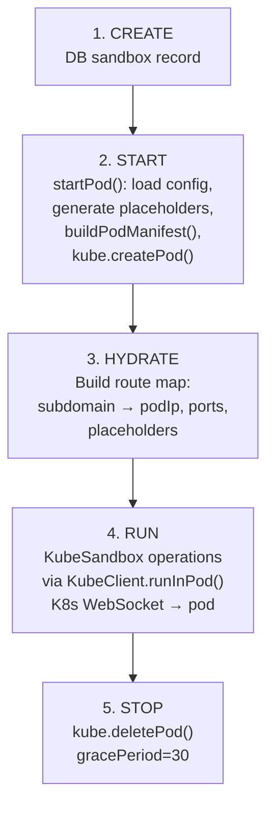
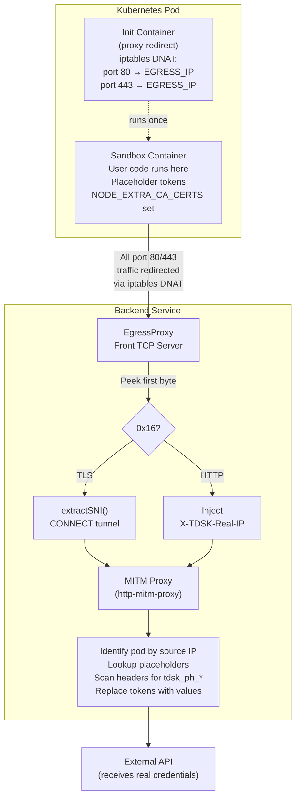

# Sandbox Architecture

## Overview

The sandbox layer (`repos/sandbox`, `@tdsk/sandbox`) provides pluggable, isolated execution environments for running agent code and user workloads. It abstracts multiple execution backends behind a unified `ISandbox` interface using a factory + strategy pattern.

Two providers are currently implemented:

- **Local Provider** -- In-memory virtual shell (`just-bash`) with optional V8 isolate (`isolated-vm`) for JavaScript code execution. Used in development and for lightweight function execution.
- **Kubernetes Provider** -- Persistent pods managed via the K8s API, with MITM egress proxy sidecar for secret injection. Used in production for agent hosting and sandbox workspaces.

The system is extensible: new providers are added by implementing `ISandboxProvider`, registering in the factory map, and adding the type to the `TSandboxType` union in `@tdsk/domain`.

**Key source files:**

| File | Purpose |
|------|---------|
| `repos/sandbox/src/sandbox.ts` | Factory function (`createSandboxProvider`) |
| `repos/sandbox/src/local/local.ts` | Local provider + sandbox |
| `repos/sandbox/src/local/isolate.ts` | V8 IsolateRunner |
| `repos/sandbox/src/local/shims/` | 14 Node.js builtin shim modules |
| `repos/sandbox/src/kube/kubeSandboxProvider.ts` | Kubernetes provider |
| `repos/sandbox/src/kube/kubeSandbox.ts` | Kubernetes sandbox (ISandbox over K8s API) |
| `repos/sandbox/src/kube/kubeClient.ts` | K8s API client (pod CRUD, watch) |
| `repos/sandbox/src/kube/podManifest.ts` | Pod manifest builder (naming, labels, init container) |
| `repos/backend/src/services/sandboxes/sandbox.ts` | SandboxService (orchestrates DB + K8s pods) |
| `repos/backend/src/services/proxy/egress.ts` | MITM egress proxy for secret injection |
| `repos/database/src/schemas/sandboxes.ts` | Database schema for sandbox config records |
| `repos/domain/src/types/sandbox.types.ts` | All sandbox type definitions |

---

## Provider Architecture



### ISandbox Contract

Defined in `repos/domain/src/types/sandbox.types.ts`:

```text
ISandbox
  run(command, args?)        Run a shell command
  readFile(path)             Read file contents
  writeFile(path, content)   Write file contents
  listDir(path)              List directory entries ([DIR] prefix for directories)
  deleteFile(path)           Delete a file or directory
  mkdir(path)                Create directory (recursive)
  fileExists(path)           Check file existence
  evaluate(code, opts?)      Run code with configured runtime
  reset()                    Clear sandbox state for reuse
  close()                    Tear down sandbox resources
```

### ISandboxProvider Contract

```text
ISandboxProvider
  readonly type: TSandboxType     Provider identifier ('local' | 'kubernetes')
  create(config): ISandbox        Create a new sandbox instance from config
```

### Factory (`repos/sandbox/src/sandbox.ts`)

The factory uses a `Map<TSandboxType, () => ISandboxProvider>` with two entries:

- `ESandboxType.local` --> `LocalSandboxProvider`
- `ESandboxType.kubernetes` --> `KubeSandboxProvider`

Each call returns a fresh instance (not singleton). Throws for unknown types.

---

## Local Provider (V8 Isolate)

**Source:** `repos/sandbox/src/local/local.ts`, `repos/sandbox/src/local/isolate.ts`

The Local provider runs entirely in-process with no external dependencies. It combines three subsystems:



### IsolateRunner Lifecycle

1. **Construction** -- Receives `Bash`, `IFileSystem`, memory limit (default 128 MB), max timer duration (default 30s), and optional env vars.
2. **Initialization** (`init()`) -- Lazy-loads `isolated-vm` via dynamic `import()`. Creates a V8 isolate with configured memory, creates a context, sets up host callbacks for each shim via the shim registry, compiles all shim modules in dependency order, and installs timer globals (`setTimeout`, `setInterval`, `setImmediate`, `clearTimeout`, `clearInterval`, `queueMicrotask`).
3. **Code Evaluation** -- Compiles user code as an ES module (`user-code.js`). Import specifiers are resolved against the shim map. Runs with configurable timeout (default 5000ms). Returns captured console output and the default export (via structured clone, with JSON fallback).
4. **Module Registration** (`registerModule(name, code)`) -- Registers named ES modules that user code can import. Releases existing modules with the same name to prevent V8 heap leaks.
5. **Disposal** (`dispose()`) -- Releases all shim modules, context, and isolate. Clears pending timers. Resets initialized flag. Each release is wrapped in `safeRelease()` to swallow "already released/disposed" errors.

### Graceful Degradation

If `isolated-vm` is unavailable (not compiled, wrong platform), the Local provider logs a warning and continues without JS code isolation. Shell and filesystem operations still work; only `evaluate()` throws.

### Node.js Builtin Shims

The shim registry (`repos/sandbox/src/local/shims/registry.ts`) defines 14 shim modules compiled in a specific dependency order. Order is significant because some shims depend on globals set by earlier shims (e.g., `crypto` uses `Buffer` set by `buffer`).

**Compilation order:**

| # | Shim | Module Names | Implementation |
|---|------|-------------|----------------|
| 1 | console | _(globals only)_ | `_log` callback captures `console.log/error/warn/info` output |
| 2 | fetch | _(globals only)_ | `_fetch` callback bridges to host `fetch()` for HTTP requests |
| 3 | buffer | `buffer`, `node:buffer` | Pure JS `Buffer` class (from/alloc/concat/toString/base64/hex) |
| 4 | path | `path`, `node:path` | Pure JS path ops (join, resolve, dirname, basename, extname, normalize, sep) |
| 5 | fs | `fs`, `node:fs` | Bridged to `IFileSystem` via `_fs*` callbacks (readFile, writeFile, exists, mkdir, readdir, unlink, stat + sync variants) |
| 6 | child_process | `child_process`, `node:child_process` | `_shellRun` callback routes to `Bash` shell |
| 7 | url | `url`, `node:url` | Uses global `URL`/`URLSearchParams` + legacy `parse`/`format` |
| 8 | querystring | `querystring`, `node:querystring` | `escape`, `unescape`, `stringify`, `parse` |
| 9 | events | `events`, `node:events` | `EventEmitter` class (on, emit, off, once, removeAllListeners) |
| 10 | os | `os`, `node:os` | Static values (platform: linux, arch: x64, tmpdir: /tmp) |
| 11 | assert | `assert`, `node:assert` | `AssertionError`, `ok`, `strictEqual`, `deepStrictEqual`, `throws` |
| 12 | util | `util`, `node:util` | `format`, `inspect`, `inherits`, `promisify`, `types` |
| 13 | crypto | `crypto`, `node:crypto` | `randomUUID`, `randomBytes`, `createHash` via host callbacks (depends on `Buffer`) |
| 14 | process | _(globals only)_ | Sets `globalThis.process` with platform, env, cwd, exit, nextTick |

**Shim source files:** `repos/sandbox/src/local/shims/*.ts` (one file per shim, plus `registry.ts` and `index.ts`)

Each shim is a `TShimDefinition` object with:
- `names` -- Array of import specifiers (both bare and `node:` prefixed, or empty for globals-only shims)
- `source` -- Optional ES module source code string (compiled into the V8 isolate)
- `setupCallbacks` -- Optional function to install host-bridged callbacks on the context jail
- `setupGlobals` -- Optional function to run after all modules are compiled (e.g., set `globalThis.process`)

---

## Kubernetes Provider

**Source:** `repos/sandbox/src/kube/kubeSandboxProvider.ts`, `repos/sandbox/src/kube/kubeSandbox.ts`, `repos/sandbox/src/kube/kubeClient.ts`, `repos/sandbox/src/kube/podManifest.ts`

The Kubernetes provider runs user code in isolated K8s pods. Pods are persistent workspaces whose lifecycle is managed separately from the `ISandbox` interface -- the provider connects to an already-running pod rather than creating one.

### Architecture



### Pod Naming and Labels

**Pod naming** (`buildPodName()` in `repos/sandbox/src/kube/podManifest.ts`):
- Format: `tdsk-sb-<slug>-<suffix>` where slug is the first 8 alphanumeric chars of the sandbox ID (lowercased) and suffix is a random 4-character alphanumeric string via `nanoid`.
- RFC 1123 compliant (lowercase alphanumeric and hyphens only).

**Label sanitization** (`sanitizeLabel()`):
- Strips non-alphanumeric characters (except `.`, `_`, `-`)
- Ensures start/end with alphanumeric
- Truncates to 63 characters (K8s label value limit)

**Labels applied to each pod** (`PodLabelKeys` in `repos/sandbox/src/constants/kube.ts`):

| Label | Value |
|-------|-------|
| `tdsk.app/managed` | `"true"` |
| `tdsk.app/org-id` | Organization ID |
| `tdsk.app/user-id` | User ID |
| `tdsk.app/sandbox-id` | Sandbox config ID |
| `tdsk.app/project-id` | Project ID |

**Annotations** (`PodAnnotationKeys`):

| Annotation | Value |
|-----------|-------|
| `tdsk.app/subdomain` | Pod subdomain for routing |
| `tdsk.app/ports` | JSON map of port configs |
| `tdsk.app/placeholders` | JSON map of placeholder token --> secret ID |

### Pod Manifest Structure

Built by `buildPodManifest()` in `repos/sandbox/src/kube/podManifest.ts`:

```yaml
V1Pod:
  apiVersion: v1
  kind: Pod
  metadata:
    name: tdsk-sb-<slug>-<suffix>
    labels: { managed, orgId, userId, sandboxId, projectId }
    annotations: { subdomain, ports, placeholders }
  spec:
    restartPolicy: Never
    automountServiceAccountToken: false
    volumes:
      - name: proxy-ca-cert              # CA cert for MITM proxy
        secret: { secretName: <certSecretName> }
    initContainers:
      - name: proxy-redirect             # iptables DNAT setup
        image: alpine
        securityContext: { capabilities: { add: [NET_ADMIN] } }
        command: [sh, -c, <iptables rules>]
    containers:
      - name: sandbox                    # User workload container
        image: <config.image>
        command: <config.command || resolved from SandboxRuntimeConfigs || [sleep, infinity]>
        workingDir: <config.workdir || /workspace>
        env:
          - NODE_EXTRA_CA_CERTS: /usr/local/share/ca-certificates/tdsk-proxy.crt
          - TDSK_RUNTIME: <config.runtime>
          - TDSK_RUNTIME_CMD: <resolved runtime command>
          - <config.envVars>
        ports: <config.ports>
        resources: <config.resources>
        securityContext:
          privileged: false
          allowPrivilegeEscalation: false
        volumeMounts:
          - name: proxy-ca-cert
            mountPath: /usr/local/share/ca-certificates/tdsk-proxy.crt
            subPath: tls.crt
```

### Container Lifecycle

Managed by `SandboxService` in `repos/backend/src/services/sandboxes/sandbox.ts`:



### KubeClient Watch System

The `KubeClient` watches pod lifecycle events via the K8s Watch API:

- **Pod watch path:** `/api/v1/namespaces/<ns>/pods` with label selector `tdsk.app/managed=true`
- **Cycle interval:** 10 minutes (`PodCycleInterval`) -- restarts the watch periodically as a workaround for K8s client bug #596
- **Event handlers:** `added`, `modified`, `deleted`, `error` callbacks
- **Route removal:** When a pod is removed from cache, all associated proxy entries are cleaned up via `onRemoveRoute` callback

### KubeSandbox Code Evaluation

Unlike the Local provider which uses V8 isolates, the Kubernetes sandbox evaluates code by writing it to a temp file in the pod and running it with a configured runtime:

1. Create temp dir `/tmp/tdsk-eval-<nanoid>/`
2. Write any provided modules as files with the runtime's extension
3. Write main code as `main.<ext>`
4. Run with runtime command (e.g., `node main.js`) with optional timeout
5. Clean up temp directory
6. Return stdout as output (no structured `result` -- callers must print JSON if structured data is needed)

**Default runtime:** `{ name: 'node', command: 'node', extension: '.js' }` (`repos/sandbox/src/constants/values.ts`)

---

## MITM Proxy Integration

**Source:** `repos/backend/src/services/proxy/egress.ts`

The MITM egress proxy intercepts all outbound HTTP/HTTPS traffic from sandbox pods and replaces placeholder tokens with real secret values. This ensures that secrets are never exposed to sandbox code -- the code only sees opaque placeholder tokens.

### Pod Internal Architecture



### Protocol Handling

The front TCP server uses protocol sniffing on the first byte of each connection:

- **TLS (first byte `0x16`):** Extracts SNI hostname from ClientHello, converts to HTTP CONNECT tunnel to the internal MITM proxy, then pipes the original TLS data through after the tunnel is established.
- **HTTP (any other first byte):** Injects an `X-TDSK-Real-IP` header after the HTTP request line and pipes directly to the MITM proxy.

### Secret Injection Flow

1. Init container sets up iptables DNAT rules redirecting ports 80 and 443 to the egress proxy service IP and port.
2. Sandbox container's `NODE_EXTRA_CA_CERTS` is set to the mounted CA certificate so TLS connections trust the MITM proxy's generated certificates.
3. When user code makes an HTTP/HTTPS request, traffic is transparently redirected to the egress proxy.
4. The egress proxy identifies which pod the request came from by matching the source IP against the route map.
5. It looks up the pod's placeholder map (token --> secret ID) from the route map annotations.
6. It scans all request headers for `tdsk_ph_*` tokens and replaces them with real secret values fetched from the database.
7. If a placeholder cannot be resolved, the proxy throws an error and returns a 502 -- it never forwards an unresolved placeholder to an external service.

For full cryptographic details on secret storage and decryption, see `docs/architecture/security-model.md`.

---

## Sandbox Runtime System

The runtime system determines which AI tool a sandbox launches. Each sandbox config has a `runtime` field (enum: `claude-code`, `codex`, `opencode`, `gemini-cli`, `custom`) that controls both the container start command and the runtime command executed by `tsa run`.

### Two-Command Model

Each sandbox uses two distinct commands:

1. **Container start command** -- The pod's `command`/`args` fields. Keeps the pod alive and starts the SSH server. For built-in runtimes, resolved from `SandboxRuntimeConfigs` in `@tdsk/domain`. Default for custom: `[sleep, infinity]`.
2. **Runtime command** -- The `runtimeCommand` field. Executed by `tsa run` after SSH connect to launch the AI tool. For built-in runtimes, resolved automatically (e.g., `claude` for the Claude Code runtime). For custom runtimes, user-specified.

An optional **init script** (`initScript`) runs between container start and the "ready" state. This is a shell script for setup tasks like installing dependencies, cloning repos, or configuring tools.

### Runtime Resolution in Pod Manifest

`buildPodManifest()` resolves runtime configuration:

1. Reads the `runtime` field from the sandbox config
2. For built-in runtimes, looks up `SandboxRuntimeConfigs[runtime]` to get the container command and runtime command (the image comes from the sandbox config, set at creation via `SandboxPresets`)
3. Validates the runtime value against the `ESandboxRuntime` enum (rejects invalid values)
4. Sets two environment variables on the pod:
   - `TDSK_RUNTIME` -- the runtime enum value (e.g., `claude-code`)
   - `TDSK_RUNTIME_CMD` -- the resolved runtime command (e.g., `claude`)

### Built-In Presets and Org Seeding

When an organization is created, four sandbox configs are automatically seeded: Claude Code, Codex, OpenCode, and Base. These have `builtIn: true` in the database. Users can start them immediately, edit their configuration, copy them to create customized variants, or delete them.

### Sandbox Copy

`POST /_/orgs/:orgId/sandboxes/:id/copy` deep-copies a sandbox config with a new ID. Copies always have `builtIn: false`. This lets users duplicate built-in presets and customize them without modifying the originals.

---

## Sandbox Direct Connect

Users and AI tools connect directly into running sandbox pods via SSH for interactive development.

### How It Works

- **Interactive access:** Users connect via `tsa ssh <sandbox-id>` or `tsa run <sandbox-id>` (which also launches the runtime). The SSH connection is tunneled through a WebSocket proxy chain (Caddy -> auth proxy -> backend -> pod port 2222).
- **Pre-configured environments:** The base sandbox image ships with Ubuntu 24.04, Node.js 22, OpenSSH server, and pre-installed AI tools (Claude Code, Codex, OpenCode).
- **Zero credential exposure:** The MITM egress proxy continues to operate transparently. AI tools making outbound API calls use placeholder tokens, and the egress proxy injects real secrets at the network layer.

### Security with Direct Access

The security model remains intact because:

1. **Network-layer interception:** The iptables DNAT rules are established by the init container before the sandbox container starts. All outbound traffic on ports 80/443 is redirected regardless of how the connection is initiated -- whether by automated agent code or an interactive SSH session.
2. **Placeholder-based credentials:** Secrets configured for the sandbox are mapped to opaque placeholder tokens at pod creation time. The sandbox environment receives only the tokens, never the real values.
3. **Pod-scoped isolation:** Each pod has its own placeholder map tied to its source IP. Even with multiple concurrent direct-connect sessions across different sandboxes, the egress proxy correctly resolves secrets per-pod.

---

## Database Schema

**Source:** `repos/database/src/schemas/sandboxes.ts`

The `sandboxes` table stores persistent sandbox configuration records. These records define what image, ports, runtimes, and secrets a sandbox pod uses. The actual pod lifecycle is ephemeral and managed by `SandboxService`.

### Table: `sandboxes`

| Column | Type | Constraints | Description |
|--------|------|-------------|-------------|
| `id` | text | PK (from `base`) | Unique sandbox config ID |
| `createdAt` | timestamp | (from `base`) | Creation timestamp |
| `updatedAt` | timestamp | (from `base`) | Last update timestamp |
| `name` | text | NOT NULL | Human-readable sandbox name |
| `org_id` | varchar(10) | NOT NULL, FK -> `orgs.id` ON DELETE CASCADE | Owning organization |
| `user_id` | uuid | FK -> `users.id` ON DELETE SET NULL | Creating user (nullable) |
| `config` | jsonb | NOT NULL | `TKubeSandboxConfig` object |

### Indexes

- `sandboxes_org_idx` on `org_id` -- Organization-scoped lookups
- `sandboxes_org_user_idx` on `(org_id, user_id)` -- User-scoped lookups within an org

### Relations

- `org` -- Many-to-one with `organizations` (cascade delete)
- `user` -- Many-to-one with `users` (set null on delete)

### Config Schema (`TKubeSandboxConfig`)

The `config` JSONB column stores a `TKubeSandboxConfig` (defined in `repos/domain/src/types/sandbox.types.ts`):

```text
TKubeSandboxConfig
  image: string                          Container image (required)
  args?: string[]                        Container args
  command?: string[]                     Container command (default: [sleep, infinity])
  workdir?: string                       Working directory (default: /workspace)
  runtime?: ESandboxRuntime              AI tool runtime (claude-code, codex, opencode, gemini-cli, custom)
  runtimeCommand?: string                Shell command launched by tsa run
  initScript?: string                    Shell script run after container start for setup tasks
  envVars?: Record<string, string>       Environment variables
  ports?: Record<string, TPortConfig>    Exposed ports with protocol
  resources?: { limits?, requests? }     CPU/memory resource constraints
  runtimes?: TSandboxRuntime[]           Code execution runtimes (legacy, for evaluate() -- distinct from runtime above)
  defaultRuntime?: string                Default code execution runtime name
  secretIds?: string[]                   Secret IDs to expose via placeholder tokens
  imagePullSecret?: string               K8s image pull secret name
  imagePullPolicy?: 'Always' | 'IfNotPresent' | 'Never'
```

### Domain Model (`repos/domain/src/models/sandbox.ts`)

The `Sandbox` model class extends `Base` and maps directly to the DB schema:

```text
Sandbox extends Base
  name: string
  orgId: string
  userId?: string
  config: TKubeSandboxConfig
```
