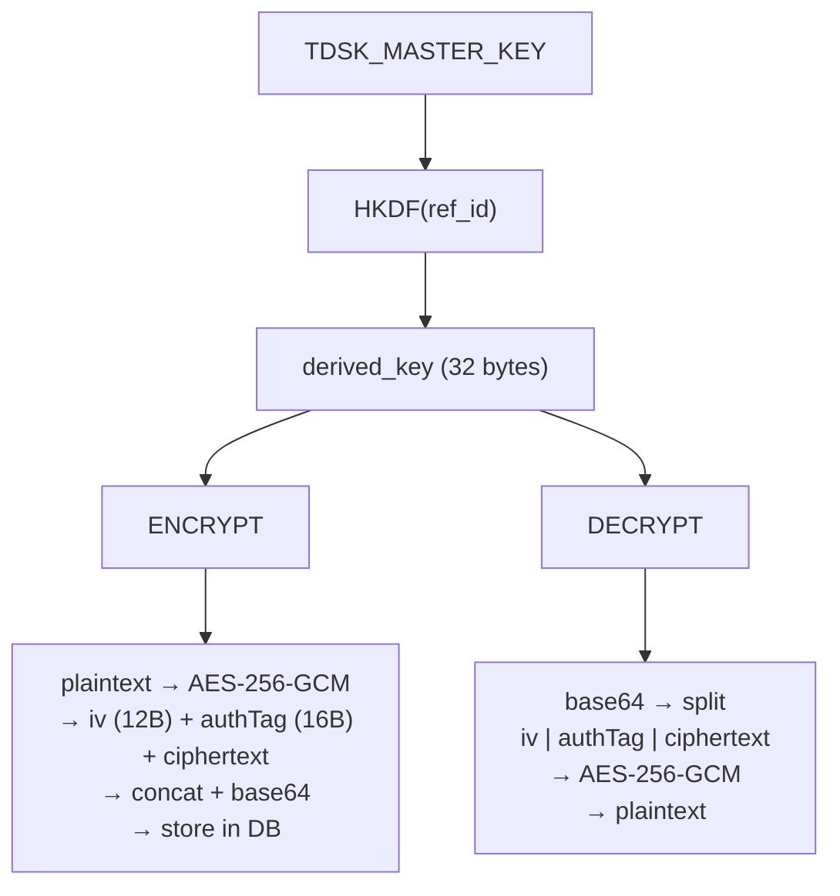
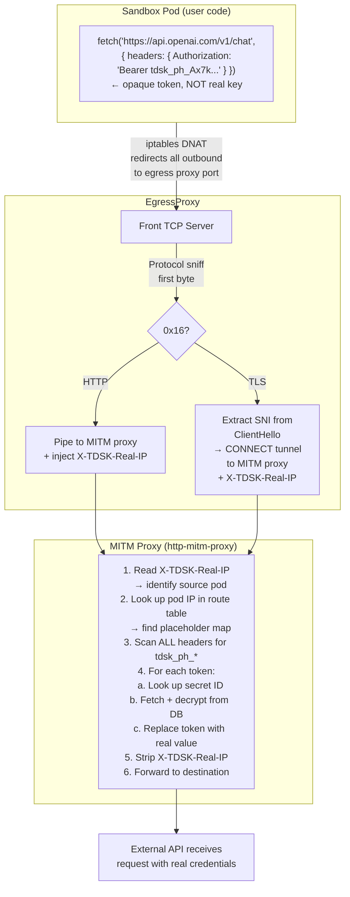
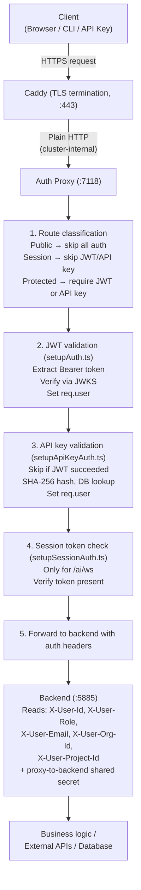

# Security Model -- Implementation Details

This document contains the internal implementation details of the Threaded Stack security model. For the user-facing overview, see [Security Model](/docs/architecture/security-model).


## Encryption at Rest -- Implementation

All secret values are encrypted before being written to the database. The encryption pipeline lives in `repos/domain/src/crypto/crypto.ts`.

### Algorithm

- **Cipher**: AES-256-GCM (authenticated encryption)
- **Key derivation**: HKDF (RFC 5869) with SHA-256
- **IV**: 12 bytes, cryptographically random per encryption
- **Auth tag**: 16 bytes (GCM default)
- **Storage format**: Base64-encoded concatenation of `[iv:12][authTag:16][ciphertext:N]`

### Master Key

The platform master key is provided via the `TDSK_MASTER_KEY` environment variable:
- Must be hex-encoded
- Minimum 64 hex characters (32 bytes) for AES-256
- Loaded once at first use, cached in-process
- Kubernetes secret managed via `tdsk kube secret tdsk`

### Per-Entity Key Derivation

Each entity (org, project, provider, agent) gets a unique derived encryption key:

```text
HKDF-SHA256(
  ikm:  TDSK_MASTER_KEY (32+ bytes),
  salt: entity ref_id (e.g., org ID, provider ID),
  info: "user-secret-key" (fixed context string),
  len:  32 bytes
) --> derived key
```

Function signature from `repos/domain/src/crypto/crypto.ts`:

```typescript
deriveKey(ref_id: string): Promise<Buffer>
```

The `ref_id` parameter is the owning entity's ID. This means that even if the master key is the same, every entity's secrets are encrypted with a different derived key.

> **Known deviation from RFC 5869**: The `ref_id` is used as the HKDF salt (parameter 3) rather than info (parameter 4). Per the RFC, salt should be random/fixed and info should be contextual. This ordering is preserved for backward compatibility with existing encrypted data.

### Encryption Flow



Key functions from `repos/domain/src/crypto/crypto.ts`:

```typescript
encryptValue(derivedKey: Buffer, plaintextValue: string): Promise<TEncryptVal>
// Returns: { iv: Buffer, encrypted: Buffer, authTag: Buffer }

decryptValue(derivedKey: Buffer, ciphertext: Buffer, iv: Buffer, authTag: Buffer): Promise<string>

encodeEncrypted(iv: Buffer, authTag: Buffer, encrypted: Buffer): string
// Returns: base64 string of [iv:12][authTag:16][ciphertext:N]
```

### Secret Creation Example

When a secret is created via `POST /secrets` (see `repos/backend/src/endpoints/secrets/createSecret.ts`):

1. Determine the scope owner (`refId`) from the exclusive arc fields
2. `deriveKey(refId)` -- derive a per-entity key from the master key
3. `encryptValue(derivedKey, plaintext)` -- produce IV, auth tag, and ciphertext
4. `encodeEncrypted(iv, authTag, encrypted)` -- pack into base64 for storage
5. `createHashKey(name)` -- truncated SHA-256 of the secret name for lookup
6. Store the `encryptedValue` (base64) and `hashKey` in the database; plaintext is never persisted


## API Key Security -- Implementation

### Generation

From `repos/domain/src/crypto/crypto.ts`:

```typescript
generateApiKey(): TKeyHash
// Returns: { key, hash, prefix }
```

1. Generate 32 bytes of cryptographically random data via `crypto.randomBytes(32)`
2. Encode as base64url and prepend the `tdsk_` prefix
3. Compute SHA-256 hash of the full key string
4. Extract the first 12 characters as a display prefix

### Hash Function

```typescript
hashKey(key: string): string
// crypto.createHash('sha256').update(key).digest('hex')
```

### Validation Flow

API key validation occurs in `repos/proxy/src/middleware/setupApiKeyAuth.ts`:

1. Extract token from `Authorization: Bearer tdsk_...`
2. Compute `hashKey(token)` (SHA-256)
3. Look up hash in database via `db.services.apiKey.getByHash(keyHash)`
4. Validate the key is active and not expired via `apiKey.isValid()`
5. Map API key scopes to backend roles:
   - `admin` scope --> `admin` role
   - `write` scope --> `member` role
   - all else --> `viewer` role
6. Set `req.user` with the key's `userId` and derived role
7. Fire-and-forget `touchLastUsed()` update


## JIT Secret Injection -- Implementation

### Server-Side Resolution (Proxy/FaaS Endpoints)

For proxy and FaaS endpoints, secrets are resolved by the `SecretResolver` service (`repos/backend/src/services/secrets/secretResolver.ts`) before outbound requests are made.

**Placeholder format**: `{{ secret-name:secret-id }}` where the ID is a 10-character nanoid.

Regex patterns from `repos/domain/src/constants/values.ts`:

```text
SecretRefTest:    /\{\{\s*.+?:[A-Za-z0-9_-]{10}\s*\}\}/
SecretRefPattern: /\{\{\s*(.+?):([A-Za-z0-9_-]{10})\s*\}\}/g
```

The `SecretResolver` supports multiple resolution methods:

- **`resolveHeaders(provider)`** -- Resolves `{{ }}` templates in provider headers
- **`resolveBodyParams(provider)`** -- Resolves templates in provider body parameters (string values only; non-string values pass through)
- **`resolveApiKey(agent, provider)`** -- Direct O(1) lookup via `provider.secretId`
- **`loadAndDecrypt(scope)`** -- Loads provider-scoped + org-scoped secrets, deduplicates (provider takes precedence), and decrypts all

**Decryption with scope fallback** (`SecretResolver.decrypt`):

1. Parse the base64 storage format: `iv[12] | authTag[16] | ciphertext[N]`
2. Determine the scope owner: `agentId || providerId || projectId || orgId`
3. Attempt decryption with the scope owner's derived key
4. If that fails, fall back to `orgId` (handles quickstart secrets encrypted with org key but stored as provider-scoped)
5. If both fail, return `null` and log a warning

### Secret Loading Precedence

When `SecretResolver.loadAndDecrypt` resolves secrets for an operation:

1. Load provider-scoped secrets (`where: { providerId }`)
2. Load org-scoped secrets (`where: { orgId }`)
3. Deduplicate by secret ID -- provider-scoped secrets take precedence when names collide
4. Decrypt each secret and return the resolved set


## MITM Proxy (Sandbox Egress) -- Implementation

Source: `repos/backend/src/services/proxy/egress.ts`

### EgressProxy Architecture



### Protocol Sniffing

The front TCP server (`handleConnection`) peeks at the first byte of each connection:

- **`0x16` (TLS ClientHello)**: The connection is TLS. The SNI hostname is extracted from the ClientHello message via `repos/backend/src/utils/proxy/extractSNI.ts`, then the connection is converted into an HTTP CONNECT tunnel to the internal MITM proxy.
- **Any other byte**: The connection is plain HTTP. It is piped directly to the MITM proxy on the loopback port.

In both cases, the real client IP is injected via the `x-tdsk-real-ip` header so the MITM request handler can identify which sandbox pod the traffic came from.

### Placeholder Token Lifecycle

1. **Pod creation** (`repos/backend/src/services/sandboxes/sandbox.ts`): For each secret ID in the sandbox config, generate `tdsk_ph_` + `nanoid(16)`. Store the mapping `{ token -> secretId }` in the route table.
2. **Pod runtime**: Sandbox code uses placeholder tokens in HTTP headers (e.g., `Authorization: Bearer tdsk_ph_Ax7kM3nP...`).
3. **Egress interception**: The `EgressProxy.handleRequest` method scans all outgoing headers for any value containing the `tdsk_ph_` prefix. When found, the token is looked up in the route table and replaced with the decrypted secret value.
4. **Failure mode**: If a placeholder token maps to a secret that cannot be resolved (deleted, decryption failure), the proxy throws an error and returns HTTP 502 to the sandbox. This prevents placeholder tokens from leaking to external services.

### CA Certificate Management

The MITM proxy uses a custom CA certificate for TLS interception:

- CA cert and key paths: `/etc/tdsk/ca/tls.crt` and `/etc/tdsk/ca/tls.key` (defined in `repos/backend/src/constants/values.ts`)
- On startup, `prepareCaDir()` creates a temp directory with the CA cert/key in the layout expected by `http-mitm-proxy`
- The library auto-generates per-hostname certificates signed by this CA
- The CA cert is injected into sandbox pods so they trust the proxy's generated certificates
- On shutdown, the temp directory is cleaned up via `fs.rmSync`


## Auth Chain -- Implementation

### Proxy-to-Backend Trust

The proxy forwards authenticated identity to the backend via headers set by `setAuthHeaders()` from `repos/domain/src/api/authHeaders.ts`:

```typescript
AuthHeaders = {
  'user.userId':    'X-User-Id',
  'user.role':      'X-User-Role',
  'user.email':     'X-User-Email',
  'user.orgId':     'X-User-Org-Id',
  'user.projectId': 'X-User-Project-Id',
}
```

An additional shared secret header (`headerKey`/`headerValue` from config) provides proxy-to-backend identity verification, ensuring the backend only accepts requests that passed through the auth proxy.

### Middleware Chain Flow



### WebSocket Authentication

WebSocket connections for AI agent interaction (`/ai/ws`) use a dedicated flow:

1. Client obtains a session token via `POST /_/ai/sessions` (authenticated with JWT or API key)
2. Client connects to `/ai/ws?token=<session-token>` or with `Authorization: Bearer <token>`
3. Proxy's `setupSessionAuth` verifies a token is present (does not validate it)
4. Backend validates the session token against its internal session state
5. WebSocket upgrade proceeds if valid


## Key Source Files

| File | Role |
|------|------|
| `repos/domain/src/crypto/crypto.ts` | AES-256-GCM encryption, HKDF key derivation, API key generation, SHA-256 hashing |
| `repos/domain/src/constants/values.ts` | `ApiKeyPrefix`, `AuthHeaders`, `SecretRefTest`, `SecretRefPattern` |
| `repos/domain/src/api/authHeaders.ts` | `setAuthHeaders()`, `fromAuthHeaders()` for proxy-to-backend header forwarding |
| `repos/proxy/src/middleware/setupAuth.ts` | JWT validation via JWKS |
| `repos/proxy/src/middleware/setupApiKeyAuth.ts` | API key hash-based validation |
| `repos/proxy/src/middleware/setupSessionAuth.ts` | Session token presence check for `/ai/ws` |
| `repos/proxy/src/middleware/setupProxy.ts` | http-proxy-middleware forwarding with auth headers |
| `repos/proxy/src/services/auth.ts` | JWKS client, token extraction, JWT verification |
| `repos/backend/src/endpoints/secrets/createSecret.ts` | Secret encryption and storage flow |
| `repos/backend/src/services/secrets/secretResolver.ts` | Secret decryption, template resolution, scope-aware loading |
| `repos/backend/src/services/proxy/egress.ts` | MITM egress proxy for sandbox pods |
| `repos/backend/src/services/proxy/proxy.ts` | ProxyService with OAuth, auth injection, domain whitelist |
| `repos/backend/src/services/endpoints/proxyEndpoint.ts` | Proxy endpoint execution with secret fetching |
| `repos/backend/src/services/sandboxes/sandbox.ts` | Placeholder token generation during pod creation |
| `repos/backend/src/utils/proxy/extractSNI.ts` | TLS ClientHello SNI extraction |
| `repos/backend/src/constants/values.ts` | `PhTokenPrefix`, `RealIpHeader`, `CACertPath`, `CAKeyPath` |
