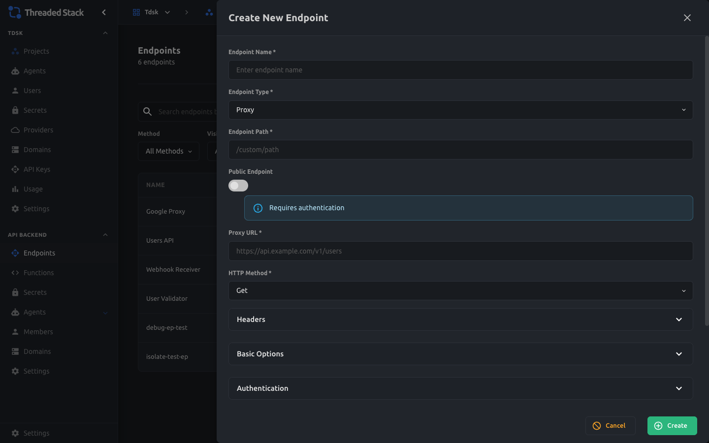
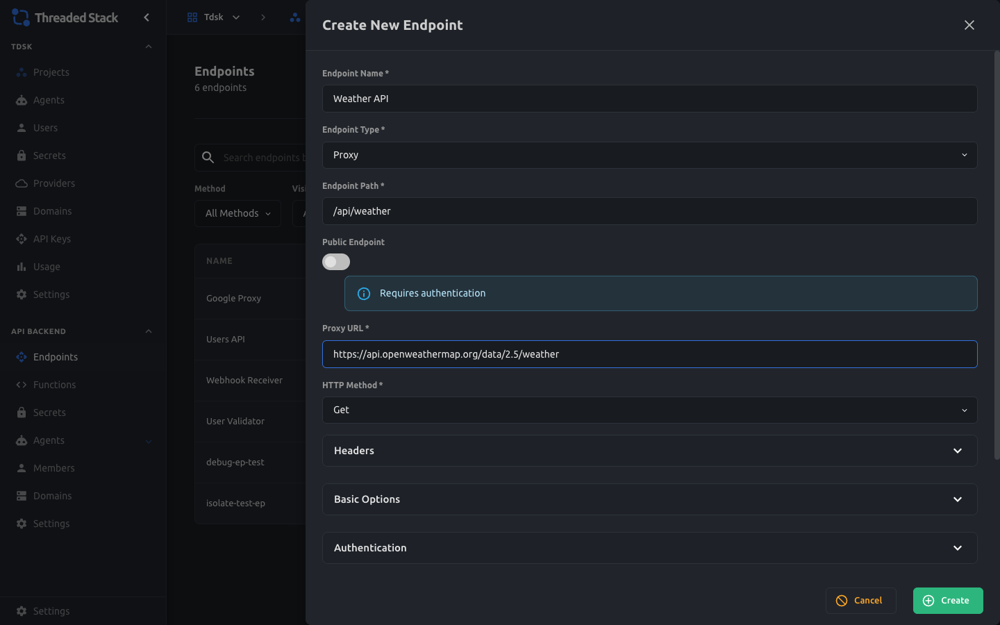
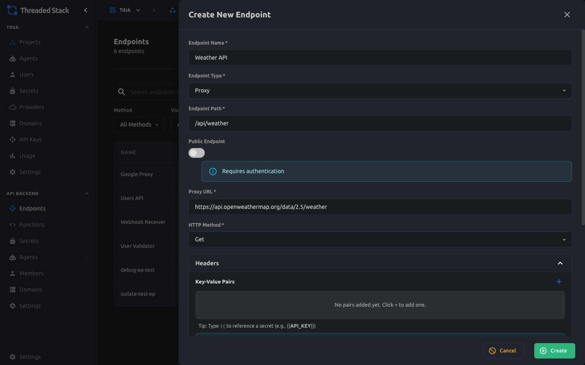
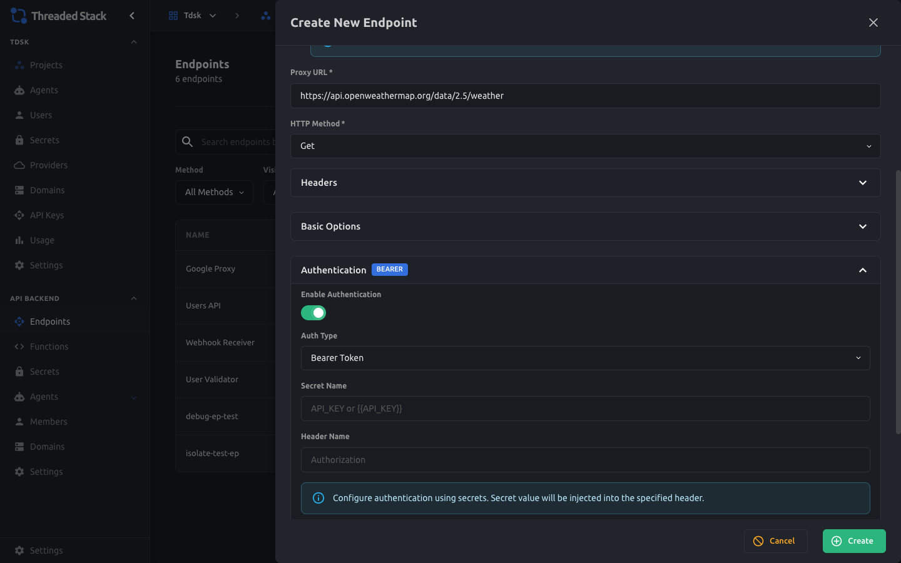
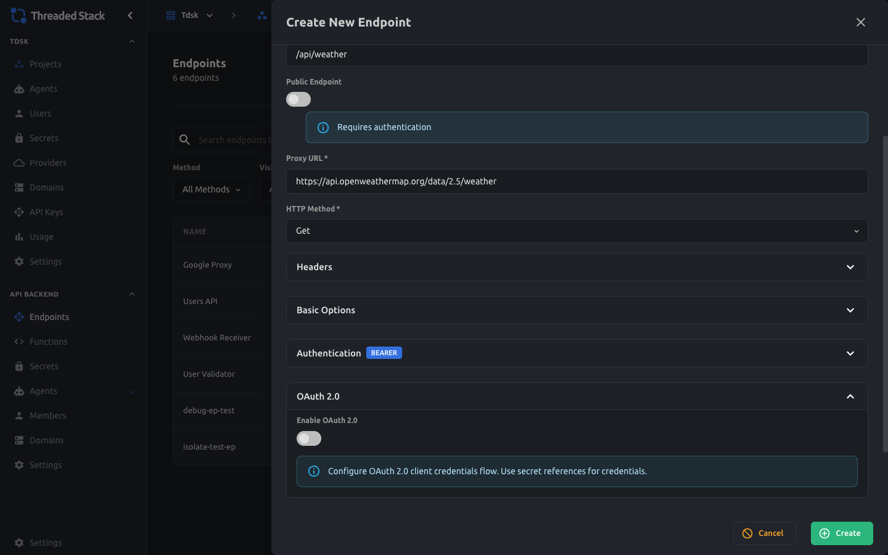

# Proxy Endpoints

A comprehensive guide to creating, configuring, and calling proxy endpoints in Threaded Stack. This document walks through the full lifecycle — from setting one up in the Admin UI to executing requests through it — with architecture diagrams, screenshots, and code examples.

---

## Table of Contents

1. [What is a Proxy Endpoint?](#what-is-a-proxy-endpoint)
2. [Architecture Overview](#architecture-overview)
3. [Creating a Proxy Endpoint (Admin UI)](#creating-a-proxy-endpoint-admin-ui)
4. [Calling a Proxy Endpoint](#calling-a-proxy-endpoint)
5. [Secret Injection](#secret-injection)
6. [Authentication Options](#authentication-options)
7. [Request Lifecycle (Step-by-Step)](#request-lifecycle-step-by-step)
8. [Retry Logic](#retry-logic)
9. [Error Handling](#error-handling)
10. [API Reference](#api-reference)
11. [Source Code Map](#source-code-map)
12. [Glossary](#glossary)

---

## What is a Proxy Endpoint?

A **proxy endpoint** lets you expose a safe, authenticated URL that forwards requests to any external API — like OpenWeatherMap, Stripe, or a private internal service — without revealing the target API's credentials to the client.

Think of it like a secure relay:

```
Your App  ──>  Threaded Stack Proxy  ──>  External API (e.g. Stripe)
                  │
                  ├── Injects API keys from encrypted secrets
                  ├── Adds custom headers
                  ├── Handles retries on failure
                  └── Logs everything
```

**Why use it?**

- **Security**: API keys stay server-side; the client never sees them
- **Simplicity**: One URL to call, all auth handled automatically
- **Reliability**: Built-in retry logic with exponential backoff
- **Flexibility**: Transform requests and responses, restrict by domain, validate paths

Threaded Stack supports three endpoint types. This document focuses on **Proxy**:

| Type | What It Does |
|------|-------------|
| **Proxy** | Forwards HTTP requests to an external URL with auth, headers, and retries |
| **FaaS** | Runs a sandboxed JavaScript/TypeScript function |
| **Agent** | Executes an AI agent with LLM streaming |

---

## Architecture Overview

### Where Proxy Endpoints Fit

```
┌─────────────┐       ┌───────────┐       ┌──────────┐       ┌──────────────┐
│   Client    │──────>│   Caddy   │──────>│  Auth    │──────>│   Backend    │
│  (browser,  │ HTTPS │  (TLS +   │       │  Proxy   │       │  (Express)   │
│   curl,     │       │  reverse  │       │  (JWT/   │       │              │
│   app)      │       │  proxy)   │       │  API key)│       │              │
└─────────────┘       └───────────┘       └──────────┘       └──────┬───────┘
                                                                    │
                                                              ┌─────┴──────┐
                                                              │ Endpoint   │
                                                              │ Dispatcher │
                                                              └─────┬──────┘
                                                                    │
                                                     ┌──────────────┼────────────┐
                                                     │              │            │
                                               ┌─────┴─────┐ ┌──────┴────┐ ┌─────┴─────┐
                                               │  Proxy    │ │   FaaS    │ │   Agent   │
                                               │  Endpoint │ │  Endpoint │ │  Endpoint │
                                               └─────┬─────┘ └───────────┘ └───────────┘
                                                     │
                                               ┌─────┴──────────────────┐
                                               │ ProxyService           │
                                               │  ├── Auth injection    │
                                               │  ├── Secret resolution │
                                               │  ├── OAuth 2.0 cache   │
                                               │  └── Domain validation │
                                               └─────┬──────────────────┘
                                                     │
                                               ┌─────┴─────┐
                                               │ External  │
                                               │    API    │
                                               │ (target)  │
                                               └───────────┘
```

### Key Services

| Service | Role |
|---------|------|
| **Caddy** | Terminates TLS, reverse-proxies to Auth Proxy |
| **Auth Proxy** (`repos/proxy`) | Validates JWT or API key, forwards to Backend |
| **Backend** (`repos/backend`) | Hosts the endpoint dispatcher + proxy engine |
| **ProxyEndpoint** | Builds and executes the proxied HTTP request |
| **ProxyService** | Applies auth, OAuth, domain validation, transforms |
| **SecretResolver** | Decrypts secrets and replaces `{{template}}` references |
| **RetryService** | Manages exponential backoff retry logic |

---

## Creating a Proxy Endpoint (Admin UI)

This section walks through creating a proxy endpoint step-by-step using the Admin dashboard.

### Step 1: Navigate to Your Organization

After logging in, you'll see the **Home** page listing your organizations.


Click on your organization to see its dashboard.


### Step 2: Open Your Project

From the org sidebar, click **Projects** to see all projects.


Click into the project where you want to create the endpoint.


### Step 3: Go to Endpoints

In the project sidebar under **API Backend**, click **Endpoints**. You'll see a table of existing endpoints.


The table shows each endpoint's **Name**, **Method** (GET, POST, etc.), **Path**, and whether it's **Public** (globe icon) or **Private** (lock icon).

### Step 4: Create a New Endpoint

Click the **+ Create Endpoint** button in the top-right corner. A drawer slides in from the right.



The form has these fields:

| Field | Required | Description |
|-------|----------|-------------|
| **Endpoint Name** | Yes | A human-readable name (e.g., "Weather API") |
| **Endpoint Type** | Yes | Select **Proxy** (default) |
| **Endpoint Path** | Yes | The path clients will call (e.g., `/api/weather`) |
| **Public Endpoint** | No | Toggle ON to skip permission checks (auth still required at the proxy level) |
| **Proxy URL** | Yes | The target URL to forward requests to |
| **HTTP Method** | Yes | The HTTP method used when proxying (GET, POST, PUT, DELETE) |

> **Important**: The **Endpoint Path** is the path your clients will call. The **Proxy URL** is the external API you're forwarding to. These are different things!
>
> - **Endpoint Path**: `/api/weather` (what your client calls)
> - **Proxy URL**: `https://api.openweathermap.org/data/2.5/weather` (where the request goes)

### Step 5: Fill in the Basics

Here's an example configuration for proxying to OpenWeatherMap:



- **Name**: Weather API
- **Path**: `/api/weather`
- **Proxy URL**: `https://api.openweathermap.org/data/2.5/weather`
- **HTTP Method**: GET

### Step 6: Add Custom Headers (Optional)

Expand the **Headers** accordion to add custom headers that will be sent with every proxied request.



Headers support **secret templates**: use `{{SECRET_NAME}}` syntax to inject encrypted secret values at runtime. For example:

| Key | Value |
|-----|-------|
| `X-Custom-Header` | `my-static-value` |
| `X-Api-Key` | `{{my-api-key-secret}}` |

The `{{my-api-key-secret}}` template will be replaced with the decrypted value of the secret named `my-api-key-secret` when the request is actually made. The secret value is never exposed to the client.

### Step 7: Configure Authentication (Optional)

Expand the **Authentication** accordion to configure how the proxy authenticates with the target API.


Toggle **Enable Authentication** to ON:



Authentication fields:

| Field | Description |
|-------|-------------|
| **Auth Type** | `Bearer Token`, `Basic Auth`, or `API Key` |
| **Secret Name** | Name of the secret containing the credential (e.g., `my-api-key`) |
| **Header Name** | Which header to set (defaults to `Authorization`) |

The info banner confirms: *"Configure authentication using secrets. Secret value will be injected into the specified header."*

### Step 8: Configure OAuth 2.0 (Optional)

For APIs that require OAuth 2.0 client credentials flow, expand the **OAuth 2.0** accordion:



OAuth fields include Token URL, Client ID, Client Secret (can be a secret template), and scopes. Threaded Stack automatically handles token exchange and caching.

### Step 9: Save

Click the **Create** button at the bottom of the drawer. Your new endpoint will appear in the endpoints table.

### Editing an Existing Endpoint

Click the pencil icon on any endpoint row to open the edit drawer:


All the same fields are available for editing.

---

## Calling a Proxy Endpoint

Once created, call your proxy endpoint through the Threaded Stack proxy URL:

```
https://px.threadedstack.app/proxy/<project-id>/<endpoint-id>
```

### Basic GET Request

```bash
curl -s \
  -H "Authorization: Bearer tdsk_<api-key>" \
  "https://px.threadedstack.app/proxy/<project-id>/<endpoint-id>" \
  --insecure
```

The `--insecure` flag is only needed in local development (self-signed Caddy certs).

### POST Request with Body

```bash
curl -s -X POST \
  -H "Authorization: Bearer tdsk_<api-key>" \
  -H "Content-Type: application/json" \
  -d '{"greeting": "hello", "count": 42}' \
  "https://px.threadedstack.app/proxy/<project-id>/<endpoint-id>" \
  --insecure
```

### With Query Parameters

Query parameters are automatically forwarded to the target URL:

```bash
curl -s \
  -H "Authorization: Bearer tdsk_<api-key>" \
  "https://px.threadedstack.app/proxy/<project-id>/<endpoint-id>?city=London&units=metric" \
  --insecure
```

If your Proxy URL is `https://api.openweathermap.org/data/2.5/weather`, the final request to the external API becomes:

```
GET https://api.openweathermap.org/data/2.5/weather?city=London&units=metric
```

### Extra Path Segments

Any path segments after the endpoint ID are appended to the target URL:

```bash
# Calls: https://api.example.com/v1/users/123/profile
curl -s \
  -H "Authorization: Bearer tdsk_<api-key>" \
  "https://px.threadedstack.app/proxy/<project-id>/<endpoint-id>/123/profile" \
  --insecure
```

### Without Auth (Will Fail)

Requests without a valid JWT or API key are rejected at the Auth Proxy level:

```bash
curl -s "https://px.threadedstack.app/proxy/<project-id>/<endpoint-id>" --insecure
# => 401 Unauthorized
```

### Public Endpoints

If an endpoint has `public: true`, the **backend** skips the permission check — but the **Auth Proxy** still requires authentication. Public only means "no project-level permission check", not "no auth at all."

---

## Secret Injection

Secrets are encrypted values stored in the database using AES-256-GCM encryption. They are only decrypted server-side at the moment a proxy request is being built — they never leave the backend.

### How `{{template}}` Syntax Works

Anywhere you can provide a string value in endpoint configuration (headers, auth secret name, OAuth fields), you can reference a secret by name using double curly braces:

```
{{my-secret-name}}
```

At execution time, the `SecretResolver` service:

1. Loads all secrets scoped to the endpoint's project
2. Decrypts each secret using the scope owner's encryption key
3. Scans header values, auth config, and body params for `{{...}}` patterns
4. Replaces each pattern with the decrypted plaintext value

### Example

You create a secret named `openweather-key` with the value `abc123xyz`.

In your endpoint's headers, you set:

```
X-Api-Key: {{openweather-key}}
```

When a client calls your proxy endpoint, the outgoing request to OpenWeatherMap includes:

```
X-Api-Key: abc123xyz
```

The client never sees `abc123xyz` — they only interact with your proxy endpoint.

### Secret Scoping

Secrets belong to exactly one scope (exclusive arc pattern):

| Scope | Meaning |
|-------|---------|
| **Organization** | Available to all projects in the org |
| **Project** | Available only within that project |
| **Provider** | Scoped to a specific LLM provider |
| **Agent** | Scoped to a specific AI agent |

Proxy endpoints fetch secrets scoped to their **project** (and the project's org).

---

## Authentication Options

The proxy engine supports four authentication methods that are applied to the **outgoing** request (the one going to the target API):

### Bearer Token

```
Authorization: Bearer <decrypted-secret-value>
```

The most common option. Set **Auth Type** to `Bearer Token`, provide a **Secret Name**, and the decrypted value is prefixed with `Bearer ` and placed in the `Authorization` header (or a custom header if you specify one).

### Basic Auth

```
Authorization: Basic <base64(secret-value)>
```

Set **Auth Type** to `Basic Auth`. The secret value should be in `username:password` format. It gets Base64-encoded and set as a Basic auth header.

### API Key

```
X-API-Key: <decrypted-secret-value>
```

Set **Auth Type** to `API Key`. The raw secret value is placed directly in the specified header — no `Bearer` prefix, no encoding.

### OAuth 2.0 (Client Credentials)

For services that use OAuth 2.0 client credentials flow:

1. Configure Token URL, Client ID, and Client Secret in the endpoint
2. On the first request, the backend exchanges credentials for an access token
3. The token is cached (with a 5-minute buffer before expiry)
4. Subsequent requests reuse the cached token until it expires
5. The access token is set as `Authorization: Bearer <token>` on the outgoing request

OAuth takes **precedence** over basic auth if both are configured.

---

## Request Lifecycle (Step-by-Step)

Here's exactly what happens when a client calls a proxy endpoint:

```
 Client                Auth Proxy           Backend               Target API
   │                      │                    │                      │
   │  1. GET /proxy/...   │                    │                      │
   │─────────────────────>│                    │                      │
   │                      │  2. Validate JWT   │                      │
   │                      │     or API key     │                      │
   │                      │                    │                      │
   │                      │  3. Forward with   │                      │
   │                      │     X-User-* hdrs  │                      │
   │                      │───────────────────>│                      │
   │                      │                    │                      │
   │                      │                    │  4. Look up endpoint │
   │                      │                    │     in database      │
   │                      │                    │                      │
   │                      │                    │  5. Check project    │
   │                      │                    │     ownership        │
   │                      │                    │                      │
   │                      │                    │  6. Check user       │
   │                      │                    │     permissions      │
   │                      │                    │                      │
   │                      │                    │  7. Fetch & decrypt  │
   │                      │                    │     project secrets  │
   │                      │                    │                      │
   │                      │                    │  8. Build proxy req: │
   │                      │                    │     - Inject headers │
   │                      │                    │     - Inject auth    │
   │                      │                    │     - Replace {{}}   │
   │                      │                    │                      │
   │                      │                    │  9. Forward ────────>│
   │                      │                    │                      │
   │                      │                    │  10. Return response │
   │                      │                    │<─────────────────────│
   │                      │                    │                      │
   │  11. JSON response   │                    │                      │
   │<─────────────────────│<───────────────────│                      │
   │                      │                    │                      │
```

### Detailed Steps

1. **Client sends request** to `https://px.threadedstack.app/proxy/<project-id>/<endpoint-id>`
2. **Auth Proxy validates** the JWT token or `tdsk_*` API key
3. **Auth Proxy forwards** the request to the Backend, injecting `X-User-Id`, `X-User-Role`, and `X-User-Email` headers
4. **Backend's endpoint dispatcher** (`/proxy/:projectId/:endpointId`) loads the endpoint record from the database
5. **Project ownership** is verified — the endpoint must belong to the specified project
6. **Permission check** — unless the endpoint is marked `public`, the user must have `read` access to endpoints in this project
7. **Secrets are loaded** for the endpoint's project and decrypted using AES-256-GCM
8. **Proxy request is built**:
   - Custom headers are added (with `{{secret}}` templates resolved)
   - Auth configuration is applied (Bearer, Basic, API Key, or OAuth 2.0)
   - Domain whitelist and path regex are validated (if configured)
9. **Request is forwarded** to the target URL via `http-proxy-middleware`
10. **Response flows back** through the proxy, optionally transformed
11. **Client receives** the response from the target API

---

## Retry Logic

If a request to the target API fails with a retryable error, the proxy engine can automatically retry it.

### Retryable Status Codes

```
408  Request Timeout
429  Too Many Requests
500  Internal Server Error
502  Bad Gateway
503  Service Unavailable
504  Gateway Timeout
```

### Configuration

Retry behavior is configured per endpoint in the `options` object:

| Option | Default | Description |
|--------|---------|-------------|
| `retries` | `0` | Number of retry attempts (0 = no retries) |
| `retryDelay` | `1000` | Initial delay in ms before first retry |
| `retryMaxDelay` | `30000` | Maximum delay between retries (30s cap) |
| `retryExponentialBackoff` | `true` | Whether to use exponential backoff |
| `retryBackoffMultiplier` | `2` | Multiplier for exponential backoff |

### Backoff Example

With defaults and `retries: 3`:

```
Attempt 1: fails → wait 1000ms (1s)
Attempt 2: fails → wait 2000ms (2s)
Attempt 3: fails → wait 4000ms (4s)
Attempt 4: fails → give up, return error to client
```

The delay formula is: `delay = initialDelay * (multiplier ^ attempt)`, capped at `maxDelay`.

---

## Error Handling

### Common Error Responses

| Status | Meaning | When |
|--------|---------|------|
| **400** | Bad Request | Endpoint has no proxy URL configured, or invalid options |
| **401** | Unauthorized | No valid JWT or API key provided |
| **403** | Forbidden | User lacks permission to use this endpoint, or endpoint doesn't belong to the project |
| **404** | Not Found | Endpoint ID or Project ID doesn't exist |
| **405** | Method Not Allowed | Request method doesn't match the endpoint's configured method |
| **502** | Bad Gateway | Target API is unreachable or returned an error after all retries |
| **500** | Internal Server Error | Unexpected failure in the proxy setup |

### Error Response Format

```json
{
  "error": "Proxy failed after retries: connect ECONNREFUSED 10.0.0.1:443"
}
```

---

## API Reference

### Create Endpoint

```
POST /_/orgs/:orgId/projects/:projectId/endpoints
```

**Body:**
```json
{
  "name": "Weather API",
  "path": "/api/weather",
  "type": "proxy",
  "method": "get",
  "projectId": "PROJECT_ID",
  "public": false,
  "options": {
    "url": "https://api.openweathermap.org/data/2.5/weather",
    "method": "get",
    "timeout": 10000,
    "retries": 3,
    "auth": {
      "type": "bearer",
      "secretName": "openweather-key"
    }
  },
  "headers": {
    "X-Custom-Header": "static-value",
    "X-Api-Key": "{{my-secret}}"
  }
}
```

### Get Endpoint

```
GET /_/orgs/:orgId/projects/:projectId/endpoints/:endpointId
```

### Update Endpoint

```
PATCH /_/endpoints/:endpointId
```

### Delete Endpoint

```
DELETE /_/endpoints/:endpointId
```

### Execute (Call the Proxy)

```
GET|POST|PUT|DELETE /proxy/:projectId/:endpointId[/*]
```

All query parameters and extra path segments are forwarded to the target URL.

---

## Source Code Map

Key files involved in the proxy endpoint system:

### Backend

| File | Purpose |
|------|---------|
| `repos/backend/src/endpoints/proxy/endpoint.ts` | Entry point — dispatches `/proxy/:projectId/:endpointId` to the right service |
| `repos/backend/src/services/endpoints/base.ts` | Abstract base class with permission checks, secret fetching, validation |
| `repos/backend/src/services/endpoints/proxyEndpoint.ts` | ProxyEndpoint class — builds and executes the proxied request |
| `repos/backend/src/services/endpoints/getEPService.ts` | Singleton registry mapping endpoint type to service |
| `repos/backend/src/services/proxy/proxy.ts` | Auth injection, OAuth token caching, domain validation, transforms |
| `repos/backend/src/services/proxy/retry.ts` | Exponential backoff retry logic |
| `repos/backend/src/services/secrets/secretResolver.ts` | Decrypts secrets, resolves `{{template}}` references |

### Auth Proxy

| File | Purpose |
|------|---------|
| `repos/proxy/src/middleware/setupProxy.ts` | Forwards `/proxy/*` to the backend |
| `repos/proxy/src/middleware/setupAuth.ts` | JWT validation via JWKS |
| `repos/proxy/src/middleware/setupApiKeyAuth.ts` | API key validation for `tdsk_*` tokens |

### Admin UI

| File | Purpose |
|------|---------|
| `repos/admin/src/components/Endpoints/Proxy/` | All proxy form components (ProxyInputs, EndpointAuth, EndpointHeaders, etc.) |
| `repos/admin/src/actions/endpoints/api/` | API actions (createEndpoint, updateEndpoint, etc.) |
| `repos/admin/src/services/endpointsApi.ts` | EndpointsApi service class |

### Domain

| File | Purpose |
|------|---------|
| `repos/domain/src/models/endpoint.ts` | Endpoint model class |
| `repos/domain/src/types/index.ts` | Type definitions (TProxyEndpointConfig, TEndpointOpts, etc.) |

---

## Glossary

| Term | Definition |
|------|-----------|
| **Proxy Endpoint** | An endpoint configuration that forwards HTTP requests to an external target URL |
| **Endpoint Dispatcher** | The backend route handler at `/proxy/:projectId/:endpointId` that loads the endpoint and delegates to the right service |
| **ProxyEndpoint (class)** | The service class that handles proxy-type endpoint execution using `http-proxy-middleware` |
| **ProxyService** | The service that applies auth, OAuth, domain validation, and transforms to outgoing proxy requests |
| **SecretResolver** | The service that decrypts secrets and replaces `{{template}}` references with plaintext values |
| **Endpoint Path** | The path your clients call (e.g., `/api/weather`) — this is part of the endpoint configuration |
| **Proxy URL** | The target URL the request gets forwarded to (e.g., `https://api.openweathermap.org/...`) |
| **Secret Template** | The `{{SECRET_NAME}}` syntax used to reference encrypted secrets in headers, auth, and body params |
| **Exclusive Arc** | A database pattern where a record belongs to exactly one of several possible parent types |
| **Public Endpoint** | An endpoint that skips backend permission checks (auth proxy still requires JWT/API key) |
| **Auth Proxy** | The gateway service (`repos/proxy`) that validates authentication before forwarding to the backend |

---

## Properties

* **method**
  * HTTP method (`get`, `post`, `put`, `delete`, `head`, `options`)
  * The `method` property exists in both `endpoint` and `proxy endpoint options`
    * At the endpoint level it's the method used to call the endpoint
    * At the options level it's the method used when proxying the request to the target
      * This means you can proxy a `GET` request to a `POST` request on the target API
