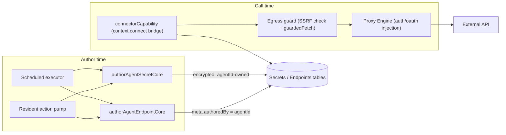

# Agent Connectors & Self-Provisioning

> **Last Updated**: July 2026

## Table of Contents

1. [What is Agent Self-Provisioning?](#1-what-is-agent-self-provisioning)
2. [Architecture Overview](#2-architecture-overview)
3. [Key Concepts](#3-key-concepts)
4. [Building a Connector: `tdsk-author-endpoint`](#4-building-a-connector-tdsk-author-endpoint)
5. [Storing a Credential: `tdsk-author-secret`](#5-storing-a-credential-tdsk-author-secret)
6. [Access Path: Function `context.connect` Capability](#6-access-path-function-contextconnect-capability)
7. [Authorization Model: Authorship Is Authorization](#7-authorization-model-authorship-is-authorization)
8. [The Egress Guard (SSRF Protection)](#8-the-egress-guard-ssrf-protection)
9. [Limits and Constraints](#9-limits-and-constraints)
10. [Use Case: End-to-End Self-Provisioning](#10-use-case-end-to-end-self-provisioning)
11. [Troubleshooting](#11-troubleshooting)

---

## 1. What is Agent Self-Provisioning?

By default an agent's tools are the ones a human configured for its project ahead of time.
Self-provisioning removes that ceiling: an agent running in a scheduled cycle or a resident
(live) session can **author its own proxy Endpoint** and **store a credential it obtained** as
its own encrypted Secret — then call that Endpoint immediately, with no human in the loop to
allowlist it.

```mermaid
flowchart LR
  AGENT["Agent (scheduled run or resident pod)"]
  SECFENCE["```tdsk-author-secret``` fence"]
  ENDFENCE["```tdsk-author-endpoint``` fence"]
  SEC["Secret (agentId-owned, encrypted)"]
  END["Endpoint (proxy type, meta.authoredBy = agentId)"]
  FUNC["Function running context.connect.invoke(ref, request)"]
  EXT["External API"]

  AGENT --> SECFENCE --> SEC
  AGENT --> ENDFENCE --> END
  SEC -.owned by.-> END
  FUNC -->|"authored by same agent — no allowlist needed"| END --> EXT
```

**When to use self-provisioning:** an agent needs to reach a third-party API a human hasn't
pre-configured — sign up for a service, obtain an API key, and call it — without a human
round-trip to create the Endpoint/Secret first.

**When not to use it:** for APIs a human has already configured and allowlisted, an agent
should just call the existing Endpoint through `context.connect` (or the invoke/effect
surface) — authoring a duplicate Endpoint is unnecessary. Self-provisioning is for closing
gaps a human hasn't gotten to yet, not a replacement for admin-configured connectors.

---

## 2. Architecture Overview

Two structured-output fences (`tdsk-author-secret`, `tdsk-author-endpoint`) and one Function
capability (`context.connect`) share a single security boundary: the egress guard and a
strict ownership model tie every authored artifact back to the agent that created it.



Both author-time cores (`authorAgentSecretCore`, `authorAgentEndpointCore`) run identically
whether the submission comes from a **scheduled** cycle (parsed from stdout by the scheduler's
executor) or a **resident** (live) pod (parsed by the resident's local action pump and POSTed
to a resident-authenticated backend endpoint). Secrets are always authored before endpoints in
the same turn, so an endpoint can reference a secret authored moments earlier.

---

## 3. Key Concepts

### The `tdsk-author-secret` fence

A structured-output block an agent emits to store a credential it obtained as its **own**
encrypted Secret:

````
```tdsk-author-secret
{ "name": "STRIPE_TEST_KEY", "value": "sk_test_...", "description": "Obtained from Stripe test dashboard" }
```
````

### The `tdsk-author-endpoint` fence

A structured-output block an agent emits to build its **own** proxy Endpoint:

````
```tdsk-author-endpoint
{
  "name": "stripe-charges",
  "path": "/charges",
  "options": { "url": "https://api.stripe.com/v1/charges" },
  "headers": { "Authorization": "Bearer {{ STRIPE_TEST_KEY:sec_ab12cd34 }}" }
}
```
````

### `meta.authoredBy`

An additive `jsonb` column on the `endpoints` table. When an agent authors an Endpoint, the
row is stamped `meta: { authoredBy: <agentId>, version: 1 }`. This is the field the
`context.connect` bridge checks to grant an agent access to its own Endpoint with no
allowlist entry (see [§7](#7-authorization-model-authorship-is-authorization)).

### `SecretRefPattern` — the canonical secret reference

A Secret is referenced inline (in Endpoint `options`/`headers`) as `{{ NAME:secretId }}`,
matched by the same regex the runtime resolver uses to template secrets into a live proxy
call. Author-time validation walks every string field in `options`/`headers` with this exact
pattern, so the ownership check can never miss a field the runtime resolver would template.

### `context.connect`

A capability injected into a FaaS Function's execution context (alongside `context.records`
and `context.scan`) that lets the Function make one outbound call through the Proxy Engine by
naming a project `proxy` Endpoint — see [§6](#6-access-path-function-contextconnect-capability).

---

## 4. Building a Connector: `tdsk-author-endpoint`

An agent emits a ` ```tdsk-author-endpoint``` ` fence containing a JSON object (or array of
objects) shaped:

```typescript
type TAuthorEndpointSubmission = {
  name: string                       // identifier-shaped, max 100 chars
  path: string                       // max 2000 chars
  type?: string                      // MUST be omitted or 'proxy'
  options: Record<string, unknown>   // MUST include options.url
  headers?: Record<string, string>
  description?: string               // max 2000 chars
}
```

Every submission passes through these gates, in order, before a row is written:

1. **Proxy-only.** `type` must be omitted or `"proxy"` — `agent`/`faas` Endpoints reach
   internal compute and other agents, and are out of the self-extension surface entirely.
2. **SSRF check at author time.** `options.url` is required and is validated by the same
   [egress guard](#8-the-egress-guard-ssrf-protection) used at call time — an internal or
   private target is rejected with a 400 before any row is written, not just refused later
   when called.
3. **No response-body secret injection.** `options.transform.injectSecrets` is refused — this
   closes the path where an Endpoint templates a decrypted secret *into the response body*,
   which the same agent (as both caller and reader of the response) could then read back out.
4. **Same-agent secret ownership.** Every secret referenced anywhere in `options` or
   `headers` (via `SecretRefPattern`, plus a direct `options.auth.secretId`) must be owned by
   the authoring agent. An attempt to reference another agent's, a project's, or an org's
   secret is rejected with a 403.
5. **Deterministic content scan.** `name`, `description`, `options`, `headers`, and `path`
   (with secret references stripped first, so a legitimate `{{ NAME:id }}` template is never
   mistaken for a literal leaked credential) are scanned; a finding rejects the submission
   with a 422.
6. **Collision handling.** A `name` already used by a human-authored or a *different* agent's
   Endpoint in the project is rejected with a 409 — it is never silently overwritten. A name
   the same agent authored previously is treated as a version update (`meta.version`
   increments) instead of a collision.

A submission never throws — every outcome is a structured `{ ok, status, ... }` result, so one
bad entry in a batch doesn't abort the rest.

---

## 5. Storing a Credential: `tdsk-author-secret`

An agent emits a ` ```tdsk-author-secret``` ` fence containing a JSON object (or array):

```typescript
type TAuthorSecretSubmission = {
  name: string          // max 200 chars
  value: string          // the raw credential — preserved byte-for-byte, never trimmed
  description?: string
}
```

**The value is never scanned, never logged, and never returned.** Only `name` and
`description` pass through the deterministic content scanner — the raw credential is excluded
specifically so a valid API key can never be rejected (or leaked into a findings string) by
the scanner. Log lines never interpolate the value, but the two paths differ in what else they
log: the **scheduled** path's success log
(`repos/backend/src/services/scheduler/executor.ts`) interpolates only the secret's `name`; the
**resident** path (`repos/resident/src/pump.ts`) logs both `name` and the resulting `secretId`.
The HTTP response from the resident's author-secret endpoint echoes only
`{ secretId, name, rotated }`.

The value is encrypted through the same pipeline `createSecret` uses (`deriveKey` →
`encryptValue` → `encodeEncrypted`) before it touches the database. The created Secret is
owned by the authoring `agentId` — this ownership **is** the authorship marker (no separate
`meta` column is needed, unlike Endpoints).

A submission with a `(agentId, name)` pair that already exists **rotates** the stored value in
place (`rotated: true`); a `name` already owned by a different owner (org, project, provider,
or another agent) is rejected with a 409 rather than creating a shadow duplicate.

---

## 6. Access Path: Function `context.connect` Capability

A FaaS Function receives a `connect` object on `context`, alongside `records`/`scan`:

```typescript
type TConnectorRequest = {
  query?: Record<string, string>    // merged onto the outbound request — cannot change the host
  headers?: Record<string, string>  // merged; endpoint-injected auth wins
  body?: unknown                     // JSON body for POST/PUT/PATCH
  method?: string                    // override the endpoint's HTTP method
}
type TConnectorResult = { ok: boolean; status?: number; body?: unknown; error?: string }

interface IConnectorCapability {
  invoke(ref: string, request?: TConnectorRequest): Promise<TConnectorResult>
}
```

```typescript
export default async function handler(request, context) {
  const result = await context.connect.invoke(`stripe-charges`, {
    method: `GET`,
    query: { limit: `10` },
  })
  return { statusCode: result.status ?? 502, body: result.body }
}
```

There is deliberately **no caller-supplied `path`** — concatenating an agent-controlled path
onto an Endpoint's base URL is the classic SSRF/traversal trigger, so the target host is fixed
by the Endpoint's stored configuration; a Function can only vary the query, headers, body, and
method.

`ref` names the Endpoint by id or by name. Only `proxy`-type Endpoints are reachable —
`agent`/`faas` Endpoints are refused, so a Function can never invoke another agent or Function
through `connect`. The secrets an Endpoint's auth/oauth config resolves **never cross into the
isolate** — the Function only ever sees the response body.

The capability is only injected when there's something to reach: an explicit endpoint grant
(the `connectEndpoints` allowlist) or a calling agent identity. With neither, `context.connect`
simply doesn't exist in the isolate — fail-closed for unidentified callers.

---

## 7. Authorization Model: Authorship Is Authorization

An agent-authored Endpoint needs **zero human allowlist** to be reached by its author — the
same agent that authored it can call it immediately. This is the platform-wide principle
"authorship is authorization," applied identically to Function invocation and to
`context.connect`.

| Endpoint origin | Access requirement | Secrets resolved for the call |
|---|---|---|
| Agent-authored (`endpoint.meta.authoredBy === caller.agentId`) | None — authorship is authorization | **Only** that agent's own secrets |
| Human-configured / allowlisted (`connectEndpoints` grant) | Must be on the caller's `connectEndpoints` allowlist | The full project secret set |

This distinction is the security-critical part: an agent-authored Endpoint is handed only the
secrets *that same agent* owns, never the project's full secret set. Without this scoping, an
agent could author an Endpoint whose auth/oauth config templates a **project** secret (one it
doesn't own) into a header and send it to a host the agent controls — a cross-owner secret
exfiltration path. Scoping the decrypted secret set to the caller's own ownership, combined
with the author-time same-agent secret-ownership check in [§4](#4-building-a-connector-tdsk-author-endpoint),
closes that path: an agent-authored Endpoint can never see a secret it doesn't already own.

The `caller` identity used for this check is platform-injected and trusted — it is never
derived from anything a model emits, so an agent cannot spoof another agent's authorship to
gain access to that agent's Endpoints or secrets.

---

## 8. The Egress Guard (SSRF Protection)

Every outbound call the platform makes on an agent's or admin's behalf — the `/proxy` engine,
the `context.connect` capability, an authored-endpoint's author-time URL check, and OAuth
token exchange — passes through a shared egress guard before the request goes out.

**What it blocks:**
- Private and reserved IPv4 ranges: RFC1918 (`10/8`, `172.16/12`, `192.168/16`), loopback
  (`127/8`), link-local (`169.254/16` — this specifically covers cloud metadata endpoints like
  `169.254.169.254`), CGNAT (`100.64.0.0/10`), multicast, and other reserved blocks.
- The IPv6 equivalents, including IPv4-mapped, NAT64, and 6to4 addresses judged by their
  embedded IPv4 target, loopback/unspecified, unique-local, link-local, and multicast ranges.
- Cluster-internal hostnames: `localhost`, any bare single-label name (treated as an
  in-cluster K8s service name), and names ending `.local`, `.internal`, `.cluster.local`,
  `.svc`, or containing `.svc.`.
- Non-`http(s)` schemes.
- **Redirects to a blocked target.** The guard's fetch wrapper follows redirects manually,
  re-validating every hop — a 3xx chain that eventually points at an internal host is refused
  partway through rather than followed blindly.

DNS is resolved **at check time**, and every address a name resolves to is validated — a
hostname that currently answers a private IP is refused even if it sometimes resolves
publicly elsewhere.

**Known limitation:** this is resolve-time validation, not socket-level IP pinning. A
DNS-rebinding race — a name that answers a public IP to this check but a private IP to the
subsequent connection — is a residual the guard does not fully close on its own. The window is
bounded because the target host is never fully attacker-chosen (an admin-configured URL on
`/proxy`, or an Endpoint additionally gated by the authorship/allowlist check on the connector
path), but this is not a claim of complete protection against a DNS-rebinding attacker who
also controls the target's DNS.

---

## 9. Limits and Constraints

| Limit | Value | Notes |
|---|---|---|
| Connector calls per Function execution | 10 | Enforced per `context.connect` capability instance |
| Allowed HTTP methods via `context.connect` | `GET`, `POST`, `PUT`, `PATCH`, `DELETE`, `HEAD` | Any other method is refused |
| Max redirect hops (egress guard) | 5 | Each hop is re-validated against the block list |
| Endpoint `name` (author-endpoint) | Identifier-shaped, max 100 chars | `^[A-Za-z][A-Za-z0-9_-]*$` |
| Endpoint `path` / `description` (author-endpoint) | Max 2000 chars each | |
| Secret `name` (author-secret) | Max 200 chars | |
| Secret `value` scanning | Never scanned | Only `name`/`description` pass the content scanner |
| Endpoint type an agent may author | `proxy` only | `agent`/`faas` types are rejected |
| `context.connect` reachable Endpoint types | `proxy` only | Cannot invoke other agents/Functions |

---

## 10. Use Case: End-to-End Self-Provisioning

A scheduled agent needs to post a message to a webhook it doesn't have a configured Endpoint
for yet:

1. The agent signs up / obtains a webhook URL and token during its run (using its full sandbox
   compute — a browser, curl, whatever the task needs).
2. It emits a `tdsk-author-secret` fence storing the token as its own Secret. The core
   encrypts and persists it, returning a `secretId`.
3. In the **same turn**, it emits a `tdsk-author-endpoint` fence referencing that `secretId`
   in a header via `{{ WEBHOOK_TOKEN:sec_xxxxxxxxxx }}`. The author-time egress guard check
   confirms the target isn't internal; the same-agent ownership check confirms the referenced
   secret belongs to it.
4. On a later Function execution (same or subsequent run), `context.connect.invoke('my-webhook', { body: {...} })`
   reaches the Endpoint with zero allowlist — it's authored by the same agent — and resolves
   only that agent's own secret to build the auth header.

No human touched the Endpoints or Secrets admin UI at any point in this flow.

---

## 11. Troubleshooting

### `endpoint not permitted for this function: <ref>`

**Checks:**
1. Confirm the Endpoint's `meta.authoredBy` matches the calling agent's id — an Endpoint
   authored by a *different* agent is never reachable without an explicit
   `connectEndpoints` allowlist grant.
2. If the Endpoint is meant to be shared, add it to the caller's `connectEndpoints`
   allowlist rather than relying on authorship.

### `tdsk-author-endpoint` submission silently dropped (no Endpoint created)

**Checks:**
1. The fence's JSON must be a valid object or array — malformed JSON yields a no-op, not an
   error.
2. Each entry needs a non-empty `name` and an `options` object. On the **scheduled** path
   (`repos/backend/src/utils/agent/authorEndpoint.ts`), `path` must also be non-empty — an
   entry missing any of `name`/`path`/`options` is dropped before validation ever runs. On the
   **resident** path (`repos/resident/src/pump.ts`), only `name` and `options.url` are
   required; a missing `path` is forwarded as `''` instead of being dropped, and the core API
   rejects it with an explicit `400 path is required` — check for that response rather than
   assuming a silent no-op.
3. Check for a 403 (secret ownership), 400 (SSRF/URL/injectSecrets/missing path), 409 (name
   collision), or 422 (content scan) in the scheduler/resident logs for that submission.

### 400 on author: URL rejected by the egress guard

**Symptom:** `tdsk-author-endpoint` fails with an SSRF-guard error before the Endpoint is
created.

**Checks:**
1. Confirm `options.url` resolves to a public host — private IPs, loopback, link-local
   (including cloud metadata), and cluster-internal names are always rejected.
2. If the URL is behind a redirect, confirm the final destination is also public — the guard
   validates every hop.

### 403: secret not owned by this agent

**Symptom:** `tdsk-author-endpoint` rejects a submission referencing a `{{ NAME:secretId }}`.

**Checks:**
1. The referenced `secretId` must have been authored by (owned by) the same agent — author the
   Secret first (via `tdsk-author-secret`) in the same or an earlier turn.
2. A project- or org-level Secret, or a different agent's Secret, can never be referenced this
   way — only the agent's own Secrets are eligible for its own authored Endpoints.

### `context.connect` is `undefined` inside a Function

**Checks:**
1. The capability is only injected when there's an explicit `connectEndpoints` grant or a
   calling agent identity — confirm the Function execution actually has a `caller.agentId` or
   a non-empty allowlist.
2. This is fail-closed by design: an unidentified caller never gets connector access.

### `connector call budget exhausted`

**Checks:**
1. A single Function execution may make at most 10 `context.connect.invoke` calls — batch or
   reduce calls within one execution, or split the work across multiple runs.
