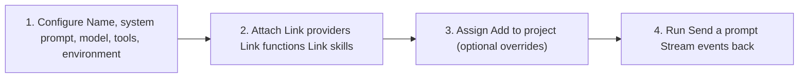

# Agent Endpoints

## What is an Agent Endpoint

An agent endpoint is one of three endpoint types in Threaded Stack. It connects an LLM provider with sandbox tools, custom functions, and conversation history to create an autonomous AI agent that can reason, use tools, and maintain persistent threads.

**Contrast with the other endpoint types:**

| Type | Purpose | Execution model |
|------|---------|-----------------|
| **Agent** | Multi-turn LLM reasoning with tool use and sandbox access | Streaming ReAct loop |
| **Proxy** | HTTP forwarding with auth, transforms, and secret injection | Single request/response passthrough |
| **FaaS** | Serverless function execution in a sandboxed environment | One-shot code execution |

Agent endpoints are the only type that maintain conversation state across requests. Each run uses a thread to persist messages, and the agent can autonomously decide to invoke tools (shell, filesystem, code evaluation, web search, custom functions) across multiple turns before returning a final response.

## Agent Lifecycle



## Agent Configuration

Agents are configured with the following fields:

| Field | Description |
|-------|-------------|
| Name | Agent display name |
| Description | Optional description of the agent's purpose |
| System prompt | Instructions sent to the LLM that define agent behavior |
| Model | Model identifier (falls back to provider default if not set) |
| Max tokens | Maximum tokens for responses (default: 100,000) |
| Tools | Allowed tool names (empty = all tools enabled) |
| Environment variables | Key-value pairs passed to the sandbox at runtime |
| Environment settings | Execution settings: sandbox type, timeout, temperature, thinking level, context budget, web provider config |
| Active | Whether the agent can be used |

### Connections

Agents connect to other resources through junction relationships:

- **Providers** -- Link one or more LLM providers with priority ordering. Priority 0 is the primary provider used by default; higher priorities serve as fallbacks. Each linked provider can optionally override the model.
- **Projects** -- Assign agents to projects with optional per-project overrides. Override fields (model, max tokens, system prompt, tools, environment variables, environment, functions) inherit from the base agent config when not set. An enabled flag controls whether the agent is active in that project.
- **Skills** -- Attach skills that provide additional system prompt instructions and tool registrations, resolved per-turn based on the user's prompt content.

### Secret Resolution

The platform resolves API keys through a 3-tier lookup: agent, then provider, then organization. Secrets are decrypted server-side and never leave the backend. Provider headers and body parameters support `{{SECRET_NAME}}` template substitution, where references are replaced with decrypted values at runtime.

## Execution Paths

Agents can be run through two transport mechanisms: SSE (Server-Sent Events) and WebSocket.

### SSE: `POST /_/agents/:id/run`

The SSE path is a one-shot request/response stream. The client sends a prompt and receives a stream of events until the agent completes.

**Request:**
```json
{
  "prompt": "Write a hello world script",
  "threadId": "optional-existing-thread-id",
  "providerId": "optional-provider-override"
}
```

**Response:** `Content-Type: text/event-stream` with `X-Thread-Id` header.

```text
data: {"type":"thread","threadId":"abc123"}

data: {"type":"text","text":"I'll create"}

data: {"type":"text","text":" a hello world script."}

data: {"type":"tool_call_start","id":"tc_1","name":"writeFile"}

data: {"type":"tool_call_args","id":"tc_1","args":"{\"path\":\"/hello.js\","}

data: {"type":"tool_result","toolUseId":"tc_1","content":"File written to /hello.js","isError":false}

data: {"type":"done","stopReason":"end_turn"}

data: [DONE]
```

**Auth:** JWT or API key (standard `/_/*` auth middleware).

**When to use:** Simple integrations, single-prompt interactions, admin UI chat, any client that does not need mid-stream steering or multi-turn persistence within a single connection.

### WebSocket: `/ai/ws`

The WebSocket path maintains a persistent connection with a long-lived agent instance. The agent persists across multiple prompts without re-initialization, and the client can steer, follow up, cancel, or reconfigure the agent mid-session.

**Connection:** `wss://host/ai/ws?token=<session-token>`

The session token is obtained via `POST /_/ai/sessions`, which resolves the agent config and API key server-side, then returns a signed JWT. The token expires after 1 hour.

**Client messages:**
| Type | Fields | Description |
|------|--------|-------------|
| `prompt` | `message`, `images?`, `files?` | Send a user prompt |
| `cancel` | | Abort the current agent run |
| `steer` | `message` | Inject a steering message mid-turn |
| `follow_up` | `message` | Queue a follow-up after the current turn |
| `update_config` | `model?`, `provider?`, `tools?`, `systemPrompt?`, `thinkingLevel?` | Reconfigure the agent between turns |

**Server messages:** Same event types as SSE, plus `heartbeat` keepalive messages.

**When to use:** Interactive chat UIs that need multi-turn sessions, real-time agent steering, mid-conversation model switching, or REPL-style interfaces.

## Tools

### Sandbox Tools

Tools that operate within the agent's sandbox environment:

| Tool | Description |
|------|-------------|
| `shellExec` | Run a shell command in the sandbox |
| `readFile` | Read file contents |
| `writeFile` | Write content to a file |
| `listDir` | List directory entries |
| `deleteFile` | Delete a file |
| `mkdir` | Create a directory |
| `fileExists` | Check if a path exists |
| `evalCode` | Evaluate JavaScript in an isolated V8 sandbox |
| `createArtifact` | Create a renderable artifact (HTML, SVG, Markdown, code, JSON, CSV, etc.) |

If an allowed tools list is provided in the agent config, only matching tools are registered. An empty or absent list registers all tools.

### Web Tools

Tools for web operations independent of any sandbox:

| Tool | Description |
|------|-------------|
| `webSearch` | Search the web and return results with titles, URLs, and snippets |
| `webFetch` | Fetch and extract content from a URL as cleaned markdown |

Web tools require a configured web provider (set in the agent's environment settings).

### Custom Function Tools

User-defined functions can be attached to agents as tools. Each function tool delegates execution to the platform's sandboxed function executor. Parameter schemas are auto-generated from the function's input schema definition, legacy default arguments, or a generic fallback input.

## Admin UI

Agents are configured through the admin dashboard:

**Agent CRUD** -- Create, list, update, and delete agents via the `/_/agents` endpoints. The admin UI provides forms for setting the agent name, description, system prompt, model, max tokens, tools, environment variables, and environment settings.

**Provider linking** -- Providers are attached to agents via the agent-providers junction table. The UI allows selecting from available org providers, setting priority order, and optionally overriding the model per provider.

**Project assignment** -- Agents are assigned to projects via the agent-projects junction table. Per-project overrides (model, system prompt, tools, functions, environment) can be configured, letting the same agent behave differently across projects.

**Skill attachment** -- Skills are linked to agents via the agent-skills junction table. Active skills are resolved per-turn based on the user's prompt content.

**Running agents** -- The admin UI sends `POST /_/agents/:id/run` with a prompt and optional thread ID. SSE events are consumed in real-time to display streaming text, tool calls, tool results, and artifacts in the chat interface.

**Thread management** -- Conversations are persisted as threads with messages. The admin UI supports viewing thread history, continuing existing threads, and branching threads from specific messages via `POST /_/threads/:id/branch`.
