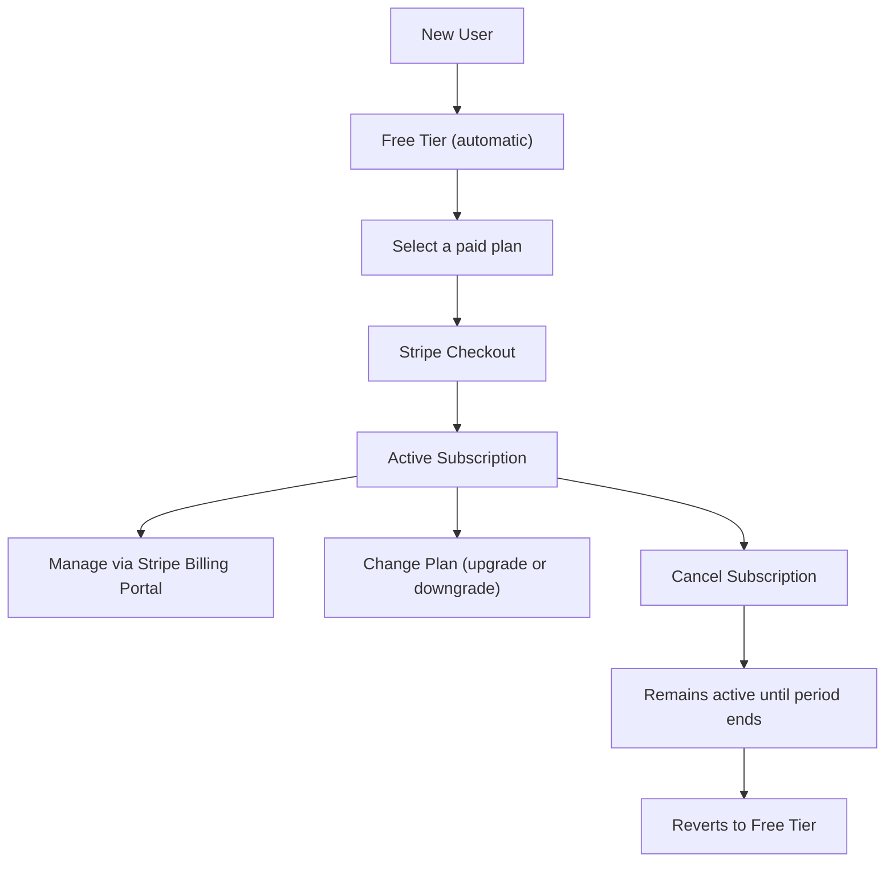

# Billing & Subscriptions

## Billing Model

**User pays, orgs consume.** Your subscription tier determines the resource limits for all organizations you own. If you own three organizations on the **pro** tier, all three get pro-level limits.

Quotas track actual usage **per organization, per billing period**. Each billing period corresponds to a calendar month. Invoices are recorded per user, since the user is the paying entity.

---

## Subscription Tiers

Four tiers are available. A value of `-1` means **unlimited**.

| Resource | Free | Solo | Pro | Team |
|---|---|---|---|---|
| Organizations | 1 | 2 | 5 | Unlimited |
| Projects | 2 | 10 | 50 | Unlimited |
| Compute (units) | 1,000 | 10,000 | 100,000 | Unlimited |
| Threads | 100 | 1,000 | Unlimited | Unlimited |
| Messages | 500 | 10,000 | Unlimited | Unlimited |
| Endpoints | 3 | 20 | Unlimited | Unlimited |
| Secrets | 5 | 25 | Unlimited | Unlimited |
| Retention (days) | 7 | 30 | 90 | 365 |
| Included Seats | 1 | 1 | 3 | 10 |
| Additional Seats | No | No | Yes | Yes |

---

## Subscription Lifecycle

### States

| Status | Meaning |
|---|---|
| `active` | Subscription is current and paid |
| `canceled` | Subscription has been cancelled (reverts to free tier) |
| `past_due` | Invoice payment failed; awaiting retry |
| `incomplete` | Initial payment has not completed |
| `trialing` | Subscription is in a trial period |

### Lifecycle Flow

### Automatic Setup

Every authenticated user automatically receives a free-tier subscription. There is no manual step required to get started.

### API Endpoints

All endpoints live under `/_/subscriptions/`:

| Method | Path | Description |
|---|---|---|
| `GET` | `/subscriptions/plans` | List all available plan tiers with their limits |
| `GET` | `/subscriptions/current` | Get your current subscription |
| `GET` | `/subscriptions/invoices` | List your invoices |
| `POST` | `/subscriptions/checkout` | Create a Stripe Checkout session or upgrade in-place |
| `POST` | `/subscriptions/update` | Change tier on an existing subscription |
| `POST` | `/subscriptions/portal` | Get a Stripe Billing Portal URL to manage payment methods |
| `DELETE` | `/subscriptions/current` | Cancel subscription at end of current period |

---

## Quota Enforcement

When you create resources (projects, endpoints, secrets, threads, messages), the platform checks if you have capacity remaining under your plan. If you've reached a limit, the request is rejected with a `403` response showing your current usage and the limit. Upgrade your plan to increase limits.

If you are on an unlimited tier for a given resource, no check is performed.

### Tracked Resources

| Resource | Incremented When | Decremented When |
|---|---|---|
| Projects | Project created | Project deleted |
| Endpoints | Endpoint created | Endpoint deleted |
| Secrets | Secret created | Secret deleted |
| Threads | Thread created | -- |
| Messages | Message created | -- |
| Compute | Function executed | -- |

Quota counters reset automatically at the start of each billing period.

---

## Invoice Tracking

Invoices are synced from Stripe and viewable from the Billing page. Each invoice shows the amount, currency, status (paid or failed), and a link to view or download the PDF from Stripe's hosted invoice page. Use the `GET /subscriptions/invoices` endpoint to retrieve your invoice history.
