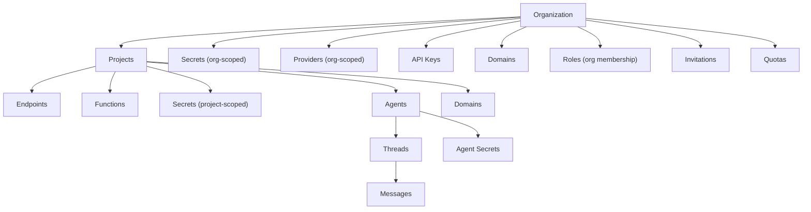

# Organizations

Organizations are the top-level container in Threaded Stack. Every resource in the platform -- projects, secrets, providers, agents, endpoints, API keys, domains -- belongs to an organization. An org's subscription tier determines the quotas and limits that govern all resources within it.

## The Shared Entity Model

The organization sits at the root of the ownership hierarchy:

Deletion of an org cascades to all owned resources.

## Org Lifecycle

### Creation

Any authenticated user can create an organization (`POST /_/orgs`). The creator is automatically assigned the `owner` role. If role assignment fails, the org is rolled back (deleted) to prevent orphaned orgs without owners.

Org creation is subject to the `organizations` quota limit from the creator's subscription tier. The platform checks how many orgs the user already owns against their plan limit before allowing creation.

### Retrieval

- **List orgs** (`GET /_/orgs`) -- Returns only orgs where the authenticated user has a role. Super admins see all orgs. Each org in the response includes the user's `userRole` for that org.
- **Get org** (`GET /_/orgs/:orgId`) -- Requires org membership (any role). Returns the org plus the user's role.

### Update and Deletion

- **Update** (`PUT /_/orgs/:orgId`) -- Requires `admin` role or higher.
- **Delete** (`DELETE /_/orgs/:orgId`) -- Requires `owner` role. Cascades to all child resources (projects, secrets, providers, roles, invitations, quotas).

## Members and Roles

Membership links a user to exactly one org OR one project (never both).

### Role Hierarchy

Roles are strictly hierarchical. Higher roles inherit all permissions of lower roles:

| Level | Role | Description |
|-------|------|-------------|
| 0 | `viewer` | Read-only access to org resources |
| 1 | `member` | Create and edit resources (projects, agents, endpoints, threads) |
| 2 | `admin` | Manage members, secrets, providers, API keys, domains, settings |
| 3 | `owner` | Delete the org, remove users, transfer ownership |
| 4 | `super` | Platform-wide admin -- bypasses all permission checks |

### Permission Matrix

Every action on every resource type maps to a minimum required role. Key org-level permissions:

| Resource | create | read | update | delete | manage |
|----------|--------|------|--------|--------|--------|
| `org` | member | viewer | admin | owner | admin |
| `project` | member | viewer | member | admin | admin |
| `secret` | admin | member | admin | admin | admin |
| `apiKey` | admin | admin | admin | admin | admin |
| `provider` | admin | member | admin | admin | admin |
| `role` | admin | viewer | admin | owner | admin |
| `domain` | admin | member | admin | admin | admin |

Note: members can see secret *names* but not *values*. Value access is restricted to `admin` and above.

### Role Management Rules

Role management enforces a strict downward-only rule: you can only manage roles with a level strictly below your own. An admin can manage members and viewers but not other admins or owners. Super admins can manage anyone.

- **Add member** (`POST /_/orgs/:orgId/members`) -- Requires `admin+`. Cannot assign a role at or above your own level.
- **Update member role** (`PUT /_/orgs/:orgId/members/:userId`) -- Requires `admin+`. Cannot promote someone to or above your own role, and cannot modify someone whose current role is at or above your own.
- **Remove member** (`DELETE /_/orgs/:orgId/members/:userId`) -- Requires `admin+`. Cannot remove owners (must transfer ownership first). Cannot remove someone with an equal or higher role.
- **List members** (`GET /_/orgs/:orgId/members`) -- Any org member (`viewer+`) can see the member list. Supports pagination via `limit` and `offset` query params.

When members are added or removed on plans that support additional seats (Pro and Team), the backend automatically updates the seat quantity on the Stripe subscription.

## Invitations

Invitations allow admins to add new users to an org, whether those users already have a Threaded Stack account or not.

### Invitation Lifecycle

**1. Create** (`POST /_/orgs/:orgId/users/invite`)

Requires `admin+` in the org. Body: `{ email, roleType, expiresInDays? }`.

Before creating an invitation, the platform:
- Validates the role type
- Validates expiration days (1-30 range)
- Checks the requesting user's permission to create roles
- Checks seat capacity against the org owner's subscription tier
- Checks for an existing pending invitation to the same email

Two paths diverge based on whether the invitee already has an account:

- **Existing user**: A role is created immediately, linking the user to the org. A notification email is sent. The response includes the new role.
- **New user**: A pending invitation record is created with a unique token. An invitation email is sent with a link to accept. The response includes the invitation.

**2. Accept** (`POST /_/invitations/accept`)

Requires authentication. Body: `{ token }`.

Validations:
- Token must match an existing invitation
- Invitation must be in `pending` status (not expired, revoked, or already accepted)
- Authenticated user's email must match the invitation's email (case-insensitive)
- User must not already be a member of the org

On success: creates the role, marks the invitation as accepted, and updates the Stripe seat quantity if the new member pushes past the included seats in the plan.

**3. Revoke** (`DELETE /_/invitations/:invitationId`)

Requires `admin+` in the invitation's org. Only pending invitations can be revoked -- already accepted, expired, or revoked invitations return errors with specific messages.

**4. List and Query**

- **List org invitations** (`GET /_/invitations/org/:orgId`) -- Requires `admin+`. Supports `status` query param: `pending` (default), `accepted`, `expired`, `revoked`, or `all`. Paginated.
- **Get my pending invitations** (`GET /_/invitations/me`) -- Authenticated endpoint. Returns all pending invitations sent to the current user's email, displayed on login so users can accept them.

### Seat Capacity Enforcement

The Free and Solo tiers do not allow additional members (1 seat each). Attempting to invite on these tiers returns a `403` directing the user to upgrade. Pro tier includes 3 seats with additional seats available. Team tier includes 10 seats with additional seats available. When a member joins or leaves on a plan that supports additional seats, the Stripe subscription is automatically adjusted.

## Projects

Projects are the primary unit of resource scoping within an org. Each project belongs to exactly one org, and the project name is unique within its org.

### Project-Level Resources

Projects contain their own scoped resources, all managed through nested endpoints under `/_/orgs/:orgId/projects/:projectId/`:

- **Endpoints** -- API proxy, FaaS, and agent endpoints
- **Functions** -- Serverless function definitions
- **Secrets** -- Project-scoped secrets (separate from org-scoped secrets)
- **Agents** -- AI agents with per-project configuration
- **Domains** -- Custom domains for project endpoints
- **Members** -- Project-level role assignments (add, list, remove, update role)

Each of these sub-resources is access-controlled, verifying the user has appropriate permissions for the project before proceeding.

### Project Membership

Projects have their own role system. Project members can be managed through dedicated endpoints: add, list, remove, and update role.

## Resource Propagation

Org-level resources are available to all projects within the org. This propagation follows a "config cascades downward" model:

### Secrets

Each secret belongs to exactly one of: org, project, provider, or agent (with one exception: an org+provider combination is allowed for provider secrets scoped to an org).

- **Org secrets** are accessible to all projects, agents, and endpoints within the org
- **Project secrets** are scoped to that project only
- **Provider secrets** are tied to a specific provider configuration
- **Agent secrets** are tied to a specific agent

The same CRUD endpoints serve both org-level and project-level contexts, available at both `/_/orgs/:orgId/secrets` and `/_/orgs/:orgId/projects/:projectId/secrets`.

### Providers

Providers (external service configurations like OpenAI, Anthropic, etc.) are org-scoped and available to all agents within the org. There is no project-level provider scoping; providers are shared across the entire org.

### Agents

Agents can exist at both the org level and the project level:

- **Org agents** (`/_/orgs/:orgId/agents`) -- Managed directly under the org, with threads and run capability
- **Project agents** (`/_/orgs/:orgId/projects/:projectId/agents`) -- Linked to a project with per-project configuration

## Quotas

Resource usage is tracked per organization per billing period. The quota system tracks current usage, defines tier limits, and blocks requests that would exceed limits.

### Tracked Resources

The following resources are tracked per billing period:

- **Projects** -- Number of projects created
- **Compute** -- Compute units consumed
- **Threads** -- Conversation threads created
- **Messages** -- Messages sent
- **Endpoints** -- Endpoints configured
- **Secrets** -- Secrets stored

### Plan Limits by Tier

Limits are determined by the org owner's subscription tier:

| Resource | Free | Solo | Pro | Team |
|----------|------|------|-----|------|
| `organizations` | 1 | 2 | 5 | unlimited |
| `projects` | 2 | 10 | 50 | unlimited |
| `compute` | 1,000 | 10,000 | 100,000 | unlimited |
| `threads` | 100 | 1,000 | unlimited | unlimited |
| `messages` | 500 | 10,000 | unlimited | unlimited |
| `endpoints` | 3 | 20 | unlimited | unlimited |
| `secrets` | 5 | 25 | unlimited | unlimited |
| `retention` (days) | 7 | 30 | 90 | 365 |
| `seats` | 1 | 1 | 3 | 10 |
| `additionalSeats` | no | no | yes | yes |

### Enforcement

Quota enforcement runs on resource-creating requests. It looks up the org owner's subscription tier and compares current usage against the tier limit. If usage is at or over the limit, the request is rejected with a `403` response containing `{ error: "quota_exceeded", resource, current, limit }`.

Enforcement is non-blocking for errors -- if the quota check itself fails, the request is allowed through and the error is logged. This prevents quota infrastructure issues from blocking all resource creation.

### Quota Query Endpoints

Three endpoints under `/_/orgs/:orgId/quotas` provide quota visibility:

- **Get usage** (`GET /_/orgs/:orgId/quotas`) -- Returns the current period's usage counters
- **Get limits** (`GET /_/orgs/:orgId/quotas/limits`) -- Returns the plan limits for the org based on the owner's subscription tier
- **Check quota** (`POST /_/orgs/:orgId/quotas/check`) -- Checks whether a specific action is within limits. Body: `{ resource, amount? }`. Returns `{ allowed, current, limit, remaining }`.

All three require org membership (`viewer+` or above).

## Admin UI

The admin dashboard provides a full management interface for organizations:

- **Org list** (`/orgs`) -- Grid of org cards, create org drawer
- **Org dashboard** (`/orgs/:orgId`) -- Overview with sidebar navigation to sub-pages
- **Users** (`/orgs/:orgId/users`) -- Member grid with invite drawer, role management
- **Secrets** (`/orgs/:orgId/secrets`) -- Org-level secret management
- **Providers** (`/orgs/:orgId/providers`) -- Provider configuration
- **API Keys** (`/orgs/:orgId/api-keys`) -- API key management
- **Domains** (`/orgs/:orgId/domains`) -- Domain verification
- **Usage** (`/orgs/:orgId/usage`) -- Quota usage dashboard
- **Settings** (`/orgs/:orgId/settings`) -- Org settings
- **Projects** (`/orgs/:orgId/projects`) -- Project list with nested project pages

