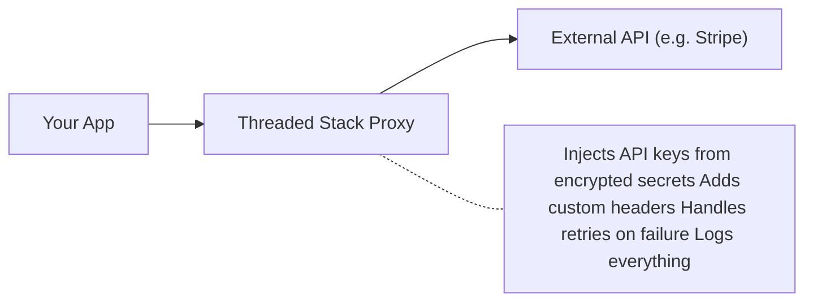
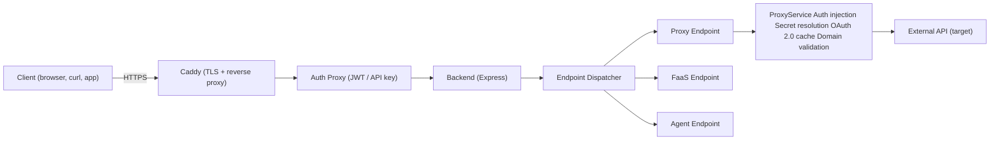
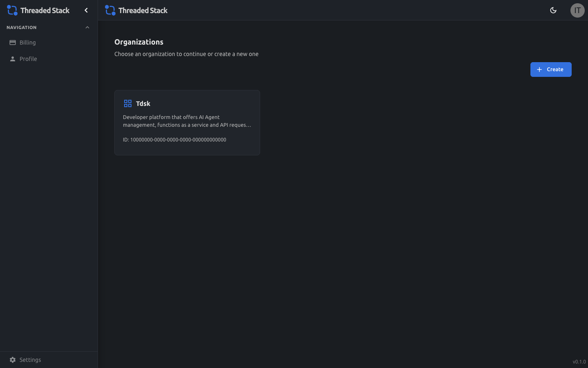
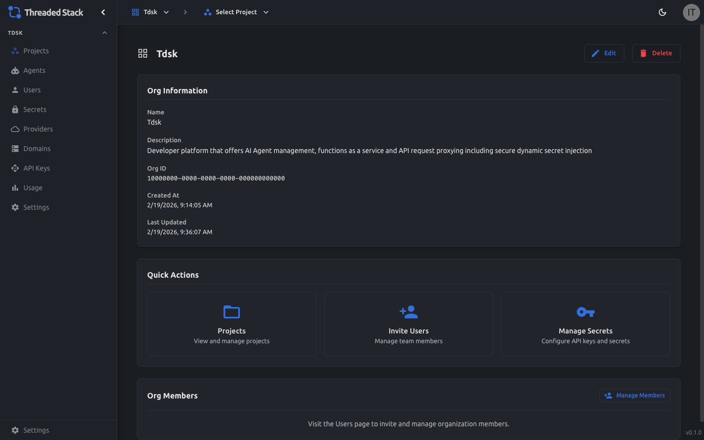
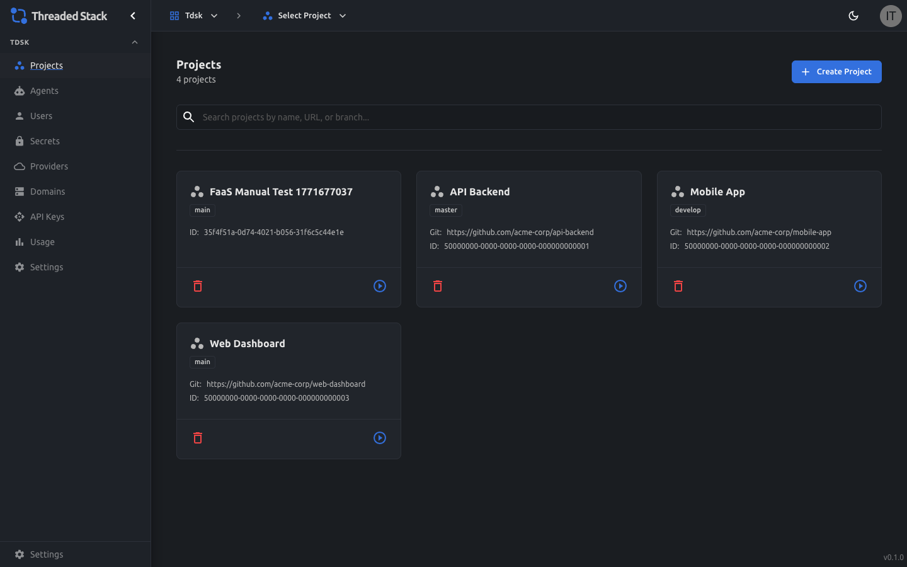
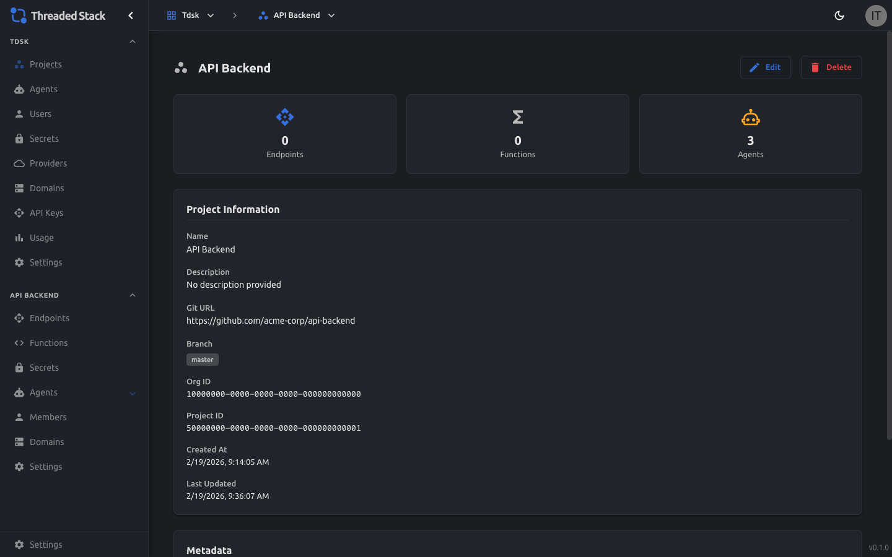
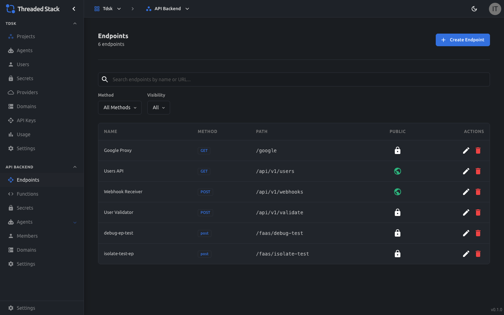
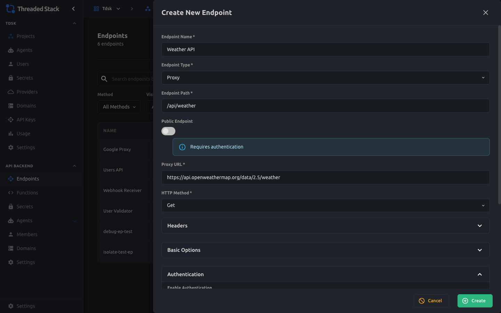
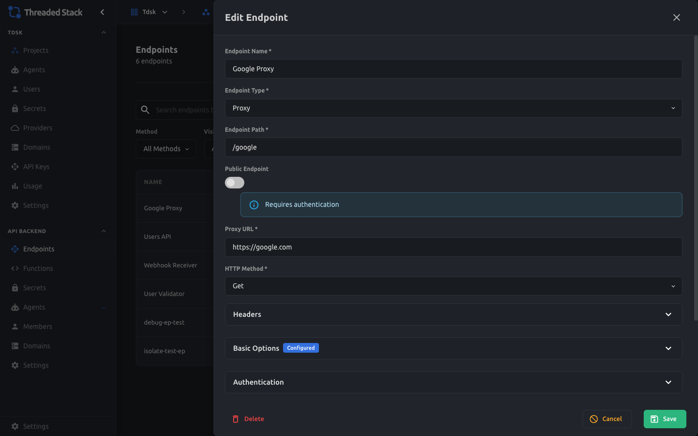
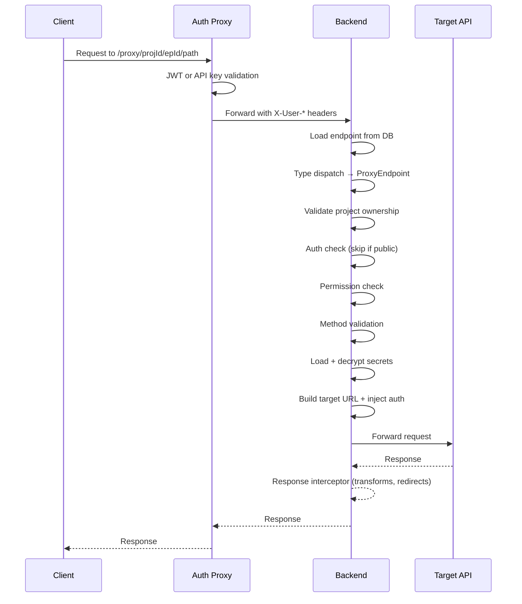

# Proxy Endpoints

A comprehensive guide to creating, configuring, and calling proxy endpoints in Threaded Stack. This document covers the full lifecycle — from setting one up in the Admin UI to executing requests through it — with architecture diagrams, screenshots, and code examples.

---

## Table of Contents

1. [What is a Proxy Endpoint?](#what-is-a-proxy-endpoint)
2. [Architecture Overview](#architecture-overview)
3. [Creating a Proxy Endpoint (Admin UI)](#creating-a-proxy-endpoint-admin-ui)
4. [Calling a Proxy Endpoint](#calling-a-proxy-endpoint)
5. [Secret Injection](#secret-injection)
6. [Configuration Options](#configuration-options)
7. [Authentication Options](#authentication-options)
8. [Request Lifecycle (Step-by-Step)](#request-lifecycle-step-by-step)
9. [Retry Logic](#retry-logic)
10. [Error Handling](#error-handling)
11. [Limits & Constraints](#limits--constraints)
12. [API Reference](#api-reference)
13. [Glossary](#glossary)

---

## What is a Proxy Endpoint?

A **proxy endpoint** lets you expose a safe, authenticated URL that forwards requests to any external API — like OpenWeatherMap, Stripe, or a private internal service — without revealing the target API's credentials to the client.

Think of it like a secure relay:



**Why use it?**

- **Security**: API keys stay server-side; the client never sees them
- **Simplicity**: One URL to call, all auth handled automatically
- **Reliability**: Built-in retry logic with exponential backoff
- **Flexibility**: Transform requests and responses, restrict by domain, validate paths

Threaded Stack supports three endpoint types. This document focuses on **Proxy**:

| Type | What It Does |
|------|-------------|
| **Proxy** | Forwards HTTP requests to an external URL with auth, headers, and retries |
| **FaaS** | Runs a sandboxed JavaScript/TypeScript function |
| **Agent** | Executes an AI agent with LLM streaming |

---

## Architecture Overview

### Where Proxy Endpoints Fit



### Key Services

| Service | Role |
|---------|------|
| **Caddy** | Terminates TLS, reverse-proxies to Auth Proxy |
| **Auth Proxy** | Validates JWT or API key, forwards to Backend |
| **Backend** | Hosts the endpoint dispatcher + proxy engine |
| **ProxyEndpoint** | Builds and executes the proxied HTTP request |
| **ProxyService** | Applies auth, OAuth, domain validation, transforms |
| **SecretResolver** | Decrypts secrets and replaces `{{template}}` references |
| **RetryService** | Manages exponential backoff retry logic |

---

## Creating a Proxy Endpoint (Admin UI)

This section walks through creating a proxy endpoint step-by-step using the Admin dashboard.

### Step 1: Navigate to Your Organization

After logging in, you'll see the **Home** page listing your organizations.



Click on your organization to see its dashboard.



### Step 2: Open Your Project

From the org sidebar, click **Projects** to see all projects.



Click into the project where you want to create the endpoint.



### Step 3: Go to Endpoints

In the project sidebar under **API Backend**, click **Endpoints**. You'll see a table of existing endpoints.



The table shows each endpoint's **Name**, **Method** (GET, POST, etc.), **Path**, and whether it's **Public** (globe icon) or **Private** (lock icon).

### Step 4: Create a New Endpoint

Click the **+ Create Endpoint** button in the top-right corner. A drawer slides in from the right.


The form has these fields:

| Field | Required | Description |
|-------|----------|-------------|
| **Endpoint Name** | Yes | A human-readable name (e.g., "Weather API") |
| **Endpoint Type** | Yes | Select **Proxy** (default) |
| **Endpoint Path** | Yes | The path clients will call (e.g., `/api/weather`) |
| **Public Endpoint** | No | Toggle ON to skip permission checks (auth still required at the proxy level) |
| **Proxy URL** | Yes | The target URL to forward requests to |
| **HTTP Method** | Yes | The HTTP method used when proxying (GET, POST, PUT, DELETE) |

> **Important**: The **Endpoint Path** is the path your clients will call. The **Proxy URL** is the external API you're forwarding to. These are different things!
>
> - **Endpoint Path**: `/api/weather` (what your client calls)
> - **Proxy URL**: `https://api.openweathermap.org/data/2.5/weather` (where the request goes)

### Step 5: Fill in the Basics

Here's an example configuration for proxying to OpenWeatherMap:


- **Name**: Weather API
- **Path**: `/api/weather`
- **Proxy URL**: `https://api.openweathermap.org/data/2.5/weather`
- **HTTP Method**: GET

### Step 6: Add Custom Headers (Optional)

Expand the **Headers** accordion to add custom headers that will be sent with every proxied request.


Headers support **secret templates**: use `{{SECRET_NAME}}` syntax to inject encrypted secret values at runtime. For example:

| Key | Value |
|-----|-------|
| `X-Custom-Header` | `my-static-value` |
| `X-Api-Key` | `{{my-api-key-secret}}` |

The `{{my-api-key-secret}}` template will be replaced with the decrypted value of the secret named `my-api-key-secret` when the request is actually made. The secret value is never exposed to the client.

### Step 7: Configure Authentication (Optional)

Expand the **Authentication** accordion to configure how the proxy authenticates with the target API.



Toggle **Enable Authentication** to ON:


Authentication fields:

| Field | Description |
|-------|-------------|
| **Auth Type** | `Bearer Token`, `Basic Auth`, or `API Key` |
| **Secret** | The secret containing the credential (referenced by ID) |
| **Header Name** | Which header to set (defaults to `Authorization`) |

The info banner confirms: *"Configure authentication using secrets. Secret value will be injected into the specified header."*

### Step 8: Configure OAuth 2.0 (Optional)

For APIs that require OAuth 2.0 client credentials flow, expand the **OAuth 2.0** accordion:


OAuth fields include Token URL, Client ID, Client Secret (can be a secret template), scopes, credential type (header or body), and additional parameters. Threaded Stack automatically handles token exchange and caching.

### Step 9: Save

Click the **Create** button at the bottom of the drawer. Your new endpoint will appear in the endpoints table.

### Editing an Existing Endpoint

Click the pencil icon on any endpoint row to open the edit drawer:



All the same fields are available for editing.

---

## Calling a Proxy Endpoint

Once created, call your proxy endpoint through the Threaded Stack proxy URL:

```http
https://px.threadedstack.app/proxy/<project-id>/<endpoint-id>
```

### Basic GET Request

```bash
curl -s \
  -H "Authorization: Bearer tdsk_<api-key>" \
  "https://px.threadedstack.app/proxy/<project-id>/<endpoint-id>" \
  --insecure
```

The `--insecure` flag is only needed in local development (self-signed Caddy certs).

### POST Request with Body

```bash
curl -s -X POST \
  -H "Authorization: Bearer tdsk_<api-key>" \
  -H "Content-Type: application/json" \
  -d '{"greeting": "hello", "count": 42}' \
  "https://px.threadedstack.app/proxy/<project-id>/<endpoint-id>" \
  --insecure
```

### With Query Parameters

Query parameters are automatically forwarded to the target URL:

```bash
curl -s \
  -H "Authorization: Bearer tdsk_<api-key>" \
  "https://px.threadedstack.app/proxy/<project-id>/<endpoint-id>?city=London&units=metric" \
  --insecure
```

If your Proxy URL is `https://api.openweathermap.org/data/2.5/weather`, the final request to the external API becomes:

```http
GET https://api.openweathermap.org/data/2.5/weather?city=London&units=metric
```

### Extra Path Segments

Any path segments after the endpoint ID are appended to the target URL:

```bash
# Calls: https://api.example.com/v1/users/123/profile
curl -s \
  -H "Authorization: Bearer tdsk_<api-key>" \
  "https://px.threadedstack.app/proxy/<project-id>/<endpoint-id>/123/profile" \
  --insecure
```

### Without Auth (Will Fail)

Requests without a valid JWT or API key are rejected at the Auth Proxy level:

```bash
curl -s "https://px.threadedstack.app/proxy/<project-id>/<endpoint-id>" --insecure
# => 401 Unauthorized
```

### Public Endpoints

If an endpoint has `public: true`, the **backend** skips the permission check — but the **Auth Proxy** still requires authentication. Public only means "no project-level permission check", not "no auth at all."

---

## Secret Injection

Secrets are encrypted values stored in the database using AES-256-GCM encryption. They are only decrypted server-side at the moment a proxy request is being built — they never leave the backend.

### How `{{template}}` Syntax Works

Anywhere you can provide a string value in endpoint configuration (headers, auth secret name, OAuth fields), you can reference a secret by name using double curly braces:

```text
{{my-secret-name}}
```

At execution time, the `SecretResolver` service:

1. Loads all secrets scoped to the endpoint's project
2. Decrypts each secret using the scope owner's encryption key
3. Scans header values, auth config, and body params for `{{...}}` patterns
4. Replaces each pattern with the decrypted plaintext value

### Example

You create a secret named `openweather-key` with the value `abc123xyz`.

In your endpoint's headers, you set:

```http
X-Api-Key: {{openweather-key}}
```

When a client calls your proxy endpoint, the outgoing request to OpenWeatherMap includes:

```http
X-Api-Key: abc123xyz
```

The client never sees `abc123xyz` — they only interact with your proxy endpoint.

### Secret Scoping

Secrets belong to exactly one scope (exclusive arc pattern):

| Scope | Meaning |
|-------|---------|
| **Organization** | Available to all projects in the org |
| **Project** | Available only within that project |
| **Provider** | Scoped to a specific LLM provider |
| **Agent** | Scoped to a specific AI agent |

Proxy endpoints fetch secrets scoped to their **project** (and the project's org).

### Security Guarantees

- Secrets are **never** exposed to clients — replacement happens server-side
- Secret values are encrypted at rest with AES-256-GCM
- Secret references use a secure pattern: `{{secret-name}}`
- The `SecretResolver.replaceInObj()` method recursively processes nested objects and arrays when replacing secret references

---

## Configuration Options

All proxy-specific configuration lives in the endpoint's `options` object. These fields control how the outgoing request to the target API is constructed and validated.

### Timeout

Controls how long the proxy waits for the target API to respond before aborting the request.

```typescript
options: {
  timeout: 10000  // milliseconds
}
```

- Applied via `http-proxy-middleware`'s `timeout` option
- No default timeout is set (inherits from `http-proxy-middleware` defaults)
- Recommended range: 5000-30000ms depending on the target API's expected response time
- Requests that exceed the timeout result in a proxy error

### Proxy Method Override

The `method` property exists at both the endpoint level and within proxy options. This allows the inbound and outbound HTTP methods to differ — for example, accepting a `GET` from the client but forwarding it as a `POST` to the target API.

```typescript
options: {
  proxyMethod: "post"  // overrides the upstream HTTP method
}
```

Valid methods: `get`, `post`, `put`, `delete`, `head`, `options`.

### Path Regex Validation

Restricts which incoming request paths are allowed through the proxy. Useful when the proxy endpoint accepts extra path segments and you want to limit them to a known pattern.

```typescript
options: {
  pathRegex: "^/api/v[0-9]+/.*"
}
```

- The regex is tested against the path portion after `/:projectId/:endpointId/`
- Requests that do not match receive a `403 Forbidden` response
- Invalid regex patterns are treated as non-matching (logged as errors)

### Domain Whitelist

Validates the **incoming request's origin** (from the `Origin` or `Referer` header) against a list of approved domains. This provides SSRF protection by restricting which clients can use the proxy.

```typescript
options: {
  domainWhitelist: {
    allowedDomains: ["app.example.com", "*.example.com"],
    enforceWhitelist: true,
    logBlocked: true
  }
}
```

| Field | Default | Description |
|-------|---------|-------------|
| `allowedDomains` | — | Array of allowed domain patterns |
| `enforceWhitelist` | `true` | When `false`, the whitelist is ignored |
| `logBlocked` | `true` | Log a warning when a request is blocked |

**Wildcard support**: `*.example.com` matches `api.example.com`, `dev.example.com`, and any other subdomain. It also matches the bare `example.com` domain.

Requests from non-whitelisted origins (or without an `Origin`/`Referer` header when enforcement is enabled) receive a `403 Forbidden` response.

### Response Transformation

Enables secret injection into response bodies from the target API.

```typescript
options: {
  transform: {
    injectSecrets: true
  }
}
```

When `injectSecrets` is `true`, the response body is parsed as JSON and any `{{secret-name}}` patterns found in string values are replaced with decrypted secret values. Non-JSON responses pass through unchanged.

---

## Authentication Options

The proxy engine supports four authentication methods that are applied to the **outgoing** request (the one going to the target API).

### Bearer Token

```http
Authorization: Bearer <decrypted-secret-value>
```

The most common option. Set **Auth Type** to `Bearer Token`, provide a **Secret**, and the decrypted value is prefixed with `Bearer ` and placed in the `Authorization` header (or a custom header if you specify one).

### Basic Auth

```http
Authorization: Basic <base64(secret-value)>
```

Set **Auth Type** to `Basic Auth`. The secret value should be in `username:password` format. It gets Base64-encoded and set as a Basic auth header.

### API Key

```http
X-API-Key: <decrypted-secret-value>
```

Set **Auth Type** to `API Key`. The raw secret value is placed directly in the specified header — no `Bearer` prefix, no encoding.

### OAuth 2.0 (Client Credentials)

For services that use OAuth 2.0 client credentials flow:

1. Configure Token URL, Client ID, and Client Secret in the endpoint
2. On the first request, the backend exchanges credentials for an access token
3. The token is cached (with a 5-minute buffer before expiry)
4. Subsequent requests reuse the cached token until it expires
5. The access token is set as `Authorization: Bearer <token>` on the outgoing request

```typescript
options: {
  oauth: {
    tokenUrl: "https://oauth.example.com/token",
    clientId: "{{CLIENT_ID}}",         // supports secret references
    clientSecret: "{{CLIENT_SECRET}}", // supports secret references
    scopes: ["read", "write"],
    credentialType: "header",          // or "body"
    additionalParams: {
      audience: "https://api.example.com"
    }
  }
}
```

**Credential types:**

| Type | Behavior |
|------|----------|
| `header` (default) | Sends `Authorization: Basic base64(clientId:clientSecret)` per RFC 6749 |
| `body` | Sends `client_id` and `client_secret` as form body parameters |

**Token caching:** Tokens are cached in-memory with the key `${tokenUrl}:${clientId}`. The cache stores the token until 5 minutes before its actual expiration to prevent race conditions.

OAuth takes **precedence** over basic auth/bearer/apikey — if both `oauth` and `auth` are configured, only OAuth is used.

### Authentication & Permissions Summary

Two layers of authentication govern access to proxy endpoints:

| Layer | What It Checks | Where |
|-------|---------------|-------|
| **Auth Proxy** (gateway) | Valid JWT or `tdsk_*` API key | Gateway |
| **Backend** (endpoint) | Project membership + `read` permission on endpoints | API Server |

- **All requests** must pass the Auth Proxy (JWT or API key validation)
- **Non-public endpoints** additionally require the user to have `read` access to endpoints in the target project
- **Public endpoints** (`public: true`) skip the backend permission check, but the Auth Proxy still enforces authentication
- **Project-scoped API keys** are restricted to their own project — a key scoped to Project A cannot access endpoints in Project B (returns `403`)

---

## Request Lifecycle (Step-by-Step)

Here's exactly what happens when a client calls a proxy endpoint:



### Detailed Steps

1. **Client sends request** to `https://px.threadedstack.app/proxy/<project-id>/<endpoint-id>`
2. **Auth Proxy validates** the JWT token or `tdsk_*` API key
3. **Auth Proxy forwards** the request to the Backend, injecting `X-User-Id`, `X-User-Role`, and `X-User-Email` headers
4. **Backend's endpoint dispatcher** (`/proxy/:projectId/:endpointId`) loads the endpoint record from the database
5. **Project ownership** is verified — the endpoint must belong to the specified project
6. **Authentication and permissions** — for non-public endpoints, the user is authenticated and must have `read` access to endpoints in this project. Project-scoped API keys are checked against the target project.
7. **HTTP method validation** — the request method must match (or be compatible with) the endpoint's configured method
8. **Secrets are loaded** for the endpoint's project and decrypted using AES-256-GCM
9. **Proxy request is built**:
   - Timeout is applied to the proxy middleware
   - Custom headers are added (with `{{secret}}` templates resolved)
   - Domain whitelist is validated against the request origin
   - Path regex is checked against the extra path segments
   - Auth configuration is applied (Bearer, Basic, API Key, or OAuth 2.0)
   - Proxy method override is applied if configured
10. **Request is forwarded** to the target URL via `http-proxy-middleware`
11. **Response flows back** — 3xx redirects are followed server-side to avoid CORS issues; response transformations are applied if configured
12. **Client receives** the response from the target API

---

## Retry Logic

If a request to the target API fails with a retryable error, the proxy engine automatically retries using exponential backoff.

### Retryable Status Codes

```text
408  Request Timeout
429  Too Many Requests
500  Internal Server Error
502  Bad Gateway
503  Service Unavailable
504  Gateway Timeout
```

### Configuration

Retry behavior is configured per endpoint in the `options` object:

| Option | Default | Description |
|--------|---------|-------------|
| `retries` | `0` | Number of retry attempts (0 = no retries) |
| `retryDelay` | `1000` | Initial delay in ms before first retry |
| `retryMaxDelay` | `30000` | Maximum delay between retries (30s cap) |
| `retryExponentialBackoff` | `true` | Whether to use exponential backoff |
| `retryBackoffMultiplier` | `2` | Multiplier for exponential backoff |

### Backoff Example

With defaults and `retries: 3`:

```text
Attempt 1: fails → wait 1000ms (1s)
Attempt 2: fails → wait 2000ms (2s)
Attempt 3: fails → wait 4000ms (4s)
Attempt 4: fails → give up, return error to client
```

The delay formula is: `delay = initialDelay * (multiplier ^ attempt)`, capped at `maxDelay`.

### Retry Safeguards

- Retries are aborted if `res.headersSent` is `true` — once the response stream is committed, the request cannot be retried
- Each retry creates a fresh `http-proxy-middleware` instance
- Retry metadata is tracked per-request via the `RetryService` and logged on completion (success or exhaustion)

---

## Error Handling

### Common Error Responses

| Status | Meaning | When |
|--------|---------|------|
| **400** | Bad Request | Endpoint has no proxy URL configured, invalid proxy method, or auth configured without a `secretId` |
| **401** | Unauthorized | No valid JWT or API key provided at the Auth Proxy layer |
| **403** | Forbidden | User lacks permission to use this endpoint, endpoint doesn't belong to the project, project-scoped API key mismatch, request origin not in domain whitelist, or path doesn't match `pathRegex` |
| **404** | Not Found | Endpoint ID or Project ID doesn't exist, or auth secret not found |
| **405** | Method Not Allowed | Request method doesn't match the endpoint's configured method |
| **502** | Bad Gateway | Target API is unreachable, returned an error after all retries, or OAuth token exchange failed |
| **500** | Internal Server Error | Unexpected failure in the proxy setup |

### Error Response Format

```json
{
  "error": "Proxy failed after retries: connect ECONNREFUSED 10.0.0.1:443"
}
```

### Server-Side Redirect Handling

When the target API returns a 3xx redirect, the proxy follows it server-side rather than passing the redirect back to the client. This prevents CORS errors that would occur if the client browser tried to follow a cross-origin redirect. The final response body and headers from the redirect target are returned to the client with the final status code.

---

## Limits & Constraints

| Constraint | Detail |
|------------|--------|
| **Authentication required** | All proxy requests must pass through the Auth Proxy with a valid JWT or API key, even for public endpoints |
| **Single target URL** | Each proxy endpoint maps to exactly one target URL (extra path segments and query params are appended) |
| **Timeout ceiling** | No enforced maximum, but excessively long timeouts risk holding connections open indefinitely |
| **Retry cap** | Configurable via `retries`; each retry holds a connection open, so high values increase resource usage |
| **Max retry delay** | Capped at `retryMaxDelay` (default 30s) regardless of backoff multiplier |
| **OAuth token cache** | In-memory only — tokens are lost on backend restart and re-fetched on the next request |
| **Secret scope** | Proxy endpoints can only reference secrets scoped to their project or the project's parent org |
| **Request body** | Proxy endpoints skip body parsing — the raw request body is forwarded as-is to the target API |
| **Response transform** | Only `injectSecrets` is supported; complex transformation rules (JSONPath, conditional logic) are not available |
| **Domain whitelist** | Validates the **incoming** request's `Origin`/`Referer` header, not the target URL's domain |
| **Valid HTTP methods** | `get`, `post`, `put`, `delete`, `head`, `options` — other methods are rejected with `400` |
| **Endpoint path uniqueness** | Endpoint paths must be unique within a project |

---

## API Reference

### Create Endpoint

```http
POST /_/orgs/:orgId/projects/:projectId/endpoints
```

**Body:**
```json
{
  "name": "Weather API",
  "path": "/api/weather",
  "type": "proxy",
  "method": "get",
  "projectId": "PROJECT_ID",
  "public": false,
  "headers": {
    "X-Custom-Header": "static-value",
    "X-Api-Key": "{{my-secret}}"
  },
  "options": {
    "url": "https://api.openweathermap.org/data/2.5/weather",
    "proxyMethod": "get",
    "timeout": 10000,
    "retries": 3,
    "retryDelay": 1000,
    "retryMaxDelay": 30000,
    "retryExponentialBackoff": true,
    "retryBackoffMultiplier": 2,
    "pathRegex": "^/v[0-9]+/.*",
    "auth": {
      "type": "bearer",
      "secretId": "SECRET_UUID",
      "headerName": "Authorization"
    },
    "oauth": {
      "tokenUrl": "https://oauth.example.com/token",
      "clientId": "{{CLIENT_ID}}",
      "clientSecret": "{{CLIENT_SECRET}}",
      "scopes": ["read", "write"],
      "credentialType": "header",
      "additionalParams": {
        "audience": "https://api.example.com"
      }
    },
    "domainWhitelist": {
      "allowedDomains": ["app.example.com", "*.example.com"],
      "enforceWhitelist": true,
      "logBlocked": true
    },
    "transform": {
      "injectSecrets": true
    }
  }
}
```

### Get Endpoint

```http
GET /_/orgs/:orgId/projects/:projectId/endpoints/:endpointId
```

### Update Endpoint

```http
PATCH /_/endpoints/:endpointId
```

### Delete Endpoint

```http
DELETE /_/endpoints/:endpointId
```

### Execute (Call the Proxy)

```http
GET|POST|PUT|DELETE /proxy/:projectId/:endpointId[/*]
```

All query parameters and extra path segments are forwarded to the target URL.

---

## Glossary

| Term | Definition |
|------|-----------|
| **Proxy Endpoint** | An endpoint configuration that forwards HTTP requests to an external target URL |
| **Endpoint Path** | The path your clients call (e.g., `/api/weather`) — this is part of the endpoint configuration |
| **Proxy URL** | The target URL the request gets forwarded to (e.g., `https://api.openweathermap.org/...`) |
| **Proxy Method** | Optional method override — the HTTP method used for the outgoing request to the target, which can differ from the inbound method |
| **Secret Template** | The `{{SECRET_NAME}}` syntax used to reference encrypted secrets in headers, auth, and body params |
| **Exclusive Arc** | A database pattern where a record belongs to exactly one of several possible parent types |
| **Public Endpoint** | An endpoint that skips backend permission checks (auth proxy still requires JWT/API key) |
| **Domain Whitelist** | A list of approved request origins that are allowed to use the proxy endpoint |
| **Path Regex** | A regular expression pattern that incoming request paths must match to be proxied |
