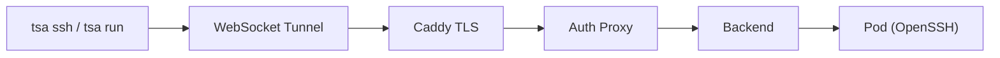
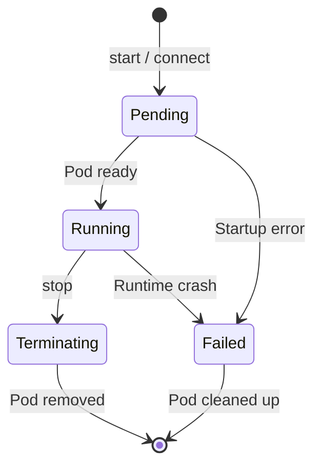
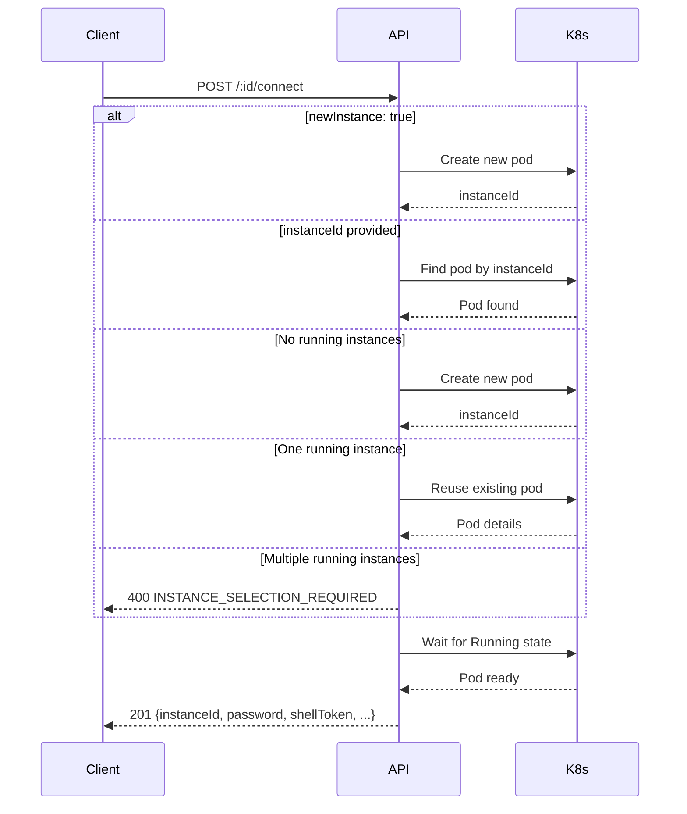

# Sandbox Connect

## What is Sandbox Connect

Sandbox Connect lets users SSH into a sandboxed container running a pre-configured AI tool -- Claude Code, Codex, OpenCode, or any tool that runs in a Docker container. The container is managed by Threaded Stack's Kubernetes infrastructure, and all outbound traffic passes through a transparent proxy that replaces placeholder tokens with real secret values. The user interacts with the AI tool directly, as if it were running locally, but never gains access to raw credentials.

Sandbox Connect is the **primary interaction surface** for Threaded Stack. The recommended workflow is `tsa run <sandbox-id>`, which starts the sandbox, syncs files, and launches the AI tool in one command.

| Surface | Interface | Audience |
|---------|-----------|----------|
| **Sandbox Connect** | **Direct container access via `tsa run`** | **Developers using off-the-shelf AI tools** |
| TSA CLI (`tsa chat`) | Terminal TUI | Developers using the built-in agent chat |
| Threads web app | Browser | Non-developers |
| API (SSE/WebSocket) | Programmatic | Integrations |

### Connection Path




## Multi-Instance Support

Sandboxes support multiple concurrent running instances of the same configuration. Each instance is an independent Kubernetes pod identified by a unique `instanceId` (the pod name). This allows teams to run several copies of a sandbox simultaneously -- for example, multiple developers each working in their own Claude Code session from the same sandbox config.

### How It Works

| Concept | Description |
|---------|-------------|
| **Instance** | A single running pod created from a sandbox configuration |
| **instanceId** | The pod name, returned by `start` and `connect` endpoints |
| **maxInstances** | Per-sandbox config field that limits how many concurrent instances can exist (default: 1) |
| **Scoping** | Each instance is scoped to the user who created it and the organization that owns the sandbox |

Each instance has independent sessions, file sync, and lifecycle. Stopping one instance does not affect others. Sessions (SSH, shell, tunnel) are tracked per-instance, so the platform knows which users are connected to which instance.

<Note>When `maxInstances` is 1 (the default), the sandbox behaves as a single-instance resource. The multi-instance machinery is still present but transparent -- `connect` reuses the single running instance without requiring an `instanceId`.</Note>

### Instance Lifecycle

Instances move through the following states:

| State | Description |
|-------|-------------|
| `Pending` | Pod created, container starting |
| `Running` | Container is up and accepting connections |
| `Failed` | Container exited with an error |
| `Terminating` | Pod is shutting down |
| `Unknown` | State could not be determined |

The `connect` endpoint polls for `Running` state before returning connection details. If the pod reaches `Failed` or `Terminating` during startup, the endpoint cleans up the pod and returns an error.

The following diagram illustrates the instance lifecycle state transitions:




## Vision

**"Bring your own AI tool, we make it secure and managed."**

Org admins configure sandbox environments -- selecting a Docker image, attaching secrets, setting resource limits, and choosing which projects the sandbox can access. Users connect to the sandbox and work with whichever AI tool is installed in the image. Threaded Stack handles:

- **Credential security** -- Secrets are injected as opaque placeholder tokens. The MITM egress proxy swaps them for real values on outbound requests. The AI tool and the user session never see raw API keys.
- **Environment consistency** -- Every team member gets the same container image, same tools, same configuration. No per-engineer setup drift.
- **Lifecycle management** -- Pods are created, monitored, and torn down automatically. When the sandbox shuts down, nothing leaks.
- **Access control** -- Sandbox pods are scoped to organizations and projects. Pod ownership is validated before any operation.

The user experience is: pick a sandbox config from the admin dashboard (or use a built-in preset), click "Start" or run `tsa run <sandbox-id>` from the terminal, and start working. The complexity of pod orchestration, TLS interception, and secret management is invisible.


## Runtime System

Sandboxes use a runtime system that determines which AI tool is launched after the container starts. The runtime is configured per sandbox and controls the command executed by `tsa run`.

### Available Runtimes

| Runtime | Enum Value | Description |
|---------|-----------|-------------|
| Claude Code | `claude-code` | Anthropic's Claude Code CLI |
| Codex | `codex` | OpenAI's Codex CLI |
| OpenCode | `opencode` | Open-source AI coding tool |
| Antigravity | `antigravity` | Antigravity CLI |
| OpenClaw | `openclaw` | OpenClaw CLI |
| Custom | `custom` | User-specified command |

### Two-Command Model

Each sandbox has two distinct commands:

1. **Container start command** — Keeps the pod alive and starts the SSH server. For built-in runtimes, this is resolved automatically.
2. **Runtime command** — Launched by `tsa run` after SSH connect. This is the AI tool itself (e.g., `claude-code`, `codex`). For custom runtimes, the user specifies this.

Additionally, an optional **init script** runs between container start and the "ready" state. Use this for setup tasks like installing dependencies, cloning repos, or configuring tools.

### Runtime Resolution

For built-in runtimes (`claude-code`, `codex`, `opencode`, `antigravity`, `openclaw`), commands are resolved automatically. The runtime command is read-only in the admin UI for built-in runtimes. For `custom` runtimes, all fields (start command, args, runtime command) are user-editable.


## Built-In Sandbox Presets

When an organization is created, default sandbox configs are automatically seeded:

| Preset | Runtime | Description |
|--------|---------|-------------|
| Claude Code | `claude-code` | Pre-configured for Anthropic's Claude Code |
| Codex | `codex` | Pre-configured for OpenAI's Codex |
| OpenCode | `opencode` | Pre-configured for the OpenCode CLI |
| Antigravity | `antigravity` | Pre-configured for the Antigravity CLI |
| OpenClaw | `openclaw` | Pre-configured for the OpenClaw CLI |
| Base | `custom` | Plain sandbox with SSH — bring your own runtime |

These presets are:
- **Immediately startable** — no configuration needed, just run them
- **Editable** — customize image, secrets, resource limits, init script
- **Copyable** — duplicate via the copy button or the copy API
- **Deletable** — remove presets you don't need


## Copy Sandbox

Any sandbox config can be duplicated using the copy action:

- **Admin UI**: Click the copy button on any sandbox row in the list
- **API**: `POST /_/orgs/:orgId/projects/:projectId/sandboxes/:id/copy`

The copy creates a new sandbox config with a new ID. All configuration (image, secrets, runtime, resource limits) is preserved. This is useful for creating customized versions of built-in presets.


## Security Model

Sandbox Connect inherits the platform's defense-in-depth security model.

### Credential Isolation

Sandbox code and connected users never see raw credentials. When a sandbox starts, each attached secret is replaced with a random opaque placeholder token. The sandbox container receives only these placeholder tokens as environment variables. When the AI tool makes outbound API calls, the egress proxy transparently swaps the placeholder tokens for real credential values before forwarding the request. If a placeholder cannot be resolved (e.g., the secret was deleted), the proxy returns an error rather than forwarding the placeholder to an external service.

### Container Security

Sandbox pods run with minimal privileges. Containers cannot escalate privileges beyond what they start with, have no access to the Kubernetes API, and do not automatically restart on failure. There is no path from within a sandbox container to the broader cluster.

### Network Interception

All outbound HTTP and HTTPS traffic from sandbox containers is redirected through the egress proxy. This redirection is set up before the sandbox starts and operates at the network level, meaning the sandbox container cannot bypass it. The proxy intercepts traffic transparently -- the AI tool makes normal HTTP/HTTPS requests without any special configuration.

### Ownership Validation

Every pod operation (start, stop, connect, list, status) validates that the requesting user's organization owns the pod. No operation can be performed on a sandbox belonging to a different organization. For multi-instance sandboxes, ownership is validated per-instance -- a user in one organization cannot interact with instances belonging to another organization, even if they know the `instanceId`.


## Use Cases

### Developer Running Claude Code with Org Secrets

A developer needs to use Claude Code to work on a project that requires API keys for OpenAI, a database connection string, and a third-party SaaS token. Instead of configuring these locally:

1. The org admin attaches the three secrets to the built-in "Claude Code" sandbox preset (seeded automatically when the org was created)
2. The developer logs in: `tsa login <api-key> --url https://your-instance.threadedstack.app`
3. The developer lists sandboxes: `tsa run --list`
4. The developer runs: `tsa run <sandbox-id>` -- the pod starts, files sync, and Claude Code launches automatically
5. Claude Code runs inside the container with placeholder tokens as environment variables
6. When Claude Code makes API calls, the egress proxy transparently replaces the placeholders with real credentials
7. The developer never sees the raw API keys -- neither does Claude Code

### Team Lead Configuring a Standard AI Environment

A team lead wants every engineer on the project to use the same AI tooling setup:

1. The team lead copies the built-in "Claude Code" preset, attaches the project's secrets, sets resource limits (CPU, memory), and adds an init script to clone the project repo
2. Any project member can start this sandbox with `tsa run <sandbox-id>`
3. Every sandbox gets the same image, same secrets, same resource limits, same setup
4. New team members get a working AI environment without any local setup

### Onboarding New Developers

A new hire joins the team and needs access to AI-assisted development:

1. The org admin invites the new user to the organization
2. The new user signs in via social login (Neon Auth)
3. The new user runs `tsa login <api-key>` and `tsa run --list` to see available sandboxes
4. `tsa run <sandbox-id>` starts the sandbox, syncs files, and launches the AI tool
5. No API keys to request, no environment to configure, no secrets shared over Slack

### Multiple Developers on the Same Sandbox Config

A team of three engineers all need Claude Code with the same secrets and environment, running simultaneously:

1. The org admin sets `maxInstances` to 5 on the shared "Claude Code" sandbox config
2. Each developer runs `tsa run <sandbox-id>` -- each gets their own isolated instance
3. All three instances share the same image, secrets, and init script, but run as independent pods
4. Each developer's file sync and sessions are scoped to their own instance
5. When a developer finishes, their instance is stopped without affecting the others


## Instance API Reference

All sandbox instance endpoints are scoped under `/_/orgs/:orgId/projects/:projectId/sandboxes/:id`. Authentication is required (JWT or API key).

### Start Instance

Creates a new pod and returns immediately without waiting for it to reach `Running` state. Use `GET /:id/status` to poll for readiness.

```http
POST /:id/start
```

**Response** (`201 Created`):

```json
{
  "data": {
    "instanceId": "sb-abc123-x7k9m"
  }
}
```

### Connect to Instance

Starts or reuses an instance, waits for it to reach `Running` state, and returns full connection details including SSH credentials and a shell token for WebSocket sessions.

```http
POST /:id/connect
Content-Type: application/json

{
  "instanceId": "sb-abc123-x7k9m",
  "newInstance": false
}
```

**Request body fields** (all optional):

| Field | Type | Description |
|-------|------|-------------|
| `instanceId` | `string` | Connect to a specific existing instance |
| `newInstance` | `boolean` | Force creation of a new instance |

**Resolution logic**:

- If `instanceId` is provided, the endpoint validates and connects to that specific instance.
- If `newInstance` is `true`, a new pod is always created (subject to `maxInstances`).
- If neither is provided and no instances are running, a new pod is created.
- If neither is provided and exactly one instance is running, it is reused (single-instance shortcut).
- If neither is provided and multiple instances are running, the endpoint returns `INSTANCE_SELECTION_REQUIRED` so the caller can choose.

The following diagram illustrates the instance resolution flow:



**Response** (`200 OK`):

```json
{
  "data": {
    "workdir": "/home/user",
    "password": "generated-ssh-password",
    "sandboxId": "uuid",
    "port": 2222,
    "instanceId": "sb-abc123-x7k9m",
    "shellToken": "jwt-token-for-websocket",
    "command": "tsa ssh my-sandbox",
    "alias": "my-sandbox"
  }
}
```

### Stop Instance

Stops one or all instances of a sandbox. Protected by session-awareness -- if other users have active sessions on the target instance, the request is rejected unless `force` is set.

```http
DELETE /:id/stop
Content-Type: application/json

{
  "instanceId": "sb-abc123-x7k9m",
  "force": false,
  "stopAll": false
}
```

**Request body fields**:

| Field | Type | Description |
|-------|------|-------------|
| `instanceId` | `string` | Stop a specific instance (required unless `stopAll` is set) |
| `stopAll` | `boolean` | Stop all active instances of this sandbox |
| `force` | `boolean` | Ignore active sessions from other users |

**Response** (`200 OK`) for single instance:

```json
{
  "data": {
    "success": true
  }
}
```

**Response** (`200 OK`) for `stopAll`:

```json
{
  "data": {
    "success": true,
    "stoppedCount": 3,
    "failedInstances": []
  }
}
```

### Get Instance Status

Returns the current state of a specific instance.

```http
GET /:id/status?instanceId=sb-abc123-x7k9m
```

**Response** (`200 OK`):

```json
{
  "data": {
    "instanceId": "sb-abc123-x7k9m",
    "state": "Running"
  }
}
```

If the instance is not found (pod was deleted), the endpoint returns `state: "Failed"` rather than a 404, allowing clients to detect terminated instances without error handling.

### List Instances

Returns all active instances for a sandbox, including their states, sessions, and the `maxInstances` limit.

```http
GET /:id/instances
```

**Response** (`200 OK`):

```json
{
  "data": {
    "maxInstances": 3,
    "instances": [
      {
        "instanceId": "sb-abc123-x7k9m",
        "sandboxId": "uuid",
        "userId": "user-uuid",
        "state": "Running",
        "sessionCount": 1,
        "sessions": [
          {
            "sessionId": "sess-uuid",
            "userId": "user-uuid",
            "orgId": "org-uuid",
            "sandboxId": "uuid",
            "instanceId": "sb-abc123-x7k9m",
            "connectedAt": "2026-05-11T10:00:00Z",
            "hasShellSession": true,
            "visibility": "private"
          }
        ]
      }
    ]
  }
}
```


## Error Codes

Sandbox endpoints return structured error responses with a `code` field for programmatic handling.

| Code | HTTP Status | Description |
|------|-------------|-------------|
| `INSTANCE_SELECTION_REQUIRED` | `400` | Multiple instances are running and the request did not specify `instanceId` or `newInstance`. The error details include the list of running instances. |
| `INSTANCE_LIMIT_REACHED` | `409` | The sandbox has reached its `maxInstances` limit. The error details include the list of active instances. |
| `ACTIVE_SESSIONS` | `409` | The target instance has active sessions from other users. Pass `force: true` to override, or wait for the other users to disconnect. |

**Error response format**:

```json
{
  "error": {
    "message": "instanceId or newInstance required when instances exist",
    "code": "INSTANCE_SELECTION_REQUIRED"
  }
}
```
