# Secrets

## What Are Secrets

Secrets are encrypted key-value pairs that store sensitive data such as API keys, tokens, and credentials. Users create secrets by name and value, but the platform immediately encrypts the value at rest using AES-256-GCM. Once stored, the raw value is never returned through the API -- only metadata (name, ID, description, scope) is exposed to non-admin users.

Secrets are scoped using the **Exclusive Arc** pattern: each secret belongs to exactly one owner entity. The database enforces this via a constraint that permits exactly one scope per secret (with one exception for provider secrets that carry dual org+provider ownership).

## Secret Lifecycle

### Create

1. Client sends `POST /secrets` with `name`, `value`, and a scope identifier (`orgId`, `projectId`, `providerId`, or `agentId`).
2. Backend validates the exclusive arc -- exactly one owner field must be set (or the org+provider dual-ownership variant).
3. Backend checks the caller has `create` permission on the `secret` resource within the target scope.
4. A unique encryption key is derived for the scope owner, and the value is encrypted with AES-256-GCM.
5. The secret record is persisted. The org's `secrets` quota counter is incremented.
6. The response returns sanitized data (no secret values included).

### Read

- `GET /secrets` lists secrets for a scope. Members see only metadata; admins (`admin` role and above) see encrypted values.
- `GET /secrets/:id` returns a single secret with the same role-based visibility.
- Raw plaintext values are never returned by any API endpoint.

### Update (Rotate)

1. Client sends `PUT /secrets/:id` with an optional new `name` and/or `value`.
2. Backend fetches the existing record, checks `update` permission.
3. If a new value is provided, the backend re-derives the encryption key from the original scope owner ID and re-encrypts.
4. The response returns sanitized data.

Rotation is an in-place re-encrypt: the old ciphertext is overwritten. All references using `{{ name:id }}` templates automatically pick up the new value on the next request -- no configuration changes needed.

### Delete

1. Client sends `DELETE /secrets/:id`.
2. Backend checks `delete` permission.
3. Backend verifies no providers reference this secret as their API key. If a provider depends on it, deletion is blocked with a `409 Conflict`.
4. The record is removed and the org's `secrets` quota counter is decremented.

## Encryption

All secret values are encrypted at rest using **AES-256-GCM** with tamper detection. Each scope owner (organization, project, provider, or agent) gets a unique derived encryption key, so compromising one entity's key cannot decrypt another entity's secrets.

### How It Works

- **Encrypt:** A random initialization vector is generated per secret. The value is encrypted with AES-256-GCM, producing ciphertext and an authentication tag that detects any tampering.
- **Storage:** The IV, auth tag, and ciphertext are combined and base64-encoded into a single stored string.
- **Decrypt:** The stored value is decoded, the encryption key is re-derived from the scope owner's identity, and the value is decrypted. The GCM auth tag ensures the ciphertext has not been modified.

For the full security model, see [Security Model](../architecture/security-model.md).

## Scoping Rules

Secrets use the **Exclusive Arc** pattern with four scope levels. A database constraint enforces that exactly one scope is set per secret (with one permitted combination):

| Scope | Description |
|-------|-------------|
| Organization | Shared across the entire org. Available to all endpoints and agents within the org. |
| Project | Scoped to a single project. Available to endpoints within that project. |
| Provider | Tied to a specific LLM or API provider. Used for provider API keys and auth headers. |
| Agent | Dedicated to a single agent. Isolated from other agents in the same org. |

### Dual Ownership Exception

Provider secrets support a dual-ownership mode where both organization and provider scopes are set. This allows the secret to appear in both the organization's secrets list and the provider's configuration. The constraint permits this combination explicitly.

### Scope Resolution During Decryption

When decrypting, the system determines the correct encryption key using scope priority order: agent > provider > project > organization. If decryption fails with the scope owner's key (e.g., a quickstart-created secret was encrypted at the org level but stored as provider-scoped), it falls back to decrypting with the org-level key.

## Placeholder Mechanisms

Threaded Stack has **two distinct placeholder systems** for injecting secrets into outbound traffic. Each serves a different execution context.

### 1. Config Templates: `{{ name:id }}`

**Syntax:** `{{ secret-name:aBcDeFgHiJ }}` (name followed by the secret's 10-character nanoid)

**When used:** At request time, when the backend itself is constructing or proxying an outbound request. This applies to:

- **Provider headers** -- e.g., `Authorization: Bearer {{ api-key:xK9mN2pQ4r }}`
- **Provider body parameters** -- template references in JSON body values
- **Proxy endpoint headers** -- custom headers configured on proxy-type endpoints
- **Response transforms** -- secret injection into proxied response bodies (when `transform.injectSecrets` is enabled)

**How it works:** The secret resolver scans string values for the `{{ name:id }}` pattern. When found, it loads the referenced secrets from the database, decrypts them, and replaces the template with the plaintext value. If no template references are detected, the fast path skips all database queries.

**Resolution scope:** The resolver loads both provider-scoped and org-scoped secrets. Provider-scoped secrets take precedence when names collide.

### 2. Egress Tokens: `tdsk_ph_*`

**Syntax:** `tdsk_ph_` followed by a 16-character random nanoid (e.g., `tdsk_ph_aB3dEf7hIjK1mN2p`)

**When used:** Inside sandbox pods, where user code runs in isolation and must never have access to real secret values. This applies to:

- **Agent sandboxes** -- when an agent executes code inside a K8s pod, any secrets the sandbox needs are replaced with opaque placeholder tokens before the pod starts.

**How it works:**

1. When a sandbox pod starts, a unique `tdsk_ph_*` token is generated for each secret the sandbox needs. These tokens are stored in a placeholder map that maps each token to its corresponding secret.
2. The placeholder map is associated with the pod's network identity.
3. All outbound HTTP/HTTPS traffic from the sandbox pod is redirected to the **Egress Proxy** -- a transparent proxy running on the backend.
4. The Egress Proxy intercepts each outbound request, identifies the source pod, looks up the pod's placeholder map, and scans all HTTP headers for `tdsk_ph_*` tokens.
5. For each token found, the proxy resolves the mapped secret, decrypts the secret value, and replaces the token with the real value before forwarding the request to the external service.
6. If a placeholder cannot be resolved, the proxy **throws an error and blocks the request** to prevent token leakage to external services.

### Why Both Systems Exist

| Concern | Config Templates `{{ }}` | Egress Tokens `tdsk_ph_*` |
|---------|--------------------------|---------------------------|
| Execution context | Backend process (trusted) | Sandbox pod (untrusted user code) |
| Resolution timing | Before the request leaves the backend | As traffic exits the sandbox through the egress proxy |
| Secret exposure | Backend decrypts in-process; plaintext lives only in memory briefly | Plaintext never enters the sandbox; replaced at the network boundary |
| Use case | Provider config, proxy endpoints, header injection | Agent sandboxes running arbitrary user code |

Config templates are sufficient when the backend itself is making the request (proxy endpoints, provider calls). Egress tokens are necessary when user-authored code running in an isolated sandbox needs to authenticate with external services without ever seeing the real credentials.

## Secret Flow Through System

```mermaid
flowchart TD
  subgraph Proxy["Proxy Endpoint"]
    P1["1. Client request arrives"]
    P2["2. Load project secrets"]
    P3["3. Decrypt secrets"]
    P4["4. Inject into auth headers, OAuth, and transforms"]
    P5["5. Replace {{ name:id }} in custom headers"]
    P6["6. Forward to upstream with real values"]
    P1 --> P2 --> P3 --> P4 --> P5 --> P6
  end

  subgraph Agent["Agent Execution (SSE)"]
    A1["1. Agent run request arrives"]
    A2["2. Load agent config and provider"]
    A3["3. Decrypt provider API key"]
    A4["4. Replace {{ }} in headers"]
    A5["5. Replace {{ }} in body params"]
    A6["6. Build LLM config with real API key"]
    A7["7. Stream request to LLM provider"]
    A1 --> A2 --> A3 --> A4 --> A5 --> A6 --> A7
  end

  subgraph Sandbox["Sandbox (K8s + Egress)"]
    S1["1. Generate tdsk_ph_* tokens"]
    S2["2. Inject tokens into pod environment"]
    S3["3. Code uses tdsk_ph_* in HTTP headers"]
    S4["4. Redirect traffic to Egress Proxy"]
    S5["5. Identify source pod"]
    S6["6. Replace tdsk_ph_* with real values"]
    S7["7. Forward to external with real credentials"]
    S1 --> S2 --> S3 --> S4 --> S5 --> S6 --> S7
  end
```

## Access Control

### Who Can Create Secrets

- **Admin+ role** required.
- For provider-scoped secrets, the provider must belong to the caller's org.
- For agent-scoped secrets, the agent must belong to the caller's org.

### Who Can Read Secret Metadata

- **Member+ role** can see secret names, IDs, descriptions, and scope identifiers.
- Secret values are stripped from all API responses before being sent to clients.

### Who Can Read Secret Values

- **Admin+ role** only (`admin`, `owner`, and `super` roles).
- Even for admins, the API returns the encrypted ciphertext, not the decrypted plaintext. Plaintext values exist only transiently in backend memory during secret resolution.

### Who Can Update / Delete Secrets

- **Admin+ role** required for both `update` and `delete` operations.
- Deletion is blocked if any provider references the secret as its API key, returning a `409 Conflict` with guidance to unlink the provider first.

### Raw Values Are Never Exposed

The platform enforces a strict principle: **secret plaintext never leaves the backend process boundary**.

- API responses return sanitized objects with secret values removed.
- LLM API keys are resolved server-side and injected into outbound requests; they are never included in session tokens or client responses.
- Sandbox pods receive opaque `tdsk_ph_*` placeholder tokens, not real values. The real values are substituted at the network boundary by the Egress Proxy.
- Every API response that includes secret data is sanitized at the model level before being sent to the client.
