# Website Docs Improvements Implementation Plan

> **For agentic workers:** REQUIRED SUB-SKILL: Use superpowers:subagent-driven-development (recommended) or superpowers:executing-plans to implement this plan task-by-task. Steps use checkbox (`- [ ]`) syntax for tracking.
>
> **CRITICAL GIT RULE:** NEVER run `git commit`, `git push`, or any git history-modifying command. Only `git add`, `git status`, `git diff`, `git log`, `git branch`, `git show` are allowed. The user handles all commits manually.

**Goal:** Improve the docs portal with Mermaid diagrams (replacing ASCII art), screenshots of Admin and Threads UIs, and exclusion of internal business docs.

**Architecture:** Client-side Mermaid rendering via a new `MermaidBlock` React component wired into the existing MDX component overrides. ASCII art in 7 docs files converted to Mermaid syntax. Playwright script captures screenshots following integration test auth patterns. Business docs excluded via existing glob/skip-dir pattern.

**Tech Stack:** React, Mermaid 11.12.3, Jotai, MUI, Playwright, MDX

**Spec:** `docs/superpowers/specs/2026-04-27-website-docs-improvements-design.md`

---

### Task 1: Exclude Business Docs from Website

**Files:**
- Modify: `repos/website/src/utils/docsContent.ts:14-25`
- Modify: `repos/website/configs/vitePluginDocsAssets.ts:7-15`

- [ ] **Step 1: Add business to content glob exclusion**

In `repos/website/src/utils/docsContent.ts`, add `'!@DOCS/business/**'` to the glob exclusion list after the existing `'!@DOCS/endpoints/**'` line:

```typescript
export const contentModules = import.meta.glob([
  '@DOCS/*/**/*.md',
  '@DOCS/*/**/*.mdx',
  '@DOCS/index.md',
  '@DOCS/index.mdx',
  '!@DOCS/superpowers/**',
  '!@DOCS/plans/**',
  '!@DOCS/meta/**',
  '!@DOCS/payments/**',
  '!@DOCS/tech/**',
  '!@DOCS/endpoints/**',
  '!@DOCS/business/**',
]) as Record<string, () => Promise<{ default: React.ComponentType }>>
```

- [ ] **Step 2: Add business to asset skip dirs**

In `repos/website/configs/vitePluginDocsAssets.ts`, add `'business'` to the `SkipDirs` array:

```typescript
const SkipDirs = [
  'superpowers',
  'node_modules',
  'plans',
  'meta',
  'payments',
  'tech',
  'endpoints',
  'business',
]
```

- [ ] **Step 3: Verify exclusion works**

Run: `cd repos/website && pnpm start`

Open `http://localhost:5884/docs` in a browser. Verify:
- The sidebar does NOT show a "Business" section
- Navigating to `http://localhost:5884/docs/business/value-proposition` shows the ComingSoon/404 page

---

### Task 2: Create MermaidBlock Component

**Files:**
- Create: `repos/website/src/components/Docs/MermaidBlock.tsx`

- [ ] **Step 1: Create the MermaidBlock component**

Create `repos/website/src/components/Docs/MermaidBlock.tsx`:

```tsx
import { useEffect, useRef, useId, useState } from 'react'
import Box from '@mui/material/Box'
import { useAtomValue } from 'jotai'
import { themeTypeAtom } from '@TAF/state/theme'

type Props = {
  code: string
}

const MermaidBlock = ({ code }: Props) => {
  const containerRef = useRef<HTMLDivElement>(null)
  const reactId = useId()
  const themeType = useAtomValue(themeTypeAtom)
  const [error, setError] = useState<string | null>(null)

  const mermaidId = `mermaid-${reactId.replace(/:/g, '')}`

  useEffect(() => {
    let cancelled = false
    setError(null)

    const render = async () => {
      const mermaid = (await import('mermaid')).default
      mermaid.initialize({
        startOnLoad: false,
        theme: themeType === 'dark' ? 'dark' : 'default',
        fontFamily: "'JetBrains Mono', 'Fira Code', 'SF Mono', Consolas, monospace",
      })

      try {
        const { svg } = await mermaid.render(mermaidId, code)
        if (!cancelled && containerRef.current) {
          containerRef.current.textContent = ''
          const range = document.createRange()
          const fragment = range.createContextualFragment(svg)
          containerRef.current.appendChild(fragment)
        }
      } catch (err) {
        if (!cancelled) {
          setError(err instanceof Error ? err.message : String(err))
        }
      }
    }
    render()
    return () => {
      cancelled = true
    }
  }, [code, themeType, mermaidId])

  if (error) {
    return (
      <Box
        sx={{
          p: 2,
          my: 2,
          borderRadius: '12px',
          bgcolor: 'error.main',
          color: 'error.contrastText',
          fontFamily: 'monospace',
          fontSize: '0.875rem',
          whiteSpace: 'pre-wrap',
        }}
      >
        Mermaid render error: {error}
      </Box>
    )
  }

  return (
    <Box
      ref={containerRef}
      sx={{
        my: 2,
        display: 'flex',
        justifyContent: 'center',
        '& svg': {
          maxWidth: '100%',
          height: 'auto',
        },
      }}
    />
  )
}

export default MermaidBlock
```

- [ ] **Step 2: Verify the component compiles**

Run: `cd repos/website && pnpm types`

Expected: No type errors related to `MermaidBlock.tsx`.

---

### Task 3: Wire MermaidBlock into MDX Components

**Files:**
- Modify: `repos/website/src/components/Docs/MDXComponents.tsx:81-108`

- [ ] **Step 1: Add the mermaid import and branch**

In `repos/website/src/components/Docs/MDXComponents.tsx`, add the lazy import at the top and modify the `code` handler:

Add import after the existing imports (line 11):

```typescript
import { lazy, Suspense } from 'react'

const MermaidBlock = lazy(() => import('@TAF/components/Docs/MermaidBlock'))
```

Replace the existing `code` handler (lines 81-108) with:

```typescript
  code: ({ className, children }: any) => {
    const language = className?.replace('language-', '') || 'text'
    if (!className)
      return (
        <Box
          component='code'
          sx={{
            px: 0.75,
            py: 0.25,
            border: 1,
            borderRadius: 0.5,
            fontSize: '0.875em',
            borderColor: 'divider',
            bgcolor: (theme) =>
              theme.palette.mode === 'dark'
                ? 'rgba(255,255,255,0.08)'
                : 'rgba(0,0,0,0.06)',
          }}
        >
          {children}
        </Box>
      )
    if (language === 'mermaid')
      return (
        <Suspense fallback={null}>
          <MermaidBlock code={String(children).trim()} />
        </Suspense>
      )
    return (
      <CodeBlock
        language={language}
        code={String(children).trim()}
      />
    )
  },
```

- [ ] **Step 2: Verify Mermaid renders in the docs**

Run: `cd repos/website && pnpm start`

Create a temporary test by adding this to any docs page (e.g. `docs/architecture/platform-overview.md`):

````markdown
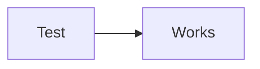
````

Open the page in the browser at `http://localhost:5884/docs/architecture/platform-overview`. Verify:
- A rendered flowchart diagram appears (not raw text)
- Toggle dark/light mode — the diagram re-renders with the correct theme

Remove the test block after verification.

- [ ] **Step 3: Verify type checks pass**

Run: `cd repos/website && pnpm types`

Expected: No type errors.

---

### Task 4: Convert ASCII Art — `docs/architecture/platform-overview.md`

**Files:**
- Modify: `docs/architecture/platform-overview.md`

This file has 3 ASCII art blocks to convert: system topology (line 33), shared entity model (line 166), and dev environment (line 231).

- [ ] **Step 1: Replace system topology diagram (line 33-54)**

Replace the existing ASCII art code block at lines 33-54 with:

````markdown
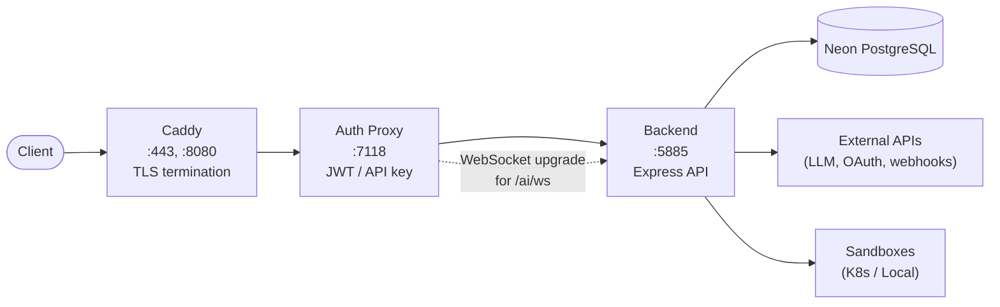
````

- [ ] **Step 2: Replace shared entity model diagram (line 166-209)**

Replace the existing ASCII art code block at lines 166-209 with:

````markdown
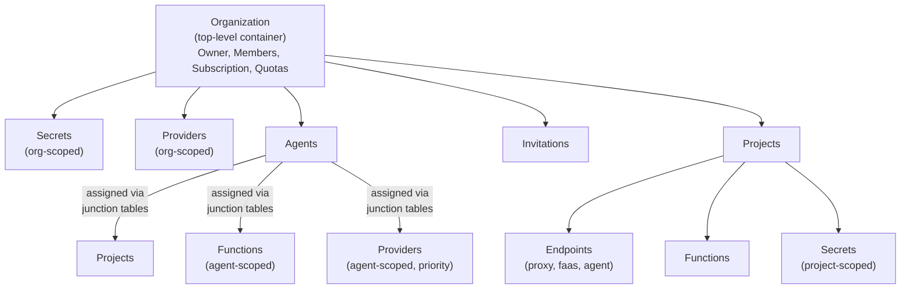
````

- [ ] **Step 3: Replace dev environment diagram (line 231-250)**

Replace the existing ASCII art code block at lines 231-250 with:

````markdown
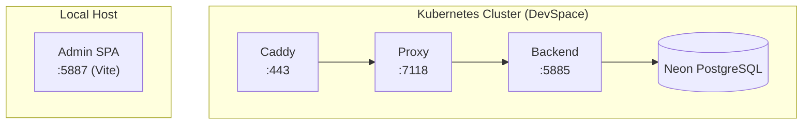
````

- [ ] **Step 4: Verify all 3 diagrams render**

Run: `cd repos/website && pnpm start`

Open `http://localhost:5884/docs/architecture/platform-overview` and verify all three diagrams render as Mermaid charts.

---

### Task 5: Convert ASCII Art — `docs/architecture/request-flow.md`

**Files:**
- Modify: `docs/architecture/request-flow.md`

This file has many ASCII art blocks. The major ones: 3-tier pipeline overview (line 14-36), auth flow decision tree (line 58-99), proxy endpoint sequence (line 222-266), FaaS sequence (line 296-346), agent SSE sequence (line 380-446), agent WebSocket sequence (line 468-518), and middleware chains (lines 549-562, 567-578, 585-593, 629-638).

- [ ] **Step 1: Replace 3-tier pipeline overview (line 14-36)**

Replace the ASCII code block with:

````markdown
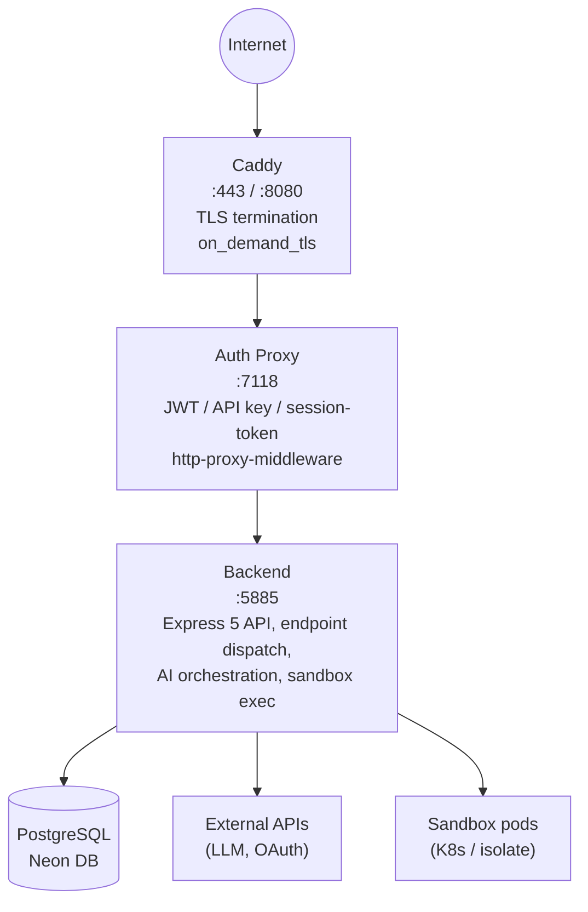
````

- [ ] **Step 2: Replace auth flow decision tree (line 58-99)**

Replace with:

````markdown
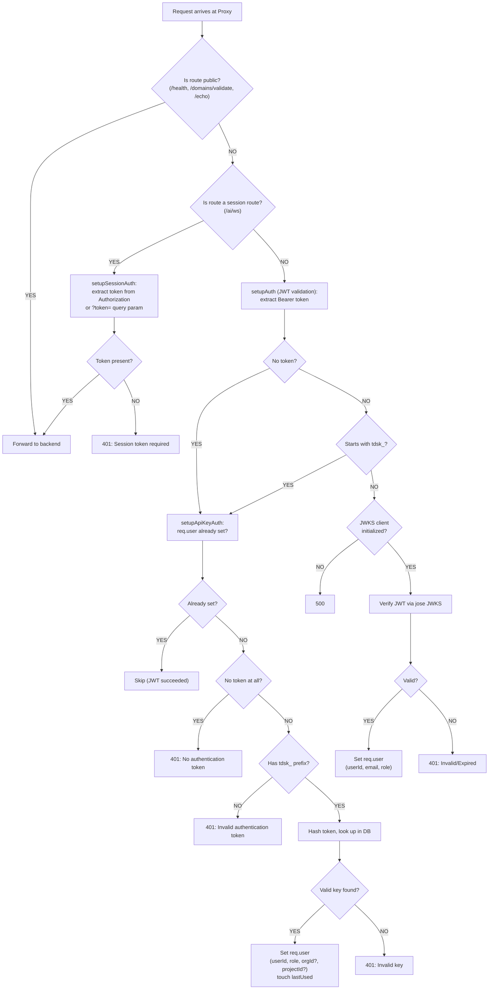
````

- [ ] **Step 3: Replace proxy endpoint sequence diagram (line 222-266)**

Replace with:

````markdown
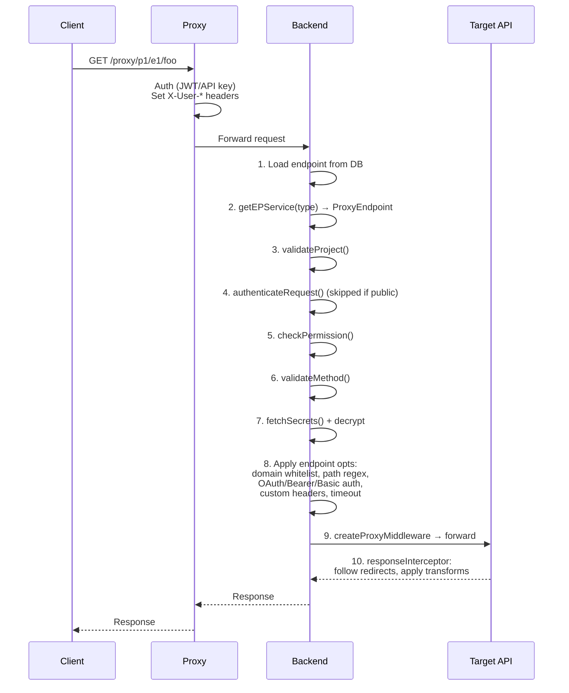
````

- [ ] **Step 4: Replace FaaS sequence diagram (line 296-346)**

Replace with:

````markdown
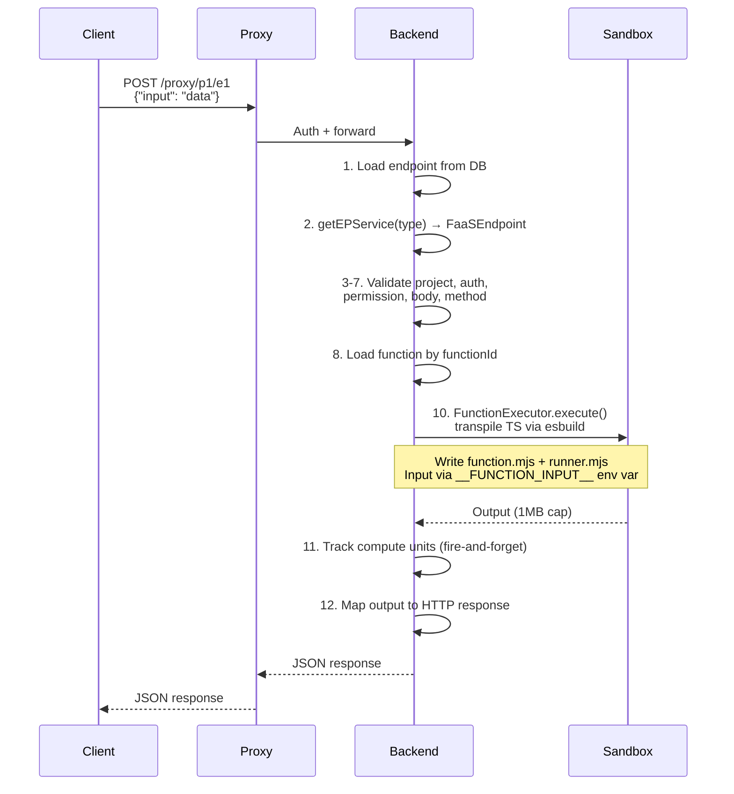
````

- [ ] **Step 5: Replace agent SSE sequence diagram (line 380-446)**

Replace with:

````markdown
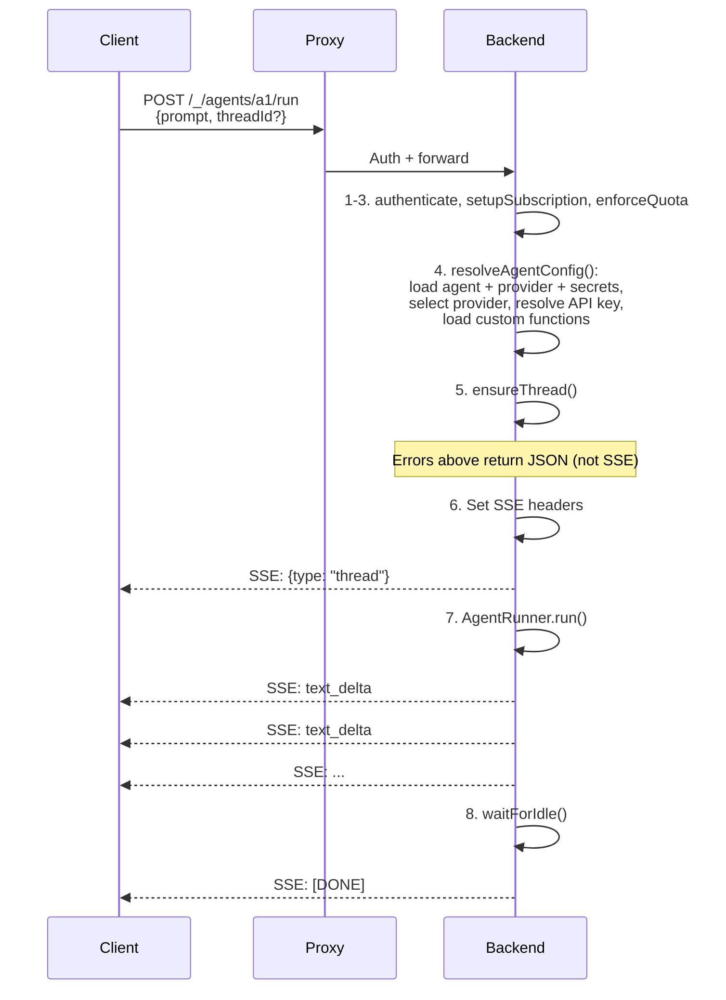
````

- [ ] **Step 6: Replace agent WebSocket sequence diagram (line 468-518)**

Replace with:

````markdown
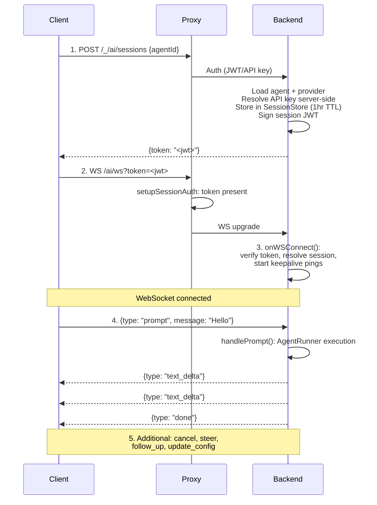
````

- [ ] **Step 7: Convert middleware chain tables to stay as-is**

The middleware chain blocks (lines 549-562, 567-578, 585-593, 629-638) are formatted as ASCII tables, NOT diagrams. These render fine as code blocks with the Shiki highlighter and don't benefit from Mermaid conversion. Leave them unchanged.

- [ ] **Step 8: Verify all diagrams render**

Run: `cd repos/website && pnpm start`

Open `http://localhost:5884/docs/architecture/request-flow` and verify all converted sequence diagrams and flowcharts render correctly.

---

### Task 6: Convert ASCII Art — `docs/architecture/sandbox-architecture.md`

**Files:**
- Modify: `docs/architecture/sandbox-architecture.md`

This file has 5 ASCII art blocks: provider architecture (line 36-53), local provider (line 99-112), K8s architecture (line 167-185), pod manifest structure (line 220-258), and MITM pod internal (line 318-376).

- [ ] **Step 1: Replace provider architecture diagram (line 36-53)**

Replace with:

````markdown
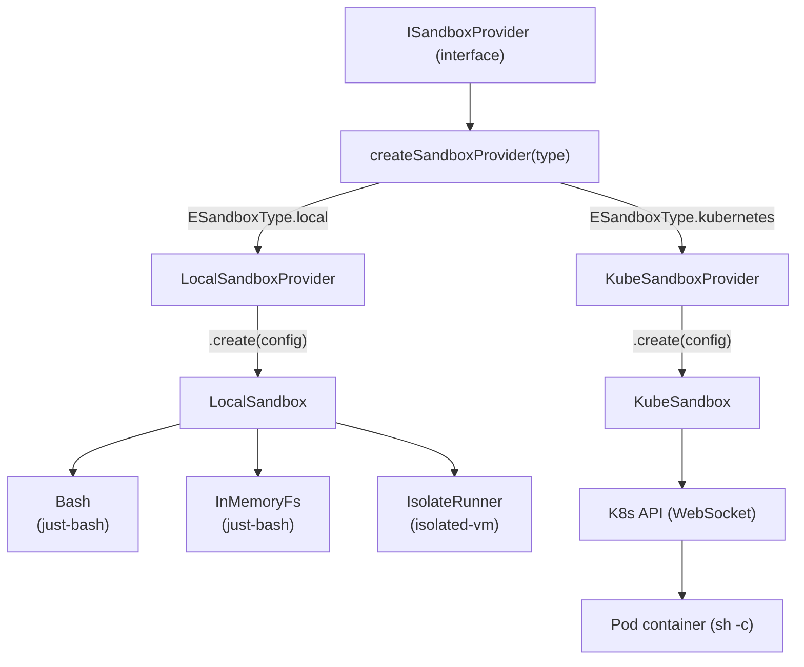
````

- [ ] **Step 2: Replace local provider breakdown (line 99-112)**

Replace with:

````markdown
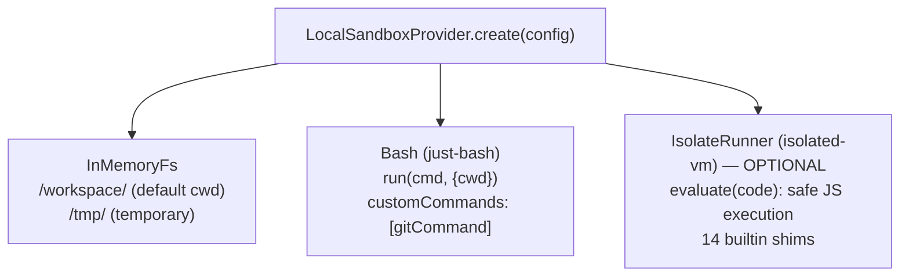
````

- [ ] **Step 3: Replace K8s architecture diagram (line 167-185)**

Replace with:

````markdown
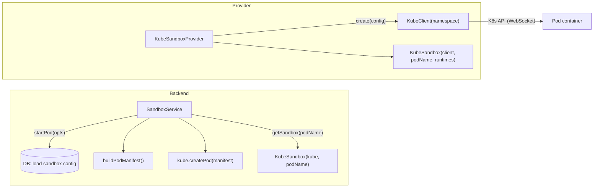
````

- [ ] **Step 4: Replace pod manifest structure (line 220-258)**

The pod manifest block at lines 220-258 is a YAML-like structure description, not a flow diagram. It reads best as a code block. Leave it unchanged.

- [ ] **Step 5: Replace MITM pod internal diagram (line 318-376)**

Replace with:

````markdown
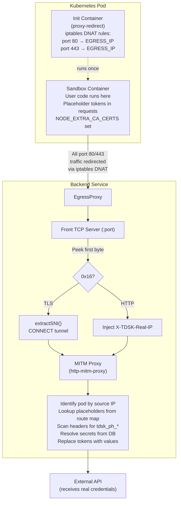
````

- [ ] **Step 6: Replace container lifecycle (line 264-284)**

Replace with:

````markdown
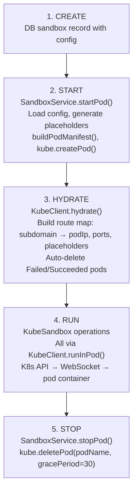
````

- [ ] **Step 7: Verify all diagrams render**

Run: `cd repos/website && pnpm start`

Open `http://localhost:5884/docs/architecture/sandbox-architecture` and verify all converted diagrams render correctly.

---

### Task 7: Convert ASCII Art — `docs/architecture/data-model.md`

**Files:**
- Modify: `docs/architecture/data-model.md:22-72`

- [ ] **Step 1: Replace entity relationship diagram**

Replace the ASCII art block at lines 22-72 with:

````markdown
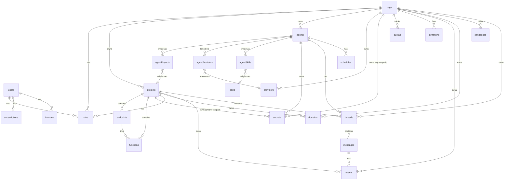
````

- [ ] **Step 2: Verify the ER diagram renders**

Run: `cd repos/website && pnpm start`

Open `http://localhost:5884/docs/architecture/data-model` and verify the ER diagram renders correctly.

---

### Task 8: Convert ASCII Art — `docs/features/organizations.md`

**Files:**
- Modify: `docs/features/organizations.md:9-27`

- [ ] **Step 1: Replace shared entity model tree**

Replace the ASCII art code block at lines 9-27 with:

````markdown
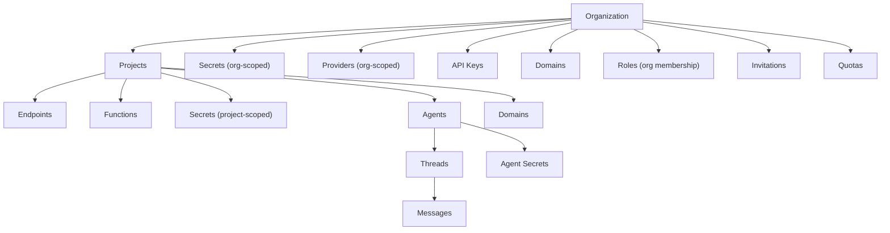
````

- [ ] **Step 2: Verify the diagram renders**

Open `http://localhost:5884/docs/features/organizations` and verify.

---

### Task 9: Convert ASCII Art — `docs/features/proxy-endpoints.md`

**Files:**
- Modify: `docs/features/proxy-endpoints.md:32-39`
- Modify: `docs/features/proxy-endpoints.md:62-95`

- [ ] **Step 1: Replace the simple relay diagram (line 32-39)**

Replace the ASCII art code block at lines 32-39 with:

````markdown
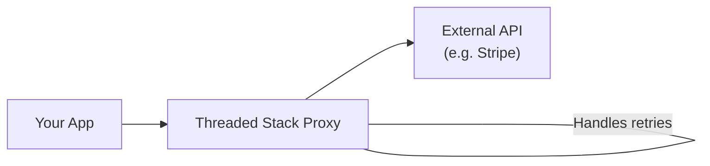
````

- [ ] **Step 2: Replace the architecture overview diagram (line 62-95)**

Replace the ASCII art code block at lines 62-95 with:

````markdown
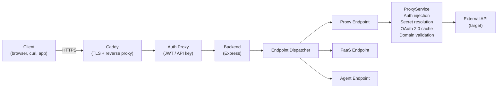
````

- [ ] **Step 3: Verify the diagrams render**

Open `http://localhost:5884/docs/features/proxy-endpoints` and verify both diagrams render.

---

### Task 10: Convert ASCII Art — `docs/features/secrets.md`

**Files:**
- Modify: `docs/features/secrets.md:60-68`

- [ ] **Step 1: Replace key derivation flow diagram**

Replace the ASCII art code block at lines 60-68 with:

````markdown
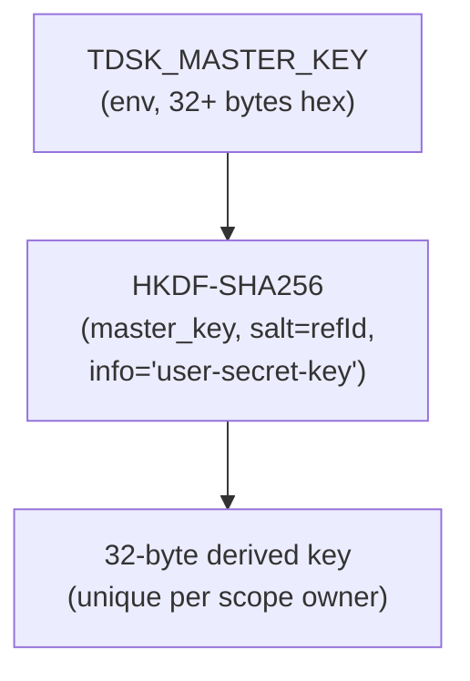
````

- [ ] **Step 2: Verify the diagram renders**

Open `http://localhost:5884/docs/features/secrets` and verify the key derivation flow renders.

---

### Task 11: Add New Diagrams — `docs/user-guide/tsa-cli.md`

**Files:**
- Modify: `docs/user-guide/tsa-cli.md`

- [ ] **Step 1: Add `tsa run` workflow diagram**

Add this diagram after the description of `tsa run` and its key capabilities section (after the bullet list near line 14), before the "## Installation" section:

````markdown
### `tsa run` Workflow

```mermaid
flowchart TD
  Login["tsa login <api-key>"]
  List["tsa sandboxes\n(list available sandboxes)"]
  Run["tsa run <sandbox-id>"]
  Start["Start sandbox pod\n(if not running)"]
  Sync["Start file sync\n(Mutagen bidirectional)"]
  SSH["SSH into pod"]
  Launch["Launch runtime command\n(e.g. claude, codex)"]
  Work["Interactive AI tool session"]

  Login --> List --> Run
  Run --> Start --> Sync --> SSH --> Launch --> Work
```
````

- [ ] **Step 2: Add `tsa chat` session lifecycle diagram**

Add this diagram in the chat session section of the doc (before or after the "### Starting a Chat" section — find the section that describes `tsa chat`):

````markdown
### Chat Session Lifecycle

```mermaid
sequenceDiagram
  participant User
  participant TSA as tsa CLI
  participant Proxy as Auth Proxy
  participant Backend

  User->>TSA: tsa chat --agent <id>
  TSA->>Proxy: GET /_/orgs (validate auth)
  Proxy->>Backend: Forward
  Backend-->>TSA: Org list

  TSA->>Proxy: POST /_/ai/sessions {agentId}
  Proxy->>Backend: Forward
  Backend-->>TSA: {token: "<session-jwt>"}

  TSA->>Backend: WS /ai/ws?token=<jwt>
  Note over TSA,Backend: WebSocket connected

  User->>TSA: Type message
  TSA->>Backend: {type: "prompt", message: "..."}
  Backend-->>TSA: {type: "text_delta", ...}
  Backend-->>TSA: {type: "text_delta", ...}
  Backend-->>TSA: {type: "done"}
  TSA-->>User: Rendered response
```
````

- [ ] **Step 3: Verify both diagrams render**

Open `http://localhost:5884/docs/user-guide/tsa-cli` and verify both new diagrams render correctly.

---

### Task 12: Add New Diagrams — `docs/user-guide/getting-started.md` and `docs/features/sandbox-connect.md`

**Files:**
- Modify: `docs/user-guide/getting-started.md`
- Modify: `docs/features/sandbox-connect.md`

- [ ] **Step 1: Add onboarding flow diagram to getting-started.md**

Add this diagram right after the opening paragraph (after line 8, before "## Prerequisites"):

````markdown
### Quick Start Flow

```mermaid
flowchart LR
  Signup["Sign Up\n(social login)"]
  Plan["Choose Plan\n(free tier auto)"]
  Org["Create\nOrganization"]
  Provider["Add Provider\n(API key)"]
  Sandbox["Launch Sandbox\n(tsa run)"]
  Work["Start Working\n(AI tool session)"]

  Signup --> Plan --> Org --> Provider --> Sandbox --> Work
```
````

- [ ] **Step 2: Add SSH tunnel chain diagram to sandbox-connect.md**

Add this diagram after the "## What is Sandbox Connect" section description (after line 15, before the "## Vision" section):

````markdown
### Connection Path

```mermaid
flowchart LR
  TSA["tsa ssh / tsa run"]
  WS["WebSocket\nTunnel"]
  Caddy["Caddy\n:443 TLS"]
  Proxy["Auth Proxy\n:7118"]
  Backend["Backend\n:5885"]
  Pod["Pod :2222\n(OpenSSH)"]

  TSA --> WS --> Caddy --> Proxy --> Backend --> Pod
```
````

- [ ] **Step 3: Verify both diagrams render**

Open the two pages in the browser and verify the new diagrams render.

---

### Task 13: Create Playwright Screenshot Script

**Files:**
- Create: `repos/website/scripts/capture-screenshots.ts`
- Modify: `repos/website/package.json`

This script follows the auth patterns from `repos/integration/playwright/fixtures/auth.ts`: mock Neon Auth session, intercept TLS proxy requests, use `TDSK_IT_*` env vars.

- [ ] **Step 1: Create the screenshot script**

Create `repos/website/scripts/capture-screenshots.ts`:

```typescript
import { chromium, type Page, type Browser } from 'playwright'
import { mkdirSync, existsSync } from 'node:fs'
import { join, resolve } from 'node:path'

const ROOT = resolve(__dirname, '..', '..', '..')
const IMAGES_DIR = join(ROOT, 'docs', 'user-guide', 'images')

const ADMIN_URL = process.env.TDSK_IT_ADMIN_URL || 'http://localhost:5887'
const THREADS_URL = process.env.TDSK_IT_THREADS_URL || 'http://localhost:5889'
const PROXY_PATTERN = 'https://px.local.threadedstack.app/**'

const API_KEY = process.env.TDSK_IT_API_KEY
const ORG_ID = process.env.TDSK_IT_ORG_ID
const PROJECT_ID = process.env.TDSK_IT_PROJECT_ID
const USER_ID = process.env.TDSK_IT_USER_ID || 'screenshot-user'

if (!API_KEY || !ORG_ID) {
  console.error('Required env vars: TDSK_IT_API_KEY, TDSK_IT_ORG_ID')
  process.exit(1)
}

const buildNeonAuthMock = () => ({
  session: {
    token: API_KEY,
    expiresAt: new Date(Date.now() + 86_400_000).toISOString(),
  },
  user: {
    id: USER_ID,
    email: 'screenshots@threadedstack.app',
    name: 'Screenshot User',
    image: '',
  },
})

async function setupAuth(page: Page) {
  await page.route('**/neondb/auth/get-session**', (route) =>
    route.fulfill({
      contentType: 'application/json',
      body: JSON.stringify(buildNeonAuthMock()),
    })
  )

  await page.route(PROXY_PATTERN, async (route) => {
    const request = route.request()
    const method = request.method().toLowerCase()
    const url = request.url()
    const headers = { ...request.headers() }
    const postData = request.postData()

    delete headers['host']
    delete headers['content-length']

    if (method === 'options') {
      await route.fulfill({
        status: 204,
        headers: {
          'access-control-allow-origin': '*',
          'access-control-allow-methods': 'GET,POST,PUT,DELETE,OPTIONS',
          'access-control-allow-headers': '*',
        },
      })
      return
    }

    try {
      const opts = { ignoreHTTPSErrors: true, headers }
      let resp
      if (method === 'get') resp = await page.request.get(url, opts)
      else if (method === 'post') resp = await page.request.post(url, { ...opts, data: postData ? JSON.parse(postData) : undefined })
      else if (method === 'put') resp = await page.request.put(url, { ...opts, data: postData ? JSON.parse(postData) : undefined })
      else if (method === 'delete') resp = await page.request.delete(url, opts)
      else resp = await page.request.fetch(url, { ...opts, method: method.toUpperCase() })

      await route.fulfill({
        status: resp.status(),
        headers: resp.headers(),
        body: await resp.body(),
      })
    } catch (err) {
      await route.fulfill({
        status: 502,
        contentType: 'application/json',
        body: JSON.stringify({ error: String(err) }),
      })
    }
  })
}

async function captureScreenshot(page: Page, url: string, filename: string) {
  const filepath = join(IMAGES_DIR, filename)
  console.log(`Capturing: ${filename} → ${url}`)
  await page.goto(url, { waitUntil: 'networkidle', timeout: 30_000 })
  await page.waitForTimeout(1000)
  await page.screenshot({ path: filepath, fullPage: false })
  console.log(`  Saved: ${filepath}`)
}

async function captureAdmin(browser: Browser) {
  const page = await browser.newPage({ viewport: { width: 1280, height: 800 } })
  await setupAuth(page)

  await captureScreenshot(page, ADMIN_URL, 'admin-login.png')

  await page.goto(`${ADMIN_URL}/orgs/${ORG_ID}`, { waitUntil: 'networkidle', timeout: 30_000 })
  await page.waitForTimeout(1500)
  await page.screenshot({ path: join(IMAGES_DIR, 'admin-org-dashboard.png'), fullPage: false })
  console.log('  Saved: admin-org-dashboard.png')

  await captureScreenshot(page, `${ADMIN_URL}/orgs/${ORG_ID}/agents`, 'admin-agent-config.png')
  await captureScreenshot(page, `${ADMIN_URL}/orgs/${ORG_ID}/providers`, 'admin-provider-config.png')
  await captureScreenshot(page, `${ADMIN_URL}/orgs/${ORG_ID}/sandboxes`, 'admin-sandbox-list.png')

  if (PROJECT_ID) {
    await captureScreenshot(page, `${ADMIN_URL}/orgs/${ORG_ID}/projects/${PROJECT_ID}/settings`, 'admin-project-settings.png')
  }

  const sandboxLinks = await page.goto(`${ADMIN_URL}/orgs/${ORG_ID}/sandboxes`, { waitUntil: 'networkidle', timeout: 30_000 })
  const firstSandboxLink = page.locator('a[href*="/sandboxes/"]').first()
  if (await firstSandboxLink.isVisible({ timeout: 5000 }).catch(() => false)) {
    await firstSandboxLink.click()
    await page.waitForLoadState('networkidle')
    await page.waitForTimeout(1000)
    await page.screenshot({ path: join(IMAGES_DIR, 'admin-sandbox-config.png'), fullPage: false })
    console.log('  Saved: admin-sandbox-config.png')
  }

  await page.close()
}

async function captureThreads(browser: Browser) {
  const page = await browser.newPage({ viewport: { width: 1280, height: 800 } })
  await setupAuth(page)

  await captureScreenshot(page, THREADS_URL, 'threads-login.png')

  await page.goto(THREADS_URL, { waitUntil: 'networkidle', timeout: 30_000 })
  await page.waitForTimeout(2000)
  await page.screenshot({ path: join(IMAGES_DIR, 'threads-home.png'), fullPage: false })
  console.log('  Saved: threads-home.png')

  await page.close()
}

async function main() {
  if (!existsSync(IMAGES_DIR)) {
    mkdirSync(IMAGES_DIR, { recursive: true })
  }

  console.log(`\nScreenshot capture starting...`)
  console.log(`  Admin URL: ${ADMIN_URL}`)
  console.log(`  Threads URL: ${THREADS_URL}`)
  console.log(`  Output: ${IMAGES_DIR}\n`)

  const browser = await chromium.launch({ headless: true })

  try {
    await captureAdmin(browser)
    await captureThreads(browser)
    console.log('\nAll screenshots captured successfully.')
  } finally {
    await browser.close()
  }
}

main().catch((err) => {
  console.error('Screenshot capture failed:', err)
  process.exit(1)
})
```

- [ ] **Step 2: Add screenshots script to package.json**

In `repos/website/package.json`, add to the `"scripts"` section:

```json
"screenshots": "npx tsx scripts/capture-screenshots.ts"
```

- [ ] **Step 3: Verify the script runs (requires Admin + Threads dev servers running)**

Run: `cd repos/website && pnpm screenshots`

Expected: Screenshots saved to `docs/user-guide/images/` directory. Check that images are present and non-empty.

---

### Task 14: Add Screenshot References to Docs

**Files:**
- Modify: `docs/user-guide/admin-ui.md`
- Modify: `docs/user-guide/threads-app.md`

- [ ] **Step 1: Add screenshots to admin-ui.md**

Add screenshot references inline at relevant locations in `docs/user-guide/admin-ui.md`:

After the "## Overview" section opening paragraph (after line 8):

```markdown

```

After the "### Top-Level Destinations" section (after the table around line 24):

```markdown

```

In the "### Organization Scope" section, after the "**Resources**" list (after line 35):

```markdown

```

In the "**AI**" section (around where agents are described):

```markdown

```

In the "### Project Scope" section (after the project resources list):

```markdown

```

After the providers section in org scope:

```markdown

```

After sandbox list reference, if a sandbox config screenshot exists:

```markdown

```

- [ ] **Step 2: Add screenshots to threads-app.md**

Add screenshot references in `docs/user-guide/threads-app.md`:

After the "## What is the Threads App" section (after line 8):

```markdown

```

After the "### Home Page" section (around line 78):

```markdown

```

- [ ] **Step 3: Verify images render on the website**

Run: `cd repos/website && pnpm start`

Open `http://localhost:5884/docs/user-guide/admin-ui` and `http://localhost:5884/docs/user-guide/threads-app`. Verify:
- Images load and display inline with the text
- Images are sized appropriately (not overflowing the content area)
- The `remarkDocsLinks` plugin rewrites paths to `/docs-assets/user-guide/images/...`

---

### Task 15: Final Verification

- [ ] **Step 1: Run type checks**

Run: `cd repos/website && pnpm types`

Expected: No type errors.

- [ ] **Step 2: Run website build**

Run: `cd repos/website && pnpm build`

Expected: Build succeeds. Check that `repos/website/dist/docs-assets/user-guide/images/` contains the screenshot PNGs.

- [ ] **Step 3: Visual verification of all pages**

With `cd repos/website && pnpm start` running, visit each page and verify Mermaid diagrams render:

1. `http://localhost:5884/docs/architecture/platform-overview` — 3 diagrams
2. `http://localhost:5884/docs/architecture/request-flow` — 5 diagrams
3. `http://localhost:5884/docs/architecture/sandbox-architecture` — 5 diagrams
4. `http://localhost:5884/docs/architecture/data-model` — 1 ER diagram
5. `http://localhost:5884/docs/features/organizations` — 1 diagram
6. `http://localhost:5884/docs/features/proxy-endpoints` — 2 diagrams
7. `http://localhost:5884/docs/features/secrets` — 1 diagram
8. `http://localhost:5884/docs/user-guide/tsa-cli` — 2 new diagrams
9. `http://localhost:5884/docs/user-guide/getting-started` — 1 new diagram
10. `http://localhost:5884/docs/features/sandbox-connect` — 1 new diagram
11. `http://localhost:5884/docs/user-guide/admin-ui` — screenshots display
12. `http://localhost:5884/docs/user-guide/threads-app` — screenshots display
13. `http://localhost:5884/docs/business/value-proposition` — shows ComingSoon (excluded)

- [ ] **Step 4: Test dark/light theme toggle**

Toggle between dark and light mode using the theme toggle in the header. Verify Mermaid diagrams re-render with the appropriate theme.
