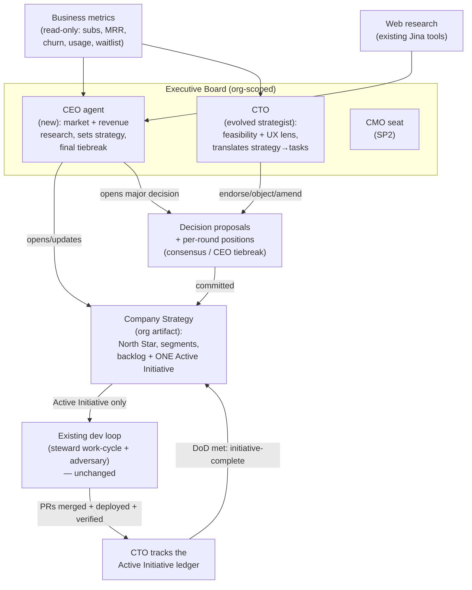

# AI Executive Layer — SP1: Executive Strategy & Coordination

**Status:** Design approved (2026-07-07). First of a sequenced multi-project effort.
**Sequence:** SP1 (this) → SP2 (CMO + external growth connectors) → SP3+ (scale).

## 1. Goal

Turn ThreadedStack from a self-*developing* platform (the existing steward/adversary
dev loop) into a self-*directed* one: an org-level executive board that decides what
the company builds and why, grounded in market research and real revenue data, with
**zero human escalation**. SP1 delivers the strategy-and-coordination keystone that
every later executive capability (marketing, sales, outreach, more agents) hangs off.

SP1 makes the company strategically self-directed and revenue-aware, and it *generates*
outreach/marketing content — but it does not send anything to the outside world. All
external action (email, social, ads, investor outreach) is SP2.

## 2. Scope

### In scope (SP1)
- A new **CEO** agent (business/market strategy, the decision-maker).
- Evolving the existing **strategist/planning** role into a **CTO** that receives the
  CEO's strategy instead of self-directing.
- **The Board Room** — an async, multi-agent decision-proposal + deliberation
  mechanism with consensus and a CEO tiebreak.
- **Company Strategy** — an org-level shared artifact the CEO owns; the single source
  of truth the whole system (execs + dev loop) consumes.
- **Commitment & Completion loop** — a frozen Active Initiative + completion-gated
  re-direction so the dev loop is never thrashed and work is never left half-baked.
- **Revenue/business instrumentation** — read-only metrics (MRR, subs, churn, usage,
  waitlist demand) surfaced to the execs.

### Out of scope (SP1 → deferred to SP2+)
- Any **external send**: real emails, social posts (LinkedIn/X/Reddit), ad spend,
  live investor/partner outreach. SP1 *drafts* and stores these as artifacts only.
- New social/publishing **connectors** and their credential provisioning.
- The **CMO** agent (its board seat is designed for now; the agent ships in SP2).

### Non-goals
- No change to the steward/adversary dev loop's internal mechanics. The CTO only
  re-sources *what* it prioritizes; the loop keeps running exactly as today.
- No human approval gate anywhere. The board + CEO tiebreak is the entire check.

## 3. Architecture overview

**Two flows, both required:**
- **Down:** Company Strategy → the single frozen Active Initiative → dev-loop tasks.
- **Up:** dev-loop completion (merged + deployed + verified) → CTO completion report →
  Company Strategy unlocks its next re-direction.

## 4. Components

### 4.1 Company Strategy (org-level artifact)
Promote the existing agent-scoped `roadmap` memory to an **org-level Company
Strategy** owned by the CEO. It holds:
- **North Star** + **target segments** + **positioning** (the durable "who/why").
- A **strategy backlog**: prioritized future initiatives, freely re-orderable.
- Exactly **one Active Initiative**: `{title, definition-of-done, evidence, committedAt}`.
- The evidence/rationale behind current bets.

It is injected as a `## Company Strategy` context section into every executive cycle
**and** into the existing dev-loop cycles (replacing the self-directed roadmap as the
priority source). One artifact, whole system aligned.

### 4.2 The Board Room
A new org-scoped **decision proposal** object (mirrors the existing
`task_proposals` / `escalations` patterns). Lifecycle:

1. **Open** — any board member opens a proposal for a **major decision**: a change to
   company direction (product pivot, roadmap priority shift, segment/positioning/pricing
   change, big resource bet; in SP2, campaigns/spend). Routine in-lane work never opens
   a proposal.
2. **Deliberate (async)** — each board member, on its own scheduled cycle, reads open
   proposals and records a **position** from its lens: `endorse | object | amend`, with
   reasoning + evidence, tagged by deliberation round. Positions are stored in a shared,
   org-scoped record every board member can read (this is the new cross-agent
   communication channel).
3. **Resolve** — when all *current* board members endorse the latest revision → the
   proposal **commits**. If the board cannot converge within `N` rounds (config, default
   3) → the **CEO decides and commits** (first among equals) with logged rationale.
4. **Commit effect** — a committed proposal writes its outcome into the Company Strategy
   (e.g. re-orders the backlog, updates positioning) — but per §4.3 it can only change
   the **Active Initiative** under the completion gate or the rare stop-the-line pivot.

Board membership is an explicit, growable list. **SP1 board = {CEO, CTO}.** SP2 adds
the CMO. The consensus/tiebreak logic is written for N members from day one; the
2-member deadlock case is exactly what the CEO tiebreak covers.

### 4.3 Commitment & Completion loop (stability)
The mechanism that prevents strategy churn from thrashing the dev loop and leaving
half-baked work (the staging-environment lesson).

- **Frozen Active Initiative** — the Company Strategy names exactly one Active
  Initiative. Its scope and **definition-of-done are fixed at commit time** and do not
  change while in flight. The steward loop works only toward it.
- **Strict definition-of-done (anti-half-baked)** — an initiative is DONE only when
  **all its tasks are merged + deployed to prod + verified healthy** (reusing the
  existing verify cycle). Partial ≠ done.
- **Reporting up** — the CTO tracks the Active Initiative's task ledger against the
  dev loop. When the DoD is met it emits an **`tdsk-initiative-complete`** report to
  the board. That completion signal is the *only* routine trigger that unlocks
  re-direction of the active work.
- **Completion-gated re-direction** — the CEO/board **cannot swap the Active
  Initiative** until a completion report arrives. On completion → the board promotes
  the next backlog initiative to Active → the loop restarts, now informed by whatever
  the CEO/CTO researched in the meantime.
- **Free parallel planning** — the CEO and CTO continuously research and shape the
  strategy backlog (future initiatives) without ever touching the Active Initiative.
  Decisions that change *future* direction can land anytime; decisions that change the
  *active* work are the rare exception below.
- **Rare stop-the-line pivot (escape hatch)** — if an Active Initiative is *clearly
  failing* (evidence-based), the board may vote to abort it. This is a high-bar,
  strong-consensus, logged event, and the abort must **wind down cleanly**
  (finish-to-safe or fully revert) — never dangling like staging. Not routine.

This hardens the "current initiative" concept the coordinator already uses rather than
inventing a parallel one.

### 4.4 CEO agent (new)
- **Soul:** founder-CEO — decisive, evidence-driven, bold but level-headed, a straight
  shooter, the face of the company, obsessed with understanding the client and whether
  the platform actually solves their problem.
- **Inputs:** market/competitor **research** (existing Jina web tools), platform
  capabilities (its own repo/docs), and **business metrics** (§4.5).
- **Outputs:** sets/updates the Company Strategy; opens board proposals for major
  moves; commissions research; **drafts** (never sends in SP1) investor/partner
  outreach, stored as artifacts.
- **Cadence:** a periodic **strategy cycle** (research + metrics → strategy) and a
  **board cycle** (post positions on open proposals, run tiebreak resolution).

### 4.5 CTO (evolved from the existing strategist)
- The existing planning/strategist role becomes the CTO. It now **receives** the
  Company Strategy instead of self-directing.
- **Responsibilities:** translate the Active Initiative into the technical roadmap +
  prioritized tasks that feed the existing steward work-cycle backlog; weigh in on
  board proposals from a **feasibility + UX** lens; track the Active Initiative ledger
  and emit `tdsk-initiative-complete`; report shipped outcomes + tech constraints back
  up to the strategy.
- The steward/adversary loop underneath is untouched.

### 4.6 Revenue / business instrumentation (read-only)
A read-only faculty that grounds decisions in real data:
- **Revenue/customers:** active subscriptions by tier, MRR, new signups, churn /
  cancellations (from `subscriptions`).
- **Engagement:** usage/quota consumption per org/period (from `quotas`).
- **Demand:** waitlist / access-gate signals.

Delivered as a `## Business metrics` context section injected into exec cycles (like
the roadmap is today), plus an optional `readBusinessMetrics` agent tool for on-demand
queries. Read-only, org-scoped, no mutation.

### 4.7 Guardrails (systemic, zero human)
- Nothing waits on a person. The board + CEO tiebreak is the entire check.
- **Major decisions must route through a board proposal** — the Company Strategy's
  direction axes (segments, positioning, pricing, Active Initiative) cannot change
  in-lane without a committed proposal.
- **In-lane routine work** auto-executes with a reversibility bias; every big bet logs
  rationale + evidence.
- The existing **reflection/curation** cycles retrospectively audit exec decisions and
  feed lessons back (catching bad bets after the fact as a backstop to the up-front
  board check).
- SP1 external content is **drafted and stored only**, never sent.

## 5. Data model changes

- **`decision_proposals`** (new, org-scoped): `id`, `orgId`, `openedByAgentId`,
  `title`, `axis`/`kind`, `description`, `evidence`, `status`
  (`open|deliberating|committed|tiebroken|rejected|aborted`), `resolution`,
  `resolvedRef`, `round`, timestamps. Follows the `task_proposals`/`escalations` service
  + schema conventions.
- **Board positions**: each member's per-round stance on a proposal
  (`proposalId`, `agentId`, `stance`, `reasoning`, `round`). Modeled either as a sibling
  table or a JSON column on the proposal — decided in the implementation plan; the
  requirement is: one recorded position per member per round, all readable by every
  member.
- **Company Strategy**: an org-level artifact. Implemented either as a new org-scoped
  memory kind (`company_strategy`) or a small dedicated record owned by the CEO — decided
  in the plan; the requirement is a single, org-scoped, CEO-owned document with a
  structured Active Initiative (`title`, `definitionOfDone`, `evidence`, `committedAt`,
  `status`) plus a prioritized backlog, injected into all exec + dev-loop cycles.
- **New agent + sandbox records**: CEO agent (`ag_*`) and its body sandbox. CTO reuses
  the existing strategist agent (re-scoped via its prompt), no new agent.
- All new tables get Drizzle schemas + services with unit tests, mirroring existing
  patterns; migrations pushed via the standard flow.

## 6. Schedules, prompts, and structured blocks

- **New git-versioned schedule prompts** in `repos/database/src/seeds/agent-schedules/`,
  wired in `agentSchedules.ts`, reconciled on deploy by the existing `[sync]` reconciler:
  - `ceo-strategy.md` (CEO strategy cycle)
  - `ceo-board.md` / `cto-board.md` (board deliberation + CEO tiebreak resolution)
  - the existing `planning.md` evolves into the CTO's strategy-consuming cycle.
- **Cadence** (tuned in the plan) must let a decision proposal open and resolve within
  ~a day, while the Active Initiative stays frozen until its completion report. Board
  cycles run a few times/day; the CEO strategy cycle runs daily; re-direction happens
  only at initiative boundaries.
- **New executor-parsed fenced blocks** (same non-throwing parse pattern as existing
  `tdsk-*` blocks, defined in `repos/domain/src/constants/`, parsed in
  `repos/backend/src/services/scheduler/executor.ts`):
  - `tdsk-strategy` — CEO writes/updates the Company Strategy.
  - `tdsk-decisions` — open a board decision proposal.
  - `tdsk-decision-positions` — post a per-round board position.
  - `tdsk-initiative-complete` — CTO reports an Active Initiative delivered.

## 7. Testing & verification

- **Unit** (match existing green suites — backend 2807, domain 726, database 576):
  decision-proposal lifecycle (open → deliberate → consensus-commit, and → CEO-tiebreak
  on deadlock, and → aborted); Company Strategy read/write + Active-Initiative freeze;
  completion gate (re-direction blocked until `initiative-complete`); business-metrics
  aggregation; all four new block parsers.
- **Integration**: a decision proposal flows CEO → CTO position → commit → Company
  Strategy → the dev loop picks up a strategy-derived task; and an Active Initiative
  completes (merged+deployed+verified) → `initiative-complete` → next initiative promoted.
- **Live smoke** (prod, post-deploy, via the now-hardened pipeline — startup probe +
  rollback alert): the CEO cycle produces a strategy grounded in real metrics; a board
  proposal resolves; a strategy-derived task appears in the steward backlog; the Active
  Initiative does not change mid-flight.

## 8. Rollout

Ship behind the standard deploy pipeline. Land the schemas/services/blocks/tests first
(inert), then seed the CEO agent + sandbox + schedules, then flip the CTO's prompt to
consume Company Strategy, then activate the CEO strategy/board cadence. Each step is a
normal steward-gated PR or a monitor-driven change, verified green before the next.

## 9. SP2+ hooks (designed-for, not built)

- The board is N-member: adding the CMO is a membership + schedule addition.
- `tdsk-strategy`/`tdsk-decisions` are the extension points for future exec faculties.
- The "drafted, not sent" outreach artifacts become SP2's send queue once connectors +
  guardrails (content review, spend caps) exist.
