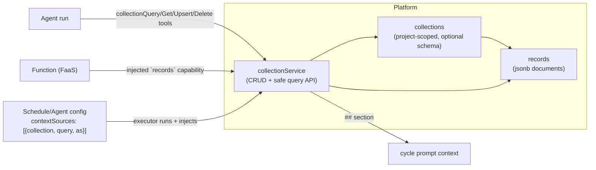

# Collections / Records Primitive — Design

**Status:** Design approved (2026-07-07).
**Part of:** the platform-generalization effort — making ThreadedStack's autonomous-agent
orchestration reusable primitives instead of hard-coded platform code (dogfooding).
This is **sub-project ①** of that effort. Sequence: ① Collections/Records (this) →
② generic effect surface (unified `invoke`) → ③ generic context injection → ④ generic
coordination/roles → ⑤ migrate the dev-loop + exec-board off the hard-coded tables.

## 1. Why

Today, use-case data (`task_proposals`, `decision_proposals`, `decision_positions`,
`company_strategies`, `skill_proposals`, `escalations`) lives in tables the platform
codebase owns. Any consumer who runs ThreadedStack inherits those tables, yet cannot
create their own equivalent for their own autonomous-agent system. That is not
dogfooding — the app is welded to a specific use case.

The fix is a generic, first-class **Collections / Records** primitive: consumer-defined
collections of structured, queryable documents that **agents and Functions** read and
write. Once it exists, the dev-loop's proposals and the exec-board's strategies become
ordinary consumer collections; nothing use-case-specific stays in the platform.

## 2. Scope

### In scope (sub-project ①)
- `collections` + `records` tables, domain models, and a service with a safe query API.
- **Three access paths:** agent tools, a Function **`records` capability**, and a
  schedule/agent **`contextSources`** config that injects collection queries into prompts.
- CRUD + query API endpoints (admin API) so consumers manage collections/records.
- Full unit + integration test coverage.

### Out of scope (later sub-projects)
- The generic effect surface (unified `invoke` → Functions). ②
- Migrating the dev-loop / exec-board off their hard-coded tables. ⑤
- No change to any existing `persist*`/table/behavior — this lands purely additive and
  dormant with respect to the live loop.

### Non-goals
- Not a general SQL database — the query API is intentionally small (filter/sort/limit).
- Not replacing `memories` (agent memory stays; Collections is app/consumer data).

## 3. Architecture

- **Collection** = a named set of Records, owned by a **project** (matches Functions /
  Endpoints scoping, so a consumer's "app" owns its collections).
- **Record** = a JSON document (`data` jsonb) with `id` + timestamps.
- All read/write goes through **one `collectionService`** so the three access paths share
  identical validation, scoping, and query semantics.

## 4. Data model

### `collections` (new)
- `id` — entityId, prefix `col`.
- `projectId` — FK → projects, **NOT NULL**, indexed. (Scoping unit.)
- `name` — text, NOT NULL. **Unique index `(projectId, name)`** — a project's collection
  names are unique; agents/Functions reference a collection by `name` within their project.
- `description` — text, nullable.
- `schema` — jsonb, nullable. When present: an array of
  `{ name, type: 'string'|'number'|'boolean'|'object'|'array', required?, indexed? }`.
  When present, writes are validated against it and `indexed` fields get expression indexes;
  when absent, the collection is schemaless (any JSON).
- `createdAt` / `updatedAt`.

### `records` (new)
- `id` — entityId, prefix `rec`.
- `collectionId` — FK → collections, NOT NULL, indexed.
- `projectId` — FK → projects, NOT NULL, indexed (denormalized for scoping + fast
  project-wide guards).
- `data` — jsonb, NOT NULL — the document.
- `createdAt` / `updatedAt`.
- **GIN index** on `data` for containment/field queries; btree on `collectionId`.

Both follow the existing schema/service/model conventions (mirror `task_proposals` /
`memories`). Relations between records (e.g. a "position" that belongs to a "proposal")
are expressed as a field holding the other record's `id` and resolved by query — document-
oriented, no cross-record FKs.

## 5. Query API (small + safe)

`collectionService.query(projectId, collectionName, opts)` where `opts`:
- `where?: Array<{ field: string, op: 'eq'|'ne'|'gt'|'gte'|'lt'|'lte'|'in'|'contains', value: unknown }>`
  — compiled to parameterized `data->>'field'` / `data @>` predicates. `field` is validated
  against the collection schema when one exists; otherwise limited to a safe identifier
  charset. Never string-interpolated into SQL.
- `orderBy?: { field, direction: 'asc'|'desc' }`.
- `limit?: number` (hard cap, default + max enforced), `offset?: number`.

Plus `get(projectId, collectionName, id)`, `upsert(projectId, collectionName, record)`
(create or replace by `id`; validates against schema), `delete(projectId, collectionName, id)`,
and `count(...)`. Every method is projectId-scoped — a caller can only touch its project's
collections. Never throws to callers on a not-found; returns `{ data }` / `{ data: [] }`
in the repo's `{ ok, data, error }` style.

## 6. Access paths

### 6.1 Agent tools (new `RecordsProvider`)
A new tool provider, wired exactly like the memory/task providers
(`repos/agent/src/tools`, gated by a `collections` feature flag + an
`agent.tools` allowlist). Tools:
- `collectionQuery(collection, where?, orderBy?, limit?)`
- `collectionGet(collection, id)`
- `collectionUpsert(collection, record)`
- `collectionDelete(collection, id)`

The backend builds the provider in `resolveAgentConfig` (mirroring `memoryProvider`), so
an agent scoped to a project reads/writes that project's collections. Runtime-brain agents
get the same via their normal tool surface.

### 6.2 Function `records` capability
`TFunctionContext` gains a `records` object alongside `{ args, envVars, secrets }`:
`records.query/get/upsert/delete/count`, scoped to the Function's project. It is a
**platform-mediated bridge** — the FunctionExecutor injects an object whose methods call
`collectionService` on the host side; the isolated V8 never gets raw DB access. This is
the mechanism that lets an **effect Function persist** (create a proposal, update a
strategy) in sub-project ②, and lets any consumer Function today store results.

### 6.3 `contextSources` config (replaces hard-coded context builders)
A new optional field on **schedules** (and agent defaults): `contextSources`, an array of
`{ collection, query, as, max? }`. When the executor assembles a cycle's prompt context,
for each source it runs `collectionService.query(...)` and injects the results under a
`## <as>` heading, capped at `max` chars. This is the generic replacement for
`buildCompanyStrategyContext`, `buildTaskBacklogContext`, etc. — the *what to inject* moves
from platform code into config + a collection query. Never throws → a failing source
degrades to an empty section (mirrors `buildRunOutcomeContext`).

## 7. Admin API + consumer surface
Standard CRUD endpoints under the project scope
(`/_/orgs/:orgId/projects/:projectId/collections` + `/collections/:name/records`), gated by
the existing `authorize()` middleware and the `collections` feature flag, so consumers
create/manage collections and records over the API the same way they manage Functions and
Endpoints.

## 8. How the dev-loop / exec-board map onto this (illustrative — NOT migrated here)
Later (sub-project ⑤): the dev-loop's `task_proposals` becomes a `proposals` collection in
project `pj_tIly2F1`; the exec-board's `company_strategies` becomes a `strategies`
collection (one record, the active strategy); `decision_positions` becomes a `positions`
collection referencing proposal ids. The `persist*` effects become Functions that
`records.upsert(...)`, and the `buildXContext` injections become `contextSources` queries.
This spec only builds the primitive; the migration is its own sub-project so the live loop
is never disturbed.

## 9. Testing
- **Unit (database):** collection/record CRUD; schema validation on upsert; the query
  compiler for every `op` (parameterized, injection-safe — a test that a malicious `field`
  cannot break out); `(projectId, name)` uniqueness; project-scoping isolation (a query in
  project A never returns project B's records).
- **Unit (backend/agent):** the four agent tools; the Function `records` capability bridge
  (a Function that upserts + queries); the `contextSources` injector (renders the `## <as>`
  section from a query; empty/degrades on error; respects `max`).
- **Integration:** create a collection via the API, upsert records, query them back; an
  agent cycle configured with a `contextSources` entry receives the injected section; a
  Function invoked with the `records` capability persists a record that a later query reads.
- **Verification bar:** `pnpm --filter @tdsk/{domain,database,backend,agent} types` + `test`
  green; additive-only migration (2 new tables, 0 drops); no existing test regresses; the
  live dev-loop is untouched (no `persist*`/executor behavior changed).

## 10. Rollout
Purely additive. Land tables + service + tools + Function capability + `contextSources`
(all inert until a consumer creates a collection or configures a source) behind the
existing safe deploy pipeline. The migration of TDSK's own loops is a separate, later
sub-project.
