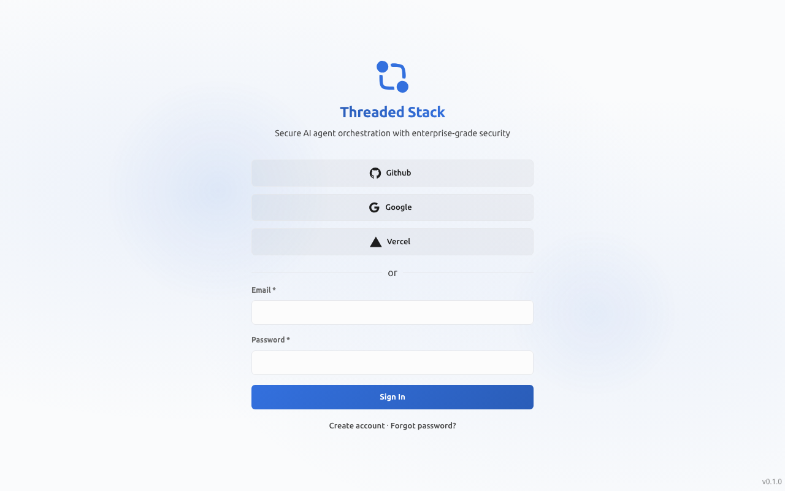
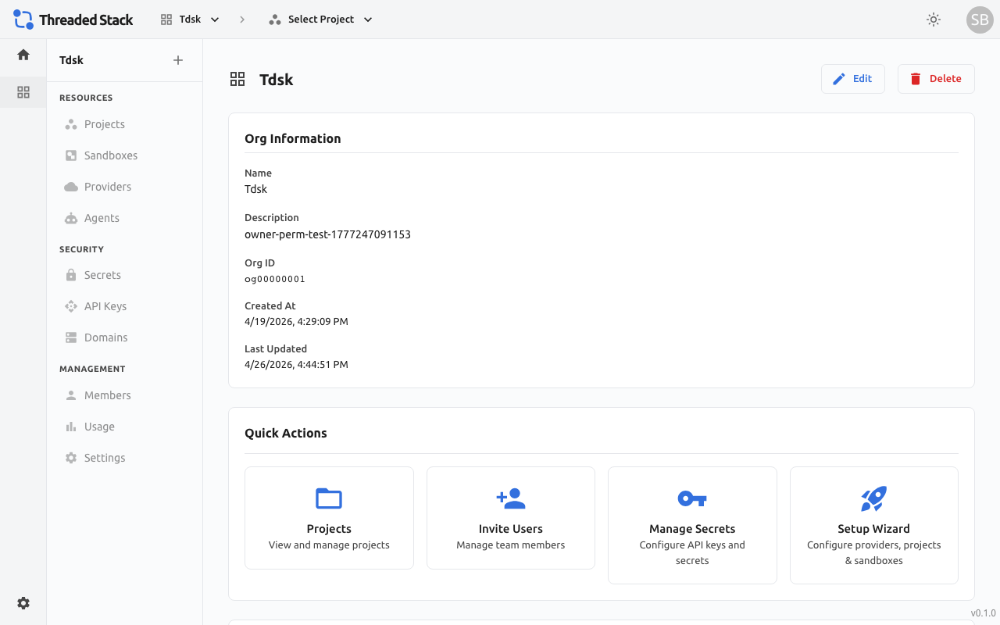
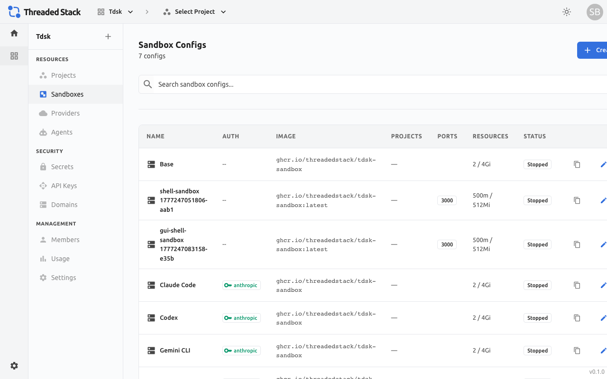
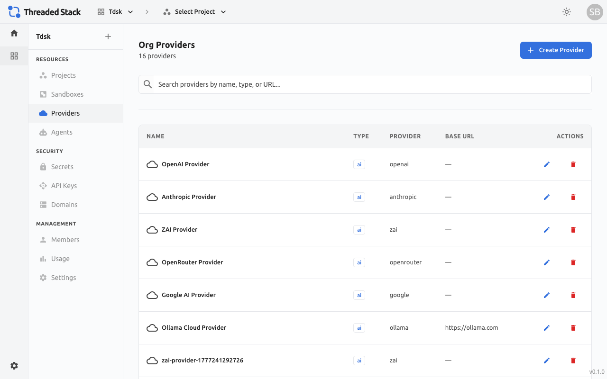
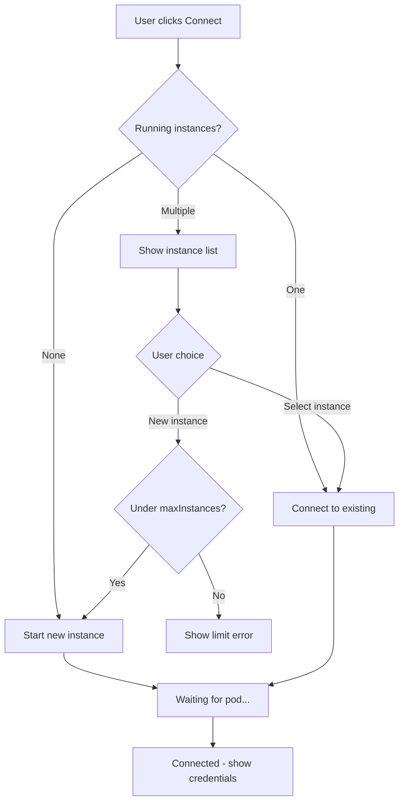

# Admin Dashboard User Guide

## Overview

The Threaded Stack Admin Dashboard is a web application that serves as the primary interface for managing your organizations, projects, sandboxes, endpoints, secrets, and billing.

**Access**: Open the dashboard in your browser. All routes beyond the login screen require authentication via one of the supported social login providers (GitHub, Google, or Vercel). After signing in, the dashboard loads your organizations and presents the main workspace.



---

## Navigation Structure

The dashboard uses a sidebar rail with context-sensitive navigation. The sidebar content changes based on where you are in the hierarchy.

### Top-Level Destinations

| Destination | Path | Description |
|---|---|---|
| Home | `/` | Landing page with quick links to Billing and Profile |
| Organizations | `/orgs` | List of all organizations you belong to |
| Billing | `/billing` | Subscription management, plan selection, invoices |
| Profile | `/profile` | Your user profile and account settings |
| Settings | `/settings` | Global application settings |



### Organization Scope

When you select an organization, the sidebar updates to show organization-level navigation grouped into three sections:

**Resources**
- Sandboxes -- Managed execution environments with runtime presets (listed first)
- Projects -- workspaces that contain endpoints and functions
- Providers -- AI model providers (OpenAI, Anthropic, etc.) and their API key configuration




**Security**
- Secrets -- Encrypted key-value pairs (API keys, tokens, credentials)
- API Keys -- API keys (`tdsk_*` tokens) for programmatic access
- Domains -- Custom domain verification and management



**Management**
- Members -- Organization member list, invitations, and role assignment
- Schedules -- Scheduled task definitions
- Usage -- Quota consumption dashboard (projects, compute, threads, messages, etc.)
- Settings -- Organization name, description, and configuration

### Project Scope

When you navigate into a project, the sidebar updates again:

**Resources**
- Sandboxes -- Sandbox configs scoped to this project (listed first)
- Endpoints -- HTTP endpoints (Proxy or FaaS type)
- Functions -- Serverless function code that endpoints can execute

**Security**
- Secrets -- Project-scoped secrets
- API Keys -- Project-scoped API keys
- Domains -- Project-level domain bindings

**Management**
- Members -- Project member management
- Settings -- Project name, description, and configuration


### Header Menu

Clicking the settings icon in the top-right header opens a dropdown with:
- **Profile** -- navigate to your user profile
- **Billing** -- navigate to billing and subscription management
- **Sign Out** -- log out of the dashboard

---

## Authentication

The login screen presents social login buttons based on your deployment configuration. The supported providers are:

- **GitHub** -- OAuth via GitHub
- **Google** -- OAuth via Google
- **Vercel** -- OAuth via Vercel

An email/password login form may also be available depending on configuration.

After successful authentication, the dashboard fetches your session token and uses it for all subsequent API requests. The token is sent as a `Bearer` header through the Caddy reverse proxy to the backend.

---

## Organization Management

Organizations are the top-level container in Threaded Stack. All resources (projects, providers, secrets, sandboxes) belong to an organization.

### Creating an Organization

1. Navigate to `/orgs`.
2. Click the **Create** button.
3. In the drawer that opens, enter an **Organization Name** and optional **Description**.
4. Click **Save**. The new organization appears in the grid.

### Organization Dashboard

Click an organization card to enter its dashboard at `/orgs/:orgId`. This page provides an overview and quick access to all organization-level resources via the sidebar.

### Managing Members

Navigate to **Members** in the sidebar (`/orgs/:orgId/members`).

**Inviting a user:**
1. Click **Invite**.
2. Enter the user's **email address**.
3. Select a **role**: Viewer, Editor, or Admin.
4. Click **Save** to send the invitation.

Member invitations respect your subscription's seat limits. If you are on the Free or Solo plan, invitations are restricted. Pro and Team plans support multiple seats, and you will see a warning if you are approaching your seat cap. If adding a member would exceed the included seats on a plan that supports additional seats, a confirmation dialog appears explaining the per-seat cost before proceeding.

**Role types:**
- **Viewer** -- read-only access to organization resources
- **Editor** -- can create and modify resources
- **Admin** -- full control including member management and settings

### Organization Secrets

Navigate to **Secrets** (`/orgs/:orgId/secrets`).

Secrets are encrypted key-value pairs stored server-side. They are never exposed to client-side code or sandbox environments directly -- the backend injects them at runtime.

**Creating a secret:**
1. Click **Add Secret**.
2. Enter a **Name** (must be unique within the scope), **Value**, and optional **Description**.
3. Click **Save**. The value is encrypted at rest using AES-256-GCM.

When editing, the current value is masked. You can toggle visibility with the eye icon. Duplicate names are detected and blocked before submission.

### Organization Providers

Navigate to **Providers** (`/orgs/:orgId/providers`).

Providers represent external services (AI model providers, APIs, etc.) that your sandboxes and endpoints connect to.

**Creating a provider:**
1. Click **Add Provider**.
2. Select a **Type** (e.g., AI).
3. Select a **Brand** from the supported LLM providers (OpenAI, Anthropic, Google, etc.).
4. Enter a **Name** for this provider configuration.
5. Link a **Secret** containing the provider's API key, or create a new secret inline.
6. Optionally add custom **Configuration** key-value pairs.
7. Click **Save**.

### Organization API Keys

Navigate to **API Keys** (`/orgs/:orgId/api-keys`).

API keys provide programmatic access to the Threaded Stack API. Keys use the `tdsk_*` prefix and are passed as `Bearer` tokens in the `Authorization` header.

### Organization Domains

Navigate to **Domains** (`/orgs/:orgId/domains`).

Register and verify custom domains for routing traffic to your organization's endpoints.

### Organization Usage

Navigate to **Usage** (`/orgs/:orgId/usage`).

The usage page displays your organization's quota consumption across six resource categories:

| Resource | Description |
|---|---|
| Projects | Number of active projects |
| Compute | Total serverless execution time (in seconds) |
| Threads | Number of conversation threads created |
| Messages | Number of messages sent across all threads |
| Endpoints | Number of active endpoints |
| Secrets | Number of stored secrets |

Each resource shows a progress bar with color coding:
- **Green** (under 70%) -- healthy usage
- **Yellow** (70-89%) -- approaching limit
- **Red** (90%+) -- at or near capacity

Resources with unlimited allocation on your plan show no progress bar.

---

## Project Management

Projects are workspaces within an organization that group related endpoints, functions, sandboxes, and secrets.

### Creating a Project

1. Navigate to **Projects** in the organization sidebar (`/orgs/:orgId/projects`).
2. Click **Create Project**.
3. Enter a **Project Name** and optional **Description**.
4. Click **Save**.

### Project Dashboard (Workspace)

Click a project card to enter its dashboard at `/orgs/:orgId/projects/:projectId`. The project landing page is the **ProjectWorkspace** dashboard, which provides:

- **Quick Actions bar** — buttons for creating a new sandbox and connecting to an existing one
- **Sandboxes panel** — lists sandbox configs assigned to the project, showing each sandbox's name, runtime badge (Claude Code, Codex, OpenCode, Custom), and a `builtIn` badge for presets
- **Recent Threads panel** — shows recent conversation threads (placeholder for future expansion)

The sidebar updates to show project-level navigation.

### Endpoints

Navigate to **Endpoints** (`/orgs/:orgId/projects/:projectId/endpoints`).

Endpoints are HTTP routes that handle incoming requests. Each endpoint has a name, URL path, HTTP method, and a type that determines how requests are processed.

**Endpoint types:**

| Type | Description |
|---|---|
| **Proxy** | Forwards requests to an external URL. Configure the target URL, headers, and path rewriting. |
| **FaaS** | Executes a serverless function. Link a function from the project's function library. |

**Creating an endpoint:**
1. Click **Add Endpoint**.
2. In the drawer, fill in the **Name**, **Path** (the URL route), and **HTTP Method**.
3. Select the **Endpoint Type** (Proxy or FaaS).
4. Configure the type-specific settings in the form that appears below.
5. Optionally mark the endpoint as **Public** (no authentication required).
6. Click **Save**.

**Endpoint detail view:**
Click an endpoint to open its detail page with three tabs:
- **Endpoint** -- view and edit the endpoint's configuration
- **Config** -- advanced configuration options
- **Test** -- send test requests to the endpoint directly from the dashboard

### Functions

Navigate to **Functions** (`/orgs/:orgId/projects/:projectId/functions`).

Functions are serverless code blocks that FaaS endpoints execute. They support TypeScript and JavaScript.

**Creating a function:**
1. Click **Add Function**.
2. Enter a **Name**, optional **Description**, and select the **Language** (TypeScript or JavaScript).
3. Write or paste your function code in the built-in Monaco editor.
4. Optionally define **Input Schema** parameters that the function accepts.
5. Optionally add **Dependencies** as key-value pairs (package name and version).
6. Optionally link the function to an **Endpoint**.
7. Click **Save**.

### Project Secrets

Navigate to **Secrets** (`/orgs/:orgId/projects/:projectId/secrets`).

Project secrets work the same as organization secrets but are scoped to the project. Both org-level and project-level secrets are available to sandboxes and endpoints within the project.

### Project Members and API Keys

These pages work the same as their organization-level counterparts but are scoped to the individual project.

---

## Sandbox Management

Sandboxes are managed execution environments where AI tools run. Navigate to **Sandboxes** in the organization or project sidebar.

### Sandbox List

The sandbox list page shows all sandbox configs with:
- **Name** — human-readable sandbox name
- **Runtime badge** — which AI tool the sandbox runs (Claude Code, Codex, OpenCode, Custom, or none)
- **Built-in badge** — indicates whether this is a pre-seeded preset
- **Copy button** — duplicates the sandbox config (copy always has `builtIn: false`)
- Standard edit and delete actions

### Creating a Sandbox

1. Click **Create Sandbox**.
2. Fill in the sandbox configuration form (described below).
3. Click **Save**.

### Sandbox Configuration Form (SandboxDrawer)

The sandbox drawer contains the following fields:

**Basic Info**
- **Name** — a human-readable name for the sandbox
- **Description** — optional description

**Runtime**
- **Runtime** — dropdown to select the AI tool: Claude Code, Codex, OpenCode, or Custom
- **Runtime Command** — the shell command executed by `tsa run` to launch the AI tool. Read-only for built-in runtimes (auto-resolved). Editable for custom runtimes.
- **Init Script** — a shell script editor (Monaco editor, shell language highlighting) for commands to run after container start. Use this for setup tasks like installing dependencies or cloning repos.

**Container** (visible only for custom runtimes)
- **Start Command** — custom container command (default: `sleep infinity`)
- **Start Args** — custom container arguments

**Image**
- **Docker Image** — the container image to use
- **Image Pull Secret** — optional K8s secret for private registries
- **Image Pull Policy** — Always, IfNotPresent, or Never

**Resources**
- **CPU Limit/Request** — CPU resource constraints
- **Memory Limit/Request** — Memory resource constraints

**Environment**
- **Environment Variables** — key-value pairs injected into the container
- **Working Directory** — container working directory (default: `/workspace`)

**Secrets**
- Attach organization or project secrets. These are injected as placeholder tokens at pod creation time.

**Ports**
- Configure exposed ports with protocol (TCP/UDP)

### Instance Status

The sandbox list and detail views show the number of active instances per sandbox configuration. An instance count badge appears next to each sandbox name when one or more instances are running, giving administrators a quick overview of which sandboxes are in use.

The sandbox list displays an instance count badge next to each sandbox name:

```
┌─────────────────────────────────────────────────┐
│ Sandbox          │ Runtime      │ Instances     │
├─────────────────────────────────────────────────┤
│ Claude Code      │ claude-code  │ ●● 2 running  │
│ Codex            │ codex        │ ● 1 running   │
│ OpenCode         │ opencode     │ — none        │
│ Base             │ custom       │ — none        │
└─────────────────────────────────────────────────┘
```

Sandboxes with running instances show filled dots (one per instance) alongside the count. Sandboxes with no active instances show a dash. The badge updates in real time as instances start or stop.

### Connect Modal

When connecting to a sandbox, a modal dialog appears with the following behavior:

- **No running instances** -- The modal shows a confirmation to start a new instance. Clicking **Connect** creates the instance and opens a session.
- **One or more running instances** -- The modal lists each running instance with its `instanceId`, state, and session count. The user can select an existing instance to join, or click **New Instance** to start an additional one.
- **Instance selection is required** when multiple instances are running -- the user must choose which instance to connect to before a session is opened.

The modal layout is organized into three areas:

- **Header** -- Shows the sandbox name and runtime badge at the top of the modal.
- **Instance list** -- Each running instance appears as a selectable row displaying the truncated `instanceId`, a color-coded state label (green for Running, yellow for Pending), and the number of active sessions. Clicking a row highlights it as the selected instance.
- **Action bar** -- At the bottom of the modal, a **Connect** button opens a session on the selected instance. A **New Instance** button starts an additional pod. When no instances exist, only a single **Connect** button is shown, which starts a new instance and immediately opens a session.

```
┌──────────────────────────────────────┐
│  Connect to: Claude Code             │
├──────────────────────────────────────┤
│  ● tdsk-sb-abc-x7k9  Running  2s     │
│  ● tdsk-sb-abc-m3p2  Running  1s     │
├──────────────────────────────────────┤
│  [ New Instance ]       [ Connect ]  │
└──────────────────────────────────────┘
```

In the instance list, "2s" and "1s" are shorthand for the active session count on that instance.

The following diagram illustrates the connect modal decision flow:



### Stop Controls

Administrators can stop sandbox instances from the sandbox detail view or the connect modal:

- **Stop a single instance** -- Terminates the selected instance's pod and disconnects all sessions on that instance.
- **Stop all instances** -- Terminates every running instance of the sandbox configuration at once.
- **Active session protection** -- Stopping is blocked if other users have active sessions on the instance, unless the administrator force-stops the instance. A confirmation dialog warns about affected sessions before a force-stop proceeds.

### Copying a Sandbox

Click the **copy** button on any sandbox row to create a duplicate. The copy gets a new ID and `builtIn: false`. All configuration is preserved. This is the recommended way to customize built-in presets.

---

## Billing and Quotas

Navigate to **Billing** from the header menu or sidebar (`/billing`).

The billing page has three tabs: **Current Plan**, **Upgrade Plan**, and **Payment History**.

### Current Plan

Displays your active subscription including:

- **Plan name and status** -- shown with a color-coded status chip (green for active, blue for trialing, yellow for past due, red for canceled)
- **Price** -- monthly cost or "Free"
- **Subscription period** -- current billing period start and end dates
- **Cancellation notice** -- if the subscription is set to cancel at period end, a warning banner appears
- **Plan features** -- a checklist showing limits for projects, endpoints, compute, threads, messages, secrets, and seat usage

The **Manage Subscription** button opens the Stripe customer portal in a new tab, where you can update payment methods, view invoices, or cancel.

### Upgrade Plan

Displays all available plans as cards. Each card shows:

- **Plan name** with a "Recommended" badge on the Pro plan and a "Current Plan" badge on your active plan
- **Monthly price** and per-seat pricing for plans that support additional seats
- **Feature list** -- organizations, projects, endpoints, compute time, threads, messages, secrets, seats, and data retention period
- **Upgrade button** -- clicking this initiates a Stripe Checkout session. You are redirected to Stripe to complete payment. On success, you return to the billing page with a confirmation toast.

### Available Plans

| Plan | Price | Key Limits |
|---|---|---|
| **Free** | $0/mo | 1 org, 2 projects, 1,000s compute, 100 threads, 500 messages, 3 endpoints, 5 secrets, 7-day retention, 1 seat |
| **Solo** | Varies | 2 orgs, 10 projects, 10,000s compute, 1,000 threads, 10,000 messages, 20 endpoints, 25 secrets, 30-day retention, 1 seat |
| **Pro** | Varies | 5 orgs, 50 projects, unlimited threads/messages/endpoints/secrets, 100,000s compute, 90-day retention, 3 seats (additional seats available) |
| **Team** | Varies | Unlimited orgs/projects/compute/threads/messages/endpoints/secrets, 365-day retention, 10 seats (additional seats available) |

A value of "Unlimited" means no cap is enforced for that resource.

### Payment History

Displays a table of past invoices with:

- **Date** -- the billing period
- **Amount** -- formatted in the invoice's currency
- **Status** -- color-coded chip (green for paid, blue for open, red for void/uncollectible)
- **Invoice link** -- a PDF download link when available

### Quota Enforcement

Resource usage is tracked in real time. When you approach or hit a limit, the dashboard communicates this through:

- **Progress bars** on the Usage page turning yellow (70%+) or red (90%+)
- **API errors** when attempting to create resources beyond your plan's limits (e.g., creating a 3rd project on the Free plan)
- **Seat warnings** in the invite member flow when approaching seat capacity

To increase limits, upgrade your plan from the Billing page.

---

## Quickstart Wizard

First-time users see a **Quickstart** option that walks through setting up a working sandbox in three steps:

1. **AI Provider** -- configure an AI provider by selecting a brand (e.g., OpenAI, Anthropic) and entering your API key. This creates both a provider and a secret in one step.
2. **Project & Sandbox** -- create a project and configure your sandbox. Enter names, select the provider you just created, and choose your AI tool runtime.
3. **Review & Create** -- review your configuration and submit. The wizard creates the provider, secret, project, and sandbox in a single operation.

After completion, you can connect to your sandbox and start working.

---

## Tips

- **Org Selector**: Use the organization selector in the sidebar header or breadcrumb to switch between organizations without navigating back to the org list.
- **Project Selector**: Similarly, switch projects using the project selector in the sidebar when within an organization scope.
- **Theme Toggle**: The dashboard supports light and dark themes. Toggle via the settings page.
- **Keyboard Navigation**: Drawer forms support standard keyboard navigation -- Tab between fields, Enter to submit.
- **Secret References**: In environment variable values and endpoint configurations, use `{{secret-name}}` syntax to reference secrets by name. The backend resolves these at runtime.
- **Search**: Most list views include a search bar for filtering resources by name.
