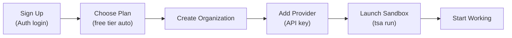

# Getting Started with Threaded Stack

This guide walks you through your first session on Threaded Stack. There are two paths depending on what you want to do:

- **Sandbox path** (recommended) -- Run an AI tool (Claude Code, Codex, OpenCode) in a managed sandbox with secure credential injection. You will be up and running in under 5 minutes.
- **Proxy endpoint path** -- Set up a secure API proxy that injects credentials into outbound requests.

Both paths start the same way: sign up, create an organization, and add a secret.

### Quick Start Flow



---

## Prerequisites

- A modern web browser (Chrome, Firefox, Safari, or Edge)
- An internet connection
- An account with one of the supported login providers: GitHub, Google, or Vercel
- For the sandbox path: the `tsa` CLI installed (see [TSA CLI](tsa-cli.md) for installation)

For the proxy endpoint path only, no CLI installation is required -- everything can be done through the browser.

---

## Sign Up

Threaded Stack uses social login, so there are no passwords to create or remember.

1. Open the Threaded Stack dashboard in your browser.
2. On the login screen, click the button for your preferred provider -- **GitHub**, **Google**, or **Vercel**.
3. Authorize Threaded Stack in the provider's OAuth consent screen.
4. You are redirected to the Threaded Stack dashboard. Your account is created automatically on first login.

If you already have an account, clicking a login button signs you in immediately.

---

## Choose a Plan

Every new account starts on the **Free** tier automatically. You can begin using the platform right away without entering payment information.

### Available Tiers

| | Free | Solo | Pro | Team |
|---|---|---|---|---|
| **Organizations** | 1 | 2 | 5 | Unlimited |
| **Projects** | 2 | 10 | 50 | Unlimited |
| **Endpoints** | 3 | 20 | Unlimited | Unlimited |
| **Secrets** | 5 | 25 | Unlimited | Unlimited |
| **Threads** | 100 | 1,000 | Unlimited | Unlimited |
| **Messages** | 500 | 10,000 | Unlimited | Unlimited |
| **Compute Units** | 1,000 | 10,000 | 100,000 | Unlimited |
| **Data Retention** | 7 days | 30 days | 90 days | 365 days |
| **Included Seats** | 1 | 1 | 3 | 10 |

The Free tier is a good fit for trying out the platform. Upgrade when you need more resources or want to add team members.

### Upgrading Your Plan

1. Click your profile avatar in the top-right corner of the dashboard.
2. Select **Billing** from the dropdown menu.
3. Switch to the **Upgrade Plan** tab.
4. Click **Upgrade** on the tier you want.
5. You are redirected to a Stripe checkout page. Enter your payment details and confirm.
6. After checkout completes, you are returned to the Billing page with your new plan active.

You can manage your subscription, view invoices, and access the Stripe billing portal from the **Billing** page at any time.

For a deeper look at subscription lifecycle, quota tracking, and seat management, see [Billing & Subscriptions](../features/billing.md).

---

## Create Your Organization

An organization is the top-level container in Threaded Stack. It groups your projects, secrets, team members, and AI agents. Resource limits from your subscription plan apply at the organization level.

1. From the **Home** page, click **Create Organization** (or the **+** button if you already have organizations listed).
2. Fill in:
   - **Name** -- A short, recognizable name for your org (e.g., "Acme Engineering").
   - **Description** -- Optional. A brief note about what this org is for.
3. Click **Create**.

Your new organization appears on the Home page. Click it to open the organization dashboard.

The left sidebar shows the sections available within your org: **Projects**, **Users**, **Secrets**, **Providers**, **Domains**, **API Keys**, **Usage**, and **Settings**.

For more details on organization features, see [Organizations](../features/organizations.md).

---

## Add Your First Secret

Secrets are encrypted values -- API keys, tokens, passwords -- that Threaded Stack stores securely and injects into outgoing requests at runtime. Your secrets are encrypted at rest using AES-256-GCM encryption and are never exposed to clients or AI agents.

### Why Add a Secret First?

When you create a proxy endpoint later in this guide, you will reference this secret by name using `{{secret-name}}` syntax. The platform replaces that placeholder with the decrypted value at the moment a request is forwarded, so the actual credential never leaves the server.

### Steps

1. In your organization's sidebar, click **Secrets**.
2. Click **Create Secret** (or the **+** button).
3. Fill in:
   - **Name** -- A descriptive, URL-safe name (e.g., `openweather-api-key`). You will reference this name in endpoint configuration.
   - **Value** -- The raw secret value (e.g., your OpenWeatherMap API key).
4. Click **Create**.

The secret is encrypted and stored. From this point forward, you reference it by name -- the raw value is not displayed again.

For a deeper dive into secret scoping (org-level vs. project-level), encryption details, and best practices, see [Secrets](../features/secrets.md).

---

## Create a Project

Projects live inside organizations and act as containers for your endpoints, functions, agents, and project-level secrets. Each project has its own set of team permissions.

1. In your organization's sidebar, click **Projects**.
2. Click **Create Project** (or the **+** button).
3. Fill in:
   - **Name** -- A name for the project (e.g., "Weather Service").
4. Click **Create**.

Click on your new project to open its dashboard. The sidebar now shows project-level sections: **Endpoints**, **Functions**, **Secrets**, **Agents**, **Threads**, **Domains**, and **Settings**.

---

## Create Your First Proxy Endpoint

A proxy endpoint is a secure relay: your application calls the Threaded Stack URL, and the platform forwards the request to an external API while injecting credentials from your encrypted secrets. The client never sees the target API's keys.

This example sets up a proxy to the [OpenWeatherMap API](https://openweathermap.org/api).

### Step 1: Open the Endpoints Page

Inside your project, click **Endpoints** in the sidebar. You will see an empty endpoints table.

### Step 2: Create the Endpoint

Click **Create Endpoint** in the top-right corner. A drawer slides in from the right.

Fill in the form:

| Field | Value |
|---|---|
| **Endpoint Name** | Weather API |
| **Endpoint Type** | Proxy (selected by default) |
| **Endpoint Path** | `/api/weather` |
| **Proxy URL** | `https://api.openweathermap.org/data/2.5/weather` |
| **HTTP Method** | GET |

A quick note on the two URL fields:
- **Endpoint Path** is the path your application calls (e.g., `/api/weather`).
- **Proxy URL** is the external API the request gets forwarded to.

### Step 3: Add a Header with Secret Injection

Expand the **Headers** section and add a custom header:

| Key | Value |
|---|---|
| `X-Api-Key` | `{{openweather-api-key}}` |

The `{{openweather-api-key}}` placeholder references the secret you created earlier. When a request passes through this endpoint, the platform decrypts the secret and replaces the placeholder with the real API key in the outgoing request. Your application never sees the raw key.

### Step 4: Save

Click **Create** at the bottom of the drawer. The new endpoint appears in the table.

### Step 5: Test Your Endpoint

You can call your proxy endpoint using `curl`, Postman, or any HTTP client. Requests go through Threaded Stack's auth layer, so you need a valid API key or JWT.

To get an API key:
1. Go to your organization's sidebar and click **API Keys**.
2. Create a new API key. Copy the key value -- it starts with `tdsk_`.

Now make a request:

```bash
curl -s \
  -H "Authorization: Bearer tdsk_<api-key>" \
  "https://your-threaded-stack-url/proxy/PROJECT_ID/ENDPOINT_ID?q=London&units=metric"
```

Replace `PROJECT_ID` and `ENDPOINT_ID` with the actual IDs (visible in the dashboard URL when you click on the project and endpoint).

What happens behind the scenes:

1. Threaded Stack validates your API key.
2. The backend loads the endpoint configuration and decrypts the project's secrets.
3. The `{{openweather-api-key}}` placeholder in the `X-Api-Key` header is replaced with the real value.
4. The request is forwarded to `https://api.openweathermap.org/data/2.5/weather?q=London&units=metric` with the injected header.
5. The response from OpenWeatherMap is returned to your application.

Your application received weather data without ever knowing the OpenWeatherMap API key.

For the full reference on proxy endpoint configuration -- authentication types, OAuth 2.0, retry logic, domain whitelists, and more -- see [Proxy Endpoints](../features/proxy-endpoints.md).

---

## Run an AI Tool in a Sandbox (Recommended Path)

If your goal is to run Claude Code, Codex, or another AI tool with managed secrets, you can skip the proxy endpoint setup above and use sandboxes instead.

### Why Sandboxes?

When you created your organization, Threaded Stack automatically seeded four built-in sandbox configs: **Claude Code**, **Codex**, **OpenCode**, **Gemini** and **Base**. These are ready to start immediately — no additional configuration required. Attach your secrets to a sandbox, and the AI tool running inside it can make API calls with real credentials without ever seeing them.

### Step 1: Create an API Key

1. In your organization's sidebar, click **API Keys**.
2. Click **Create API Key** and copy the key (starts with `tdsk_`).

### Step 2: Attach Secrets to a Sandbox

1. In the sidebar, click **Sandboxes**.
2. Click on a built-in sandbox (e.g., "Claude Code") to open its configuration.
3. In the **Secrets** section, attach the secret you created earlier.
4. Click **Save**.

### Step 3: Install and Login with `tsa`

```bash
tsa login tdsk_<api-key>
```

### Step 4: Run the Sandbox

```bash
# List available sandboxes
tsa run --list

# Start the Claude Code sandbox
tsa run <sandbox-id>
```

This starts the sandbox pod, syncs your local files, SSHs in, and launches Claude Code. The AI tool can now make outbound API calls, and the MITM proxy transparently injects your real credentials.

For the full sandbox reference, see [Sandbox Usage](sandbox-usage.md).

---

## Next Steps

You now have the foundation: an organization, secrets, and either a working sandbox or a proxy endpoint. Here is where to go from here:

- **Sandbox Usage** -- Full guide to sandboxes, runtimes, file sync, and SSH access. See [Sandbox Usage](sandbox-usage.md).
- **FaaS Endpoints** -- Run sandboxed JavaScript/TypeScript functions as API endpoints. See [FaaS Endpoints](../features/faas-endpoints.md).
- **Agent Endpoints** -- Execute AI agents with LLM streaming. See [Agent Endpoints](../features/agent-endpoints.md).
- **Team Management** -- Invite team members to your organization, assign roles, and control access. See [Organizations](../features/organizations.md).
- **Usage Tracking** -- Monitor your resource consumption against plan limits from the **Usage** page in your organization sidebar.
- **Threads** -- Build conversational AI workflows with persistent message history and thread branching. See [Threads](../features/threads.md).
- **Billing** -- View invoices, change plans, or manage payment details from the **Billing** page. See [Billing & Subscriptions](../features/billing.md).
