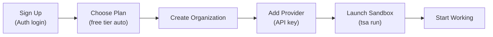

# Getting Started with Threaded Stack

This guide walks you through launching your first AI tool in a managed sandbox. You will be up and running in under 5 minutes.

### Quick Start Flow



---

## Prerequisites

- A modern web browser (Chrome, Firefox, Safari, or Edge)
- An internet connection
- An account with one of the supported login providers: GitHub, Google, or Vercel
- The `tsa` CLI installed (see [TSA CLI](tsa-cli.md) for installation)

---

## Sign Up

Threaded Stack uses social login, so there are no passwords to create or remember.

1. Open the Threaded Stack dashboard in your browser.
2. On the login screen, click the button for your preferred provider -- **GitHub**, **Google**, or **Vercel**.
3. Authorize Threaded Stack in the provider's OAuth consent screen.
4. You are redirected to the Threaded Stack dashboard. Your account is created automatically on first login.

If you already have an account, clicking a login button signs you in immediately.

---

## Choose a Plan

Every new account starts on the **Free** tier automatically. You can begin using the platform right away without entering payment information.

The Free tier includes one sandbox session, which is enough to get started. See the [Pricing page](/pricing) for a full comparison of all tiers and limits. Upgrade when you need more sessions, projects, or team seats.

### Upgrading Your Plan

1. Click your profile avatar in the top-right corner of the dashboard.
2. Select **Billing** from the dropdown menu.
3. Switch to the **Upgrade Plan** tab.
4. Click **Upgrade** on the tier you want.
5. You are redirected to a Stripe checkout page. Enter your payment details and confirm.
6. After checkout completes, you are returned to the Billing page with your new plan active.

You can manage your subscription, view invoices, and access the Stripe billing portal from the **Billing** page at any time.

For a deeper look at subscription lifecycle, quota tracking, and seat management, see [Billing & Subscriptions](../features/billing.md).

---

## Create Your Organization

An organization is the top-level container in Threaded Stack. It groups your projects, secrets, sandboxes, and team members. Resource limits from your subscription plan apply at the organization level.

1. From the **Home** page, click **Create Organization** (or the **+** button if you already have organizations listed).
2. Fill in:
   - **Name** -- A short, recognizable name for your org (e.g., "Acme Engineering").
   - **Description** -- Optional. A brief note about what this org is for.
3. Click **Create**.

Your new organization appears on the Home page. Click it to open the organization dashboard.

The left sidebar shows the sections available within your org: **Projects**, **Users**, **Secrets**, **Providers**, **Domains**, **API Keys**, **Usage**, and **Settings**.

For more details on organization features, see [Organizations](../features/organizations.md).

---

## Add Your First Secret

Secrets are encrypted values -- API keys, tokens, passwords -- that Threaded Stack stores securely and injects into sandbox environments at runtime. Secrets are encrypted at rest using AES-256-GCM and are never exposed to AI tools or clients.

### Why Add a Secret?

When your sandbox makes outbound API calls, the MITM egress proxy intercepts the request and replaces placeholder tokens with your real credentials. The AI tool inside the sandbox never sees the actual secret values.

### Steps

1. In your organization's sidebar, click **Secrets**.
2. Click **Create Secret** (or the **+** button).
3. Fill in:
   - **Name** -- A descriptive, URL-safe name (e.g., `anthropic-api-key`).
   - **Value** -- The raw secret value (e.g., your Anthropic API key).
4. Click **Create**.

The secret is encrypted and stored. From this point forward, you reference it by name -- the raw value is not displayed again.

For a deeper dive into secret scoping (org-level vs. project-level), encryption details, and best practices, see [Secrets](../features/secrets.md).

---

## Run Your First Sandbox

When you created your organization, Threaded Stack automatically seeded six built-in sandbox configs: **Claude Code**, **Codex**, **OpenCode**, **Antigravity**, **OpenClaw**, and **Base**. These are ready to start immediately. Attach your provider credentials to a sandbox, and the AI tool running inside it can make API calls with real credentials without ever seeing them.

### Step 1: Create an API Key

1. In your organization's sidebar, click **API Keys**.
2. Click **Create API Key** and copy the key (starts with `tdsk_`).

### Step 2: Attach Secrets to a Sandbox

1. In the sidebar, click **Sandboxes**.
2. Click on a built-in sandbox (e.g., "Claude Code") to open its configuration.
3. In the **Secrets** section, attach the secret you created earlier.
4. Click **Save**.

### Step 3: Install and Login with `tsa`

```bash
tsa login tdsk_<api-key>
```

### Step 4: Run the Sandbox

```bash
# List available sandboxes
tsa run --list

# Start the Claude Code sandbox
tsa run <sandbox-id>
```

This starts the sandbox pod, syncs your local files, SSHs in, and launches Claude Code. The AI tool can now make outbound API calls, and the MITM proxy transparently injects your real credentials.

For the full sandbox reference, see [Sandbox Usage](sandbox-usage.md).

---

## Next Steps

You now have the foundation: an organization, credentials, and a running sandbox. Here is where to go from here:

- **Sandbox Usage** -- Full guide to sandboxes, runtimes, file sync, and SSH access. See [Sandbox Usage](sandbox-usage.md).
- **Session Sharing** -- Share live terminal sessions with teammates in real-time. See [Session Sharing](../features/session-sharing.md).
- **Team Management** -- Invite team members to your organization, assign roles, and control access. See [Organizations](../features/organizations.md).
- **Threads** -- Build conversational AI workflows with persistent message history and thread branching. See [Threads](../features/threads.md).
- **Usage Tracking** -- Monitor your resource consumption against plan limits from the **Usage** page in your organization sidebar.
- **Billing** -- View invoices, change plans, or manage payment details from the **Billing** page. See [Billing & Subscriptions](../features/billing.md).
- **Proxy Endpoints** -- Forward requests to external APIs with automatic credential injection. See [Proxy Endpoints](../features/proxy-endpoints.md).
- **FaaS Endpoints** -- Run serverless JavaScript/TypeScript functions as API endpoints. See [FaaS Endpoints](../features/faas-endpoints.md).
