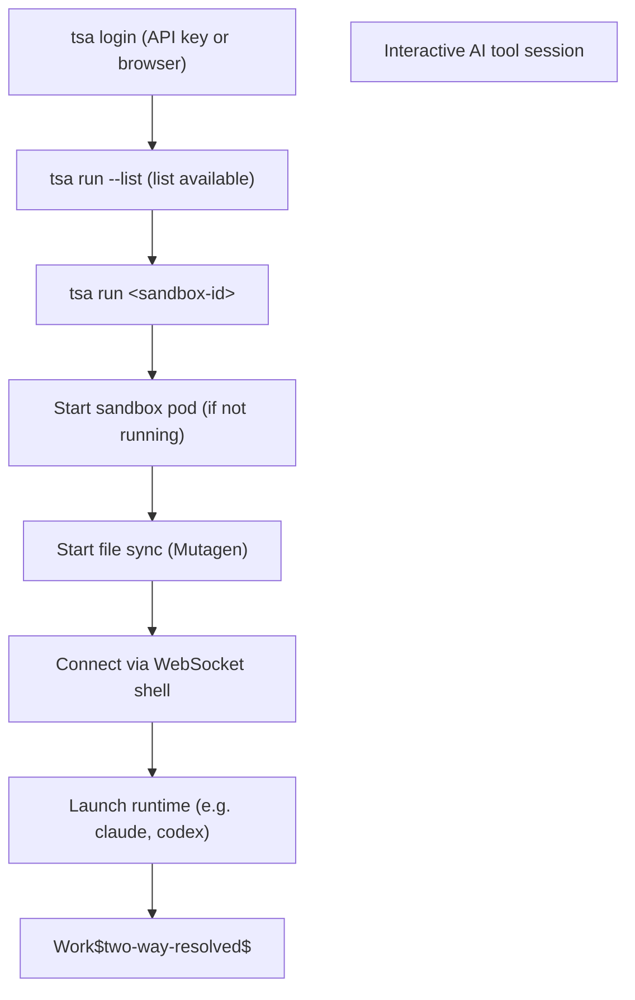

# tsa -- Threaded Stack CLI

## What is tsa

`tsa` is the Threaded Stack CLI for running AI tools in managed sandboxes from the command line. The recommended entry point is `tsa run`, which starts a sandbox, syncs files, and launches your AI tool in one command.

`tsa` handles sandbox lifecycle, WebSocket connections, and file sync. API keys never leave the server.

Key capabilities:

- **`tsa run`** -- start a sandbox, sync files, and launch an AI tool (Claude Code, Codex, OpenCode, Antigravity, OpenClaw, or custom)
- **`tsa ssh`** -- SSH into a running sandbox for manual access
- **`tsa sync`** -- file synchronization via Mutagen (two-way-resolved by default, configurable)
- **`tsa ports`** -- manage exposed ports on running sandbox instances
- Context file injection from `AGENTS.md` and `.tdsk/context/`
- Two-layer configuration (global + per-project)
- Browser login and API key authentication

### `tsa run` Workflow



## Installation

### Verify installation

```bash
tsa --version
tsa --help
```

## Authentication

`tsa` authenticates against the Threaded Stack API using either an API key or browser-based OAuth login. Credentials are stored in a YAML config file at `~/.config/tdsk/tsa.yaml` with `0600` permissions.

### Log in

There are two ways to authenticate:

**API key login** -- Pass an API key (prefixed `tdsk_`) directly. The key is validated by fetching `/_/orgs` through the proxy.

```bash
tsa login <api-key>
tsa login tdsk_abc123def456
tsa login --apiKey tdsk_abc123def456
```

**Browser login** -- Run `tsa login` without arguments. This opens your browser for OAuth sign-in, then creates a long-lived session key so you stay authenticated across CLI restarts.

```bash
tsa login
```

**Options:**

| Flag | Description |
|------|-------------|
| `--url <proxy-url>` | Custom proxy URL (default: https://px.threadedstack.app) |
| `--insecure` | Skip TLS certificate validation (useful for local dev with self-signed certs) |

Example with a local development proxy:

```bash
tsa login tdsk_abc123def456 --url https://px.threadedstack.app --insecure
```

### Check status

```bash
tsa status
```

Displays whether you are logged in, the proxy URL, and a masked version of your API key.

### Log out

```bash
tsa logout
```

Removes stored credentials from `~/.config/tdsk/tsa.yaml`.

### Credential storage

Credentials are stored in the global config file:

```text
~/.config/tdsk/tsa.yaml
```

The file is created with `0600` permissions (owner read/write only) inside a directory with `0700` permissions. The stored fields are:

```yaml
auth:
  apiKey: "tdsk_..."
  proxyUrl: "https://px.threadedstack.app"
  insecure: false
  token: "..."              # Browser session token (short-lived, managed automatically)
  expiresAt: "..."          # Token expiration timestamp
  sessionKeyId: "..."       # Long-lived session key ID (created after browser login)
```

## Key Commands

### CLI commands

These are invoked from your shell as `tsa <command>`.

**Sandbox commands** (recommended):

| Command | Alias | Description | Auth Required |
|---------|-------|-------------|:---:|
| `tsa run <sandbox-id>` | `sb` | Start sandbox + sync files + launch AI tool | Yes |
| `tsa ssh <sandbox-id>` | -- | SSH into a running sandbox (plain shell) | Yes |
| `tsa sync <sandbox-id>` | `sy` | Start file sync with a sandbox | Yes |
| `tsa sync stop <sandbox-id>` | -- | Stop file sync for a sandbox instance | Yes |
| `tsa sync status [sandbox-id]` | -- | Show sync status (grouped by instance) | Yes |
| `tsa sync flush <sandbox-id>` | -- | Trigger immediate sync for an instance | Yes |
| `tsa sync cleanup` | -- | Terminate orphaned sync sessions (errored/disconnected) | Yes |
| `tsa ports [<sandbox>]` | `port`, `po` | List exposed and detected ports on an instance | Yes |
| `tsa ports add <port>` | `expose` | Expose a port on a running sandbox instance | Yes |
| `tsa ports remove <port>` | `rm`, `unexpose` | Remove an exposed port | Yes |
| `tsa ports open <port>` | -- | Print the URL for an exposed port | Yes |
| `tsa sessions list <sandbox-id>` | `session` | List active sessions (grouped by instance) | Yes |
| `tsa sessions start <sandbox-id>` | -- | Start a new session on a sandbox instance | Yes |
| `tsa sessions connect <id>` | `join`, `attach` | Attach to an existing session | Yes |
| `tsa sessions share [<id>]` | -- | Make a session public | Yes |
| `tsa sessions unshare [<id>]` | -- | Make a session private | Yes |
| `tsa proxy <sandbox-id> [instance-id]` | -- | Internal SSH ProxyCommand (accepts optional instance ID) | Yes |

**`tsa run` flags:**

| Flag | Alias | Description |
|------|-------|-------------|
| `--list` | — | List available sandboxes with name, runtime, and ID |
| `--no-sync` | — | Skip automatic file synchronization |
| `--new` | `-n` | Force creation of a new instance (skips session discovery) |
| `--instance <id>` | `--instanceId`, `--inst` | Select a specific running instance |
| `--org <id>` | — | Specify organization (auto-detects if only one) |

**`tsa ssh` flags:**

| Flag | Alias | Description |
|------|-------|-------------|
| `--instance <id>` | `--instanceId`, `--inst` | Select a specific instance for SSH connection |
| `--new` | `-n` | Start a new instance before connecting |

**`tsa sessions` flags:**

| Flag | Alias | Description |
|------|-------|-------------|
| `--instance <id>` | `--instanceId`, `--inst` | Target a specific instance (`start` subcommand) |
| `--new` | `-n` | Start a new instance for the session (`start` subcommand) |

<Note>

`tsa sessions connect <session-id>` auto-detects the correct instance from session metadata — no `--instance` flag needed.

</Note>

**`tsa sync` flags:**

| Flag | Alias | Description |
|------|-------|-------------|
| `--instance <id>` | `--instanceId`, `--inst` | Target a specific instance for sync operations |
| `--new` | `-n` | Start sync on a new instance |
| `--all` | `-a` | Stop sync for all instances of a sandbox (`stop` subcommand only) |
| `--daemon` | `-d` | Run sync in background (returns immediately) |
| `--source <path>` | `-s`, `--src` | Local source path (single-rule shorthand, overrides config rules) |
| `--target <path>` | `-t`, `--tgt` | Remote target path (default: `/workspace`) |
| `--mode <mode>` | `-m` | Sync mode: `two-way-resolved` (default), `two-way-safe`, `one-way-replica`, `one-way-safe` |
| `--ignore <patterns>` | `-i` | Ignore patterns (repeatable) |
| `--noDefaults` | -- | Skip default ignore patterns |
| `--sessionName <name>` | `--sn` | Name for the sync session |

**`tsa ports` flags:**

| Flag | Alias | Description |
|------|-------|-------------|
| `--protocol <proto>` | `--proto` | Port protocol: `http` (default) or `https` (`add` subcommand only) |

**General commands:**

| Command | Alias | Description | Auth Required |
|---------|-------|-------------|:---:|
| `tsa login [<key>]` | `li` | Authenticate with API key or browser login | No |
| `tsa logout` | `lo` | Remove stored credentials | No |
| `tsa status` | `st` | Show authentication status | No |
| `tsa help` | `-h`, `--help` | Show available commands | No |
| `tsa --version` | `-v` | Show version | No |

Running `tsa` with no arguments shows the help output.

### Common usage patterns

```bash
# List available sandboxes (name, runtime, ID)
tsa run --list

# Start a sandbox, sync files, and launch the AI tool
tsa run <sandbox-id>

# Start without file sync
tsa run <sandbox-id> --no-sync

# Force a new instance (skip instance selection prompt)
tsa run <sandbox-id> --new

# Connect to a specific instance by ID (suffix match)
tsa run <sandbox-id> --instance abc123

# SSH into a sandbox without launching the AI tool
tsa ssh <sandbox-id>

# SSH into a specific instance
tsa ssh <sandbox-id> --instance abc123

# Start file sync on a new instance
tsa sync <sandbox-id> --new

# Stop sync for a specific instance
tsa sync stop <sandbox-id> --instance abc123

# Stop sync for all instances of a sandbox
tsa sync stop <sandbox-id> --all

# Show sync status grouped by instance
tsa sync status

# List sessions grouped by instance
tsa sessions list <sandbox-id>

# Browser login (opens browser for OAuth)
tsa login

# List ports on a sandbox instance
tsa ports <sandbox-id>

# Expose port 3000 on a running sandbox
tsa ports add 3000 --sandbox <sandbox-id>

# Get URL for an exposed port
tsa ports open 3000 --sandbox <sandbox-id>

# Remove an exposed port
tsa ports remove 3000 --sandbox <sandbox-id>

# Start sync with explicit source and target
tsa sync <sandbox-id> --source ./src --target /workspace/src

# Start sync in background (daemon mode)
tsa sync <sandbox-id> --daemon

# Clean up orphaned sync sessions
tsa sync cleanup

```

## Session Sharing

Sessions are persistent PTY connections to sandbox pods. Multiple clients (CLI and browser) can attach to the same session simultaneously, providing a shared terminal experience.

### Reconnecting to sessions

When you run `tsa run <sandbox-id>`, the CLI first resolves the target instance (see [Multi-Instance Support](#multi-instance-support)), then checks for existing sessions on that instance. If it finds one, it prompts you to reconnect rather than creating a new session. Use `--new` to skip the prompt and create a new instance:

```bash
tsa run <sandbox-id> --new
```

To reconnect to a session on a specific instance:

```bash
tsa run <sandbox-id> --instance <id>
```

### Listing sessions

```bash
tsa sessions list <sandbox-id>
```

Displays each session's ID, owner, visibility (`private` or `public`), connection time, and instance. Sessions are grouped by instance when multiple instances are running.

### Joining a shared session

```bash
tsa sessions connect <session-id>
```

The sandbox and instance are auto-resolved from session metadata. The server validates that the session is public and that you have sandbox exec permission.

### Sharing and unsharing

Only the session owner can change visibility:

```bash
# Make a session public so org members can join
tsa sessions share <session-id>

# Make it private again
tsa sessions unshare <session-id>
```

### Detaching

Detaching closes your local connection without killing the server-side PTY. Other clients continue uninterrupted.

- **`Ctrl+]`** -- Opens a session menu bar at the bottom of the terminal. Press `d` to detach, or any other key to dismiss.
- **`~.`** -- Type tilde then period immediately after pressing Enter (SSH-style escape sequence).

After detaching, the session enters a 5-minute idle window. If no one reconnects within 5 minutes, the session is cleaned up. The sandbox pod remains running independently.

## Multi-Instance Support

A single sandbox configuration can have multiple running instances simultaneously. Each instance is an independent pod with its own SSH sessions, file sync, and lifecycle. This lets you run parallel workstreams against the same sandbox preset without interference.

### Instance resolution

When you run a sandbox command (`tsa run`, `tsa ssh`, `tsa sync`, `tsa sessions start`), the CLI resolves which instance to target using the following rules:

| Condition | Behavior |
|-----------|----------|
| `--new` flag provided | Always creates a new instance |
| `--instance <id>` provided | Matches by suffix (exact or tail match); errors if the suffix is ambiguous |
| No instances running | Server creates a default instance automatically |
| One instance running | Auto-selects it and prints a notification |
| Multiple instances running (TTY) | Prompts an interactive picker to select an instance or create a new one |
| Multiple instances running (non-TTY) | Requires explicit `--instance` or `--new`; exits with an error otherwise |

<Tip>

The `--instance` flag supports suffix matching. If your instance ID is `inst_a1b2c3d4e5f6`, you can target it with `--instance e5f6` as long as the suffix is unambiguous across running instances.

</Tip>

### Instance-aware commands

All sandbox commands are instance-aware:

- **`tsa run`** and **`tsa ssh`** resolve a single instance before connecting.
- **`tsa sessions list`** groups sessions by instance, showing which instance each session belongs to.
- **`tsa sessions connect`** auto-detects the instance from session metadata -- no `--instance` flag required.
- **`tsa sync start`** and **`tsa sync stop`** target a specific instance. Use `--all` with `stop` to halt sync across every instance of a sandbox.
- **`tsa sync status`** displays sync state grouped by instance.
- **`tsa sync flush`** triggers an immediate sync cycle for a specific instance.
- **`tsa ports`** resolves the target instance before listing or managing ports.
- **`tsa proxy`** accepts an optional positional instance ID (`tsa proxy <sandbox-id> [instance-id]`) for use as an SSH `ProxyCommand`.

### Examples

```bash
# Start a sandbox — if multiple instances exist, you'll be prompted to pick one
tsa run sb_abc123

# Force a fresh instance regardless of how many are already running
tsa run sb_abc123 --new

# Connect to the instance whose ID ends with "d4e5"
tsa ssh sb_abc123 --instance d4e5

# List all sessions across all instances of a sandbox
tsa sessions list sb_abc123

# Start sync targeting a specific instance
tsa sync sb_abc123 --instance d4e5

# Stop sync for every instance of a sandbox
tsa sync stop sb_abc123 --all
```

## Configuration

`tsa` uses a two-layer YAML configuration system. Project-level config overrides global config for shared keys.

### Config file locations

| Path | Purpose |
|------|---------|
| `~/.config/tdsk/tsa.yaml` | Global config (auth, display, behavior, hooks, tools) |
| `.tdsk/config.yaml` | Project config (org, context paths, hooks, tools) |
| `AGENTS.md` | Auto-detected context file (project root) |
| `.tdsk/context/` | Auto-detected context files directory |

### Global config (`~/.config/tdsk/tsa.yaml`)

```yaml
# Authentication (managed by tsa login/logout)
auth:
  apiKey: "tdsk_..."
  proxyUrl: "https://px.threadedstack.app"
  insecure: false

# Default IDs (used when --org not specified)
org: "org_xxx"
project: "proj_xxx"

# Display preferences
display:
  theme: "dark"       # dark | light | auto
  verbose: false
  markdown: true
  timestamps: false

# Behavior settings
behavior:
  autoResume: false
  maxHistory: 50       # Max input history entries
  confirmTools: false

# File sync rules
sync:
  rules:
    - name: "project-sync"
      source: "./src"
      target: "/workspace/src"
      mode: "two-way-resolved"    # one-way-replica | one-way-safe | two-way-safe | two-way-resolved
      ignores: ["node_modules", ".git"]
  defaultIgnores: ["node_modules", ".git", "dist"]
  sandboxes:
    "<sandbox-id>":
      rules:                     # Per-sandbox rule overrides
        - name: "custom-sync"
          source: "./custom"
          target: "/workspace/custom"

# Lifecycle hooks (shell commands)
hooks:
  onSessionStart: "echo started"
  onSessionEnd: "echo ended"
  onToolCall: "echo tool called"
  onToolResult: "echo tool result"
  onError: "echo error"
  onMessage: "echo message"

# Tool safety controls
tools:
  confirm: ["shellExec"]   # Require confirmation before running
  block: ["deleteFile"]    # Block entirely
```

### Project config (`.tdsk/config.yaml`)

Place this file in your project root to set project-specific defaults:

```yaml
org: "org_xxx"
context: ["./docs/api.md"]

hooks:
  onSessionStart: "echo project session"

tools:
  confirm: ["writeFile"]
  block: []
```

### Config merge rules

When both global and project configs exist:

- `org` from project config **overrides** the global value.
- `hooks` are **merged** per-key (project wins on conflicts).
- `tools.confirm` and `tools.block` arrays are **concatenated** (both global and project entries apply).
- `sync.rules` from global config are used as the base; per-sandbox overrides in `sync.sandboxes` take precedence for matching sandboxes.

### Context files

`tsa` automatically detects and injects context files when connecting to sandboxes:

- **`AGENTS.md`** -- If present at the project root, its contents are injected as context. This is a convention shared with Claude Code, Codex, and other AI tools.
- **`.tdsk/context/`** -- All files in this directory are loaded and injected.

Context is injected as XML blocks:

```xml
<context>--- AGENTS.md ---
Your context here...
</context>
```

### Environment variables

`tsa` respects the following environment variables:

| Variable | Description |
|----------|-------------|
| `HOME` | Used to resolve `~/.config/tdsk/` config directory |
| `NO_COLOR` | When set, disables colored output |

### Lifecycle hooks

Hooks execute shell commands on specific events. They run via `/bin/sh -c` with a 10-second timeout. Errors are silently written to stderr.

| Hook | Triggered when |
|------|---------------|
| `onSessionStart` | A chat session begins |
| `onSessionEnd` | A chat session ends |
| `onToolCall` | A tool is invoked |
| `onToolResult` | A tool returns a result |
| `onError` | An error occurs |
| `onMessage` | A message is sent or received |
